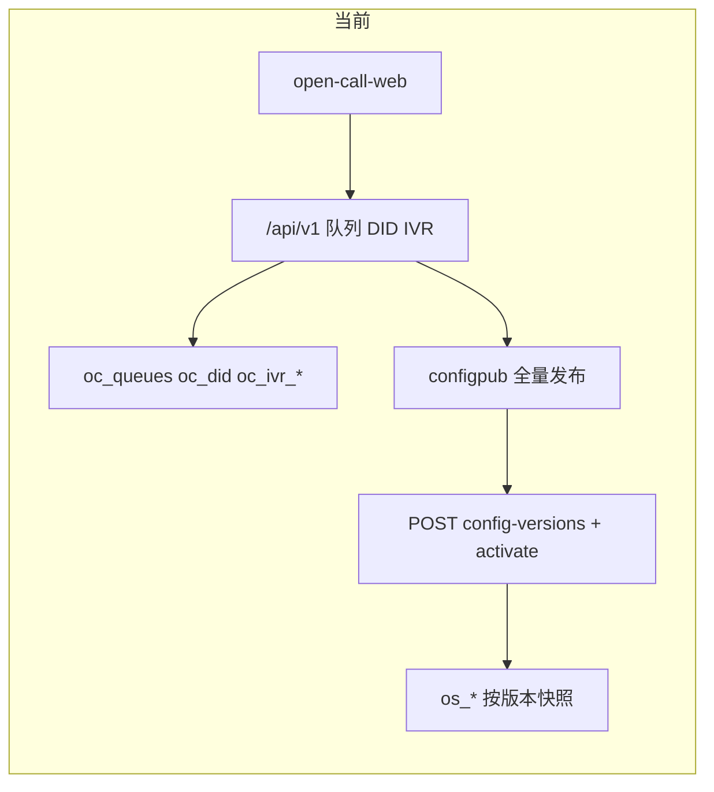
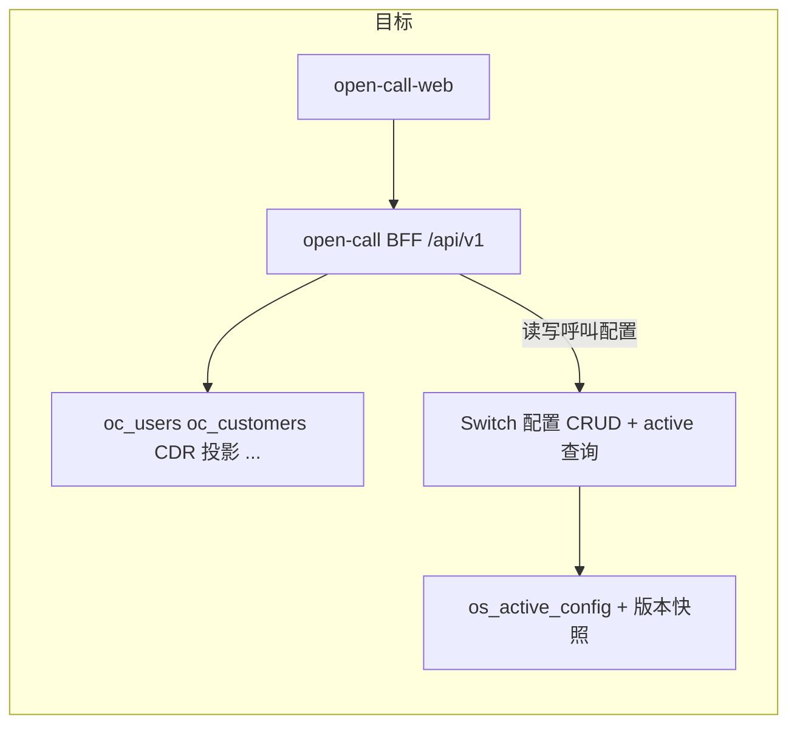

# Switch 为呼叫配置权威 + 实时同步改造

## 现状与差距

- **编辑与存储**：管理端改的是 [open-call 业务库](open-call/internal/store/migrate/sql/000001_init.sql)（`oc_queues`、`oc_did_routes`、`oc_ivr_flows` 等），Switch 侧仅在手动点击「发布并激活」后通过 [configpub.Publisher](open-call/internal/layers/biz/configpub/publisher.go) 全量 `StoreConfig` + `ActivateConfig` 更新。
- **读取**：列表/详情 API 读 `oc_*`；Switch 仅有 `GET /configuration/versions/{version}` **元数据**（无完整 bundle），运行时另有 `GET /queues/{id}/status`、`GET /agents/{id}/session` 等。
- **与目标不一致**：你希望 **Switch 存呼叫配置、open-call 存业务信息**；保存即同步；**从 Switch 查最新激活配置 + 运行时状态**。

## 目标架构

**边界约定（与 [统一软交换架构实施方案](docs/统一软交换架构实施方案.md) 对齐并细化）**

| 留在 open-call（业务） | 迁到 open-switch（呼叫） |
|------------------------|---------------------------|
| 用户/角色/权限、OIDC、审计 | 队列、技能、DID 路由、坐席路由资料（分机、技能绑定、队列绑定） |
| 客户/工单/访客业务令牌、CDR/录音**业务投影** | IVR 流程草稿/发布快照（技术执行 JSON） |
| `business_action` 决策逻辑与业务库查询 | SIP/WebRTC/ACD/排队运行时状态 |

**「实时」实现方式（保留版本锁定）**：不在呼叫路径上查 open-call；每次管理写操作在 Switch 内执行 **「读取当前激活 bundle → 变更 → 校验 → 新版本 Store → 立即 Activate」**（与现有 [ActivateConfig](open-switch/internal/layers/cccore/configuration.go) 相同语义：新呼入用新版本，已有 `RoutingSession` 仍锁定旧 `config_version`）。对用户而言无需再点「发布并激活」。

---

## 阶段 1：open-switch 读接口（激活快照）

在 [CallCenterAdminPort](open-switch/internal/ports/configuration.go) 与 HTTP 路由 [switch_router.go](open-switch/internal/app/http/switch_router.go) 增加：

- `GET /switch/v2/configuration/active` → 返回 `ConfigBundle` + `ConfigVersionView`（从 `os_active_config` 联表 `os_queues` / `os_did_routes` / `os_agents` / `os_ivr_published_snapshots` 等 **当前激活版本** 组装；可复用 `payload` 字段或现有 `insertBundle` 的逆查询）。
- `GET /switch/v2/configuration/active/summary`（可选）→ 仅版本号、checksum、activated_at，供健康/对账。

补充契约：[docs/open-switch对接说明.md](docs/open-switch对接说明.md)、[docs/api/openapi.yaml](docs/api/openapi.yaml)（若存在对应 tag）。

---

## 阶段 2：open-switch 写接口（资源级 + 内部自动激活）

在 `internal/layers/cccore` 新增 **ConfigEditor**（或扩展 `Service`）：

- `ApplyMutation(ctx, func(*ConfigBundle) error)`：加 advisory lock → `LoadActiveBundle` → 应用变更 → `validateBundle` → `StoreConfig` → `ActivateConfig`（单事务或等价顺序，失败则不部分激活）。
- 对外 REST（均需 integrator Bearer，与现有管理面一致）：

| 资源 | 建议路径 | 说明 |
|------|----------|------|
| 队列 | `GET/POST /queues`，`GET/PATCH/DELETE /queues/{id}`，`PUT /queues/{id}/agents|skills` | 字段对齐 [QueueConfig](open-switch/internal/ports/configuration.go) |
| 技能 | `GET/POST /skills`，`PATCH/DELETE /skills/{id}` | |
| 坐席路由 | `GET/POST /agents`，`PATCH /agents/{id}`，`PUT /agents/{id}/skills` | `user_ref` 指向 open-call 用户 ID；展示名可由 open-call 合并 |
| DID | `GET/POST /did-routes`，`PATCH/DELETE /did-routes/{id}` | 保持 trunk+did 冲突校验（现有 `validateActiveDIDConflicts`） |
| IVR | `GET/POST /ivr/flows`，草稿 `PATCH`，`POST .../publish`，`GET .../versions`，`POST .../rollback` | Switch 需新增 **`os_ivr_flows`（草稿）** 表（当前仅有按 `config_version` 的 [os_ivr_published_snapshots](open-switch/internal/store/migrate/sql/000001_init.sql)，无草稿表） |

保留现有 `POST /configuration/versions` 全量上传，供迁移/灾备；日常改配置走资源 API。

---

## 阶段 3：open-call 改为 Switch 代理层

1. **扩展** [SwitchAdminPort](open-call/internal/ports/switch_admin.go) / [switchapi/admin.go](open-call/internal/integration/switchapi/admin.go)：封装上述 GET active 与资源 CRUD。
2. **重写业务服务**（保持对外 `/api/v1` 路径不变，减少前端改动）：
   - [queue/service.go](open-call/internal/layers/biz/queue/service.go)、[configpub/snapshot.go](open-call/internal/layers/biz/configpub/snapshot.go)（DID）、技能/坐席绑定、 [ivr/service.go](open-call/internal/layers/biz/ivr/service.go) → 改为调用 Switch，**不再写 `oc_queues` / `oc_did_routes` / `oc_ivr_*`**。
   - 坐席账号创建流程：先在 open-call 建 `User` + 业务侧 `Agent` 记录（若仍需 `oc_agents` 仅存 `user_id` 与业务字段），再 `POST /switch/v2/agents` 写入路由字段（extension、terminal、skills）；列表展示时 **GET Switch active bundle** 与 `oc_users` join。
3. **删除管理面全量发布路径**：
   - 去掉 `POST /api/v1/config/publish` 与 [handleConfigPublish](open-call/internal/app/http/config_publish_handler.go) 的用户入口；[configpub.Publisher](open-call/internal/layers/biz/configpub/publisher.go) 仅保留给 **一次性迁移 CLI** 或 `config/import` 灾备。
4. **configio 导入**：[configio](open-call/internal/layers/biz/configio) 改为编译 bundle 后调用 Switch 全量 `StoreConfig`+`Activate`（或逐资源 API），不再写 `oc_*` 路由表。
5. **就绪探针**：[run.go](open-call/internal/app/run.go) `/health/ready` 可增加「能否 `GET configuration/active`」检查。

---

## 阶段 4：数据迁移与表退役

1. **迁移脚本**（`open-call/cmd` 或 `deploy/migrate-config-to-switch`）：读取现有 `oc_*` 路由数据 + 已发布 IVR 快照 → 组装 `ConfigBundle` → Switch `Store`+`Activate`（**保持原 UUID**，保证 [oc_cdr](open-call/internal/store/models/cdr.go)、访客 `queue_id` 与事件投影一致）。
2. **Schema**：新增 Switch `os_ivr_flows` 迁移；open-call 侧对 `oc_queues` 等表标记 deprecated（后续迁移删除或只读视图），**禁止**新代码写入。
3. **种子**：[seed.go](open-call/internal/store/seed.go) 改为在 Switch 写入演示队列/DID（或迁移后空库由 Switch seed）。

---

## 阶段 5：前端与文档

- [admin/views/shell.js](open-call-web/admin/views/shell.js)：移除「发布并激活呼叫配置」按钮；IVR 编辑器 [ivr-editor.js](open-call-web/shared/components/ivr/ivr-editor.js) 成功提示改为「已同步至 Switch，新呼入立即生效」。
- 管理端可选：在状态页展示 `active.version` / checksum（来自 Switch summary）。
- 更新 [统一软交换架构实施方案.md](docs/统一软交换架构实施方案.md) 第 2 节：由「草稿在 open-call + 手动发布」改为「呼叫配置 SoT 在 Switch，open-call BFF 代理写、读 active」。

---

## 测试与验收

- **Switch**：`cccore` 单测 — 连续 PATCH 队列自动递增版本；激活后新 `RoutingSession` 用新配置；旧 session 版本不变；DID 冲突拒绝激活。
- **open-call**：HTTP 测试 — `PATCH /queues` 后 Switch `GET /configuration/active` 含变更；无 `oc_queues` 写入。
- **集成**：DID 入呼 → 队列 → ACD 在 **仅 Switch + open-call 业务库** 下通过；断开 open-call 后已发布路由仍可入呼（架构 §9 要求）。

---

## 风险与约束

- **破坏性变更**：已有环境必须先跑迁移脚本再升级二进制；两库 `oc_*` 与 `os_*` 短暂双写期需避免。
- **IVR 草稿上 Switch** 是新增表与 API，工作量最大；可列为子里程碑（先队列/DID/坐席，后 IVR 迁完再删 open-call IVR 表）。
- **性能**：每次保存生成新版本会写多表；可后续做「无变更 checksum 则跳过激活」优化。
