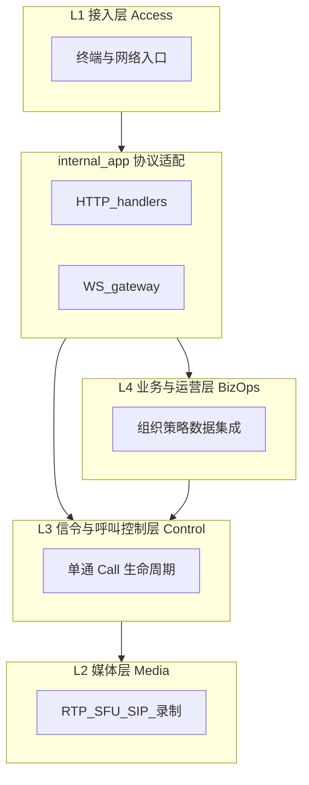
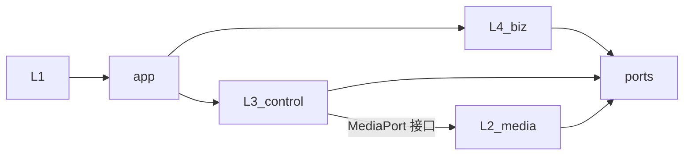
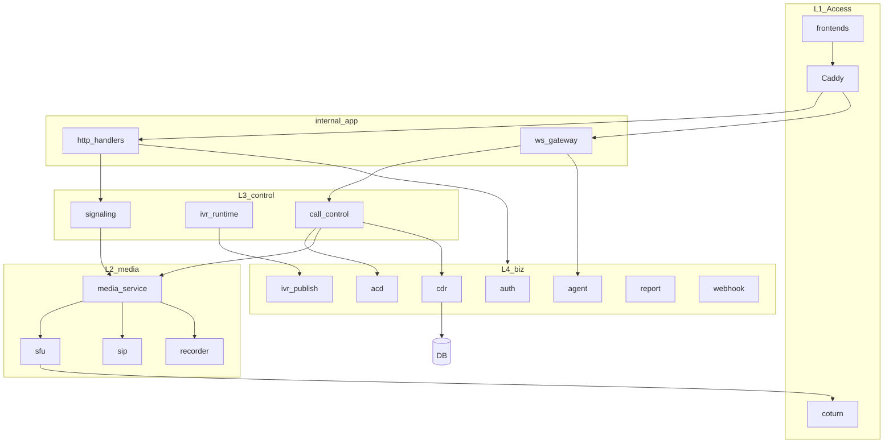
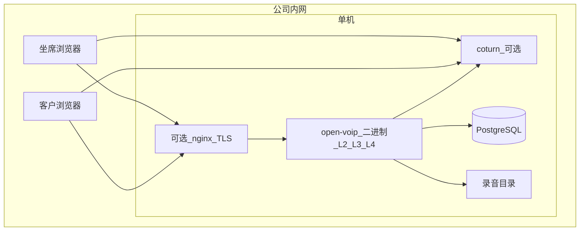

# Open VoIP 系统设计

> 版本：v0.3（与需求 [requirements.md](./requirements.md) v0.2 对齐）  
> 场景：小型公司内网、单机 All-in-One；Go 服务端 + Pion SFU + Lit/Vite 前端  

本文档为 **系统设计主文档**。功能需求以 requirements 为准；本文描述架构、**四级分层**、层间契约与代码结构。

**仓库布局**：设计与 API 契约位于仓库 `docs/`；可运行代码位于 `app/`（Go、前端、deploy），二者分离。

---

## 1. 系统概述

Open VoIP 是面向内网的 Web 呼叫中心：语音/视频坐席、访客排队、IVR、录音与 CDR、可选 PSTN。服务端默认 **单进程**（`open-voip`）承载业务与控制逻辑，**Pion SFU** 处理 WebRTC 媒体；TLS 可由二进制或前置反代终结，**coturn** 在跨网段场景可选启用。

**相关文档**

| 文档 | 说明 |
|------|------|
| [technical-design.md](./technical-design.md) | 技术选型、领域、数据、部署（**实现权威**） |
| [layering.md](./layering.md) | depguard、组合根 |
| [events.md](./events.md) | WebSocket / Webhook |
| [implementation-plan.md](./implementation-plan.md) | 分阶段实施与 Sprint |
| [docs/api/](./api/) | 独立 REST 对接（OpenAPI） |

**技术栈摘要**（细则见 [technical-design §2](./technical-design.md)）：Go 1.27.1、PostgreSQL + GORM AutoMigrate、Lit 3 + Vite、单一 `config.yml`、单二进制交付。

设计目标：

- 逻辑上 **接入 / 媒体 / 信令与呼叫控制 / 业务与运营** 四层分离，**禁止跨层耦合**
- 物理上可单机部署；全链路以 `call_id` 追踪（Room ID = `call_id`）
- Out of Scope：多租户、K8s 集群、原生 App、完整 CRM（见 requirements §17）

---

## 2. 四级分层架构

现代 VoIP 呼叫中心在概念上分为四层。在本项目中，四层对应 **明确的代码边界**（`internal/layers/*`）与 **层间 Port**（`internal/ports`），而不是四个独立微服务。

### 2.1 分层总览



| 层级 | 名称 | 唯一职责 | 典型组件 |
|------|------|----------|----------|
| **L1** | 接入层 | 用户与网络如何进入系统 | `frontend/*`（Lit）、`deploy/` 安装与 systemd、可选 coturn、防火墙 UDP 端口 |
| **L2** | 媒体层 | 音视频与电信媒体的传输与处理 | `layers/media`：SFU、SRTP、Hold/mute、DTMF、IVR 放音轨、SIP、录音写盘 |
| **L3** | 信令与呼叫控制层 | 单通 **Call** 的状态机与媒体编排时机 | `layers/control`：FSM、转接/三方/监听、IVR 运行时、WebRTC 信令编排 |
| **L4** | 业务与运营层 | 组织、路由策略、话单与对外集成 | `layers/biz`：Auth/RBAC、坐席/队列/技能、ACD 选人、IVR 配置发布、CDR/报表、Webhook |

**L1 与进程边界**：浏览器与 Caddy/coturn 属于接入层；Go 进程内的 `internal/app` 是 **接入适配层**（HTTP/WebSocket），只做鉴权与协议转换，不包含 ACD/FSM/SFU 算法。

### 2.2 各层职责边界（只做什么 / 不做什么）

| 层 | 必须做 | **禁止** |
|----|--------|----------|
| **L1** | TLS 终结、静态资源与反代、TURN 中继、客户端 WebRTC | 队列策略、Call 状态、访问业务数据库 |
| **L2** | 建 Room、转发 track、执行 Hold/mute、检测 DTMF、注入 IVR 音频、SIP 对话、生成录音文件 | 振铃分配、坐席示忙、写 CDR 业务字段、JWT、推送 `call.ringing` |
| **L3** | 创建/迁移 Call FSM、决定 Offer/Answer/重协商时机、绑定 Leg、驱动 IVR 运行时、调用 MediaPort | 用户/队列 CRUD、报表 SQL、RBAC 规则定义 |
| **L4** | 认证授权、配置与快照发布、ACD 算法、CDR/报表/质检、Webhook、审计 | import Pion、解析 SDP、直接操作 RTP、`CreateRoom` |

### 2.3 依赖规则（单向 DAG）



| 允许 | 禁止 |
|------|------|
| `layers/biz` → `ports` | `layers/biz` → `layers/control` / `layers/media` |
| `layers/control` → `ports`；通过注入的 **MediaPort** 调 L2 | `layers/control` → `layers/biz` |
| `layers/media` → `ports`、Pion/SIP 库 | `layers/media` → `layers/control` / `layers/biz` / `store` |
| `app/http`、`app/ws` → 各层 **Service 或 Port 接口** | handler 内实现 ACD/FSM/SFU |
| **`cmd/open-voip` / `app/bootstrap` 唯一** 组装各层具体实现 | 各层 package 互相 wire |

 enforcement：`app/.golangci.yml`（depguard），CI 违反分层即失败。

### 2.4 层间契约（`internal/ports`）

跨层协作 **仅** 通过 `internal/ports` 中的接口与 DTO；禁止跨层 import 实现包或使用对方 domain 实体。

| Port | 调用方 | 实现方 | 说明 |
|------|--------|--------|------|
| **CallControlPort** | L4（Guest、外呼 API 等） | L3 | `StartInbound`、`Answer`、`Hangup`、`Transfer`、`Outbound`；L4 **不** 持有 MediaPort |
| **ACDDispatchPort** | L3 | L4 `queue/acd` | `RequestAgent(ctx)` → agent_id；**ACD 不** import Call FSM |
| **MediaPort** | L3 | L2 | Room、Track、Hold、DTMF、Recording、SIP leg |
| **ConfigSnapshotPort** | L3 IVR/路由 | L4 | 只读已发布 queue/ivr/工作时间快照 |
| **AgentDirectoryPort** | L3 | L4 | 分机号 → agent、video_capable |
| **RecordingPolicyPort** | L3 | L4 | 按队列返回录音策略 |
| **CDRRecorderPort** | L3（FSM 迁移点） | L4 | 写 CDR；L3 不直接 SQL |
| **CallEventPublisher** | L3 | `app/ws` | `call.*`、`video.*` |
| **AgentEventPublisher** | L4 | `app/ws` | `agent.state_changed` 等 |

**呼入分配（层间协作示例）**

1. **L4** `GuestService` 校验 token → 调 **CallControlPort.StartInbound**（L3）
2. **L3** 创建 Call，IVR 或入队 → 调 **ACDDispatchPort.RequestAgent**（L4 仅选人）
3. **L3** Offer 振铃 → **CallEventPublisher**
4. 接听后 **L3** 查 **RecordingPolicyPort** → **MediaPort.CreateRoom**（L2）

### 2.5 逻辑架构（按 Port 边界）



### 2.6 通道与分层（正交）

| 通道 | 路径 | 协议 |
|------|------|------|
| 管理/查询 | L1 → `app/http` → L4 | HTTPS REST |
| 业务实时 | L1 → `app/ws` ← L3/L4 EventPublisher | WSS JSON |
| 媒体信令 | L1 → `app/http/media` → L3 → L2 | HTTPS + ICE trickle |
| 媒体数据 | L1 ↔ L2 | UDP SRTP（不经 HTTP 代理） |

业务 WebSocket **不承载 SDP**；WebRTC Offer/Answer/ICE 走媒体信令通道。

### 2.7 禁止耦合清单（设计/代码评审）

| 反模式 | 正确做法 |
|--------|----------|
| `queue` import `call/fsm` | L4 实现 `ACDDispatchPort`；L3 调用 |
| 签入时 `CreateRoom` | 签入只更新 L4 坐席状态；Room 在 L3 Answer 后创建 |
| L2 回调写 CDR | L3 FSM 调 `CDRRecorderPort` |
| L2 读 IVR/队列 DB | L4 发布快照；L3 `ivr/runtime` 读 Port |
| `app/http` 内写 ACD | 算法仅在 L4 `queue/acd` |
| L4 调 Pion 录制 | 录制仅在 L2；L3 调 `MediaPort.StartRecording` |
| 单一 `events` 包混合 WS+业务 | `ports/events` 定义类型；`app/ws` 传输；L3/L4 分开发布 |

### 2.8 需求模块与四层映射

| requirements 章节 |  primarily 层级 |
|-------------------|----------------|
| §2 PLAT、§11 ADM、§4 AGENT、§5 QUEUE、§8 REC 策略、§9 CDR、§10 RPT、Webhook | **L4** |
| §6 CALL、§6 IVR 运行时、§9 EVT 呼叫类、§7 视频协商流程 | **L3** |
| §3 MEDIA、§7 媒体轨、§8 录制文件、MEDIA-07 SIP | **L2** |
| §2 DEPLOY、§12–14 UI、PLAT-01 HTTPS | **L1** + `app` |

---

## 3. 部署拓扑（单机）

与 requirements §0.2 一致：



---

## 4. 代码结构（与四层对应）

代码根目录为 **`app/`**（与 `docs/` 分离）：

```
app/
  cmd/open-voip/      # 组合根入口
  internal/
    ports/            # 层间接口 + 跨层 DTO
    layers/
      biz/            # L4
      control/        # L3
      media/          # L2
    app/              # L1 协议适配（http/ws/run）
    store/            # GORM 持久化（主要 L4）
  frontend/           # L1 Lit 客户端
  deploy/             # systemd、config 示例
```

领域模型、MediaPort、REST/事件详见 [technical-design.md](./technical-design.md)、[events.md](./events.md)、[docs/api/](./api/)。

---

## 5. 工程规范：中文注释（强制）

实现与评审时必须遵守；与四层分层规范同等优先级。

### 5.1 Go 代码

| 范围 | 要求 |
|------|------|
| **实体与值对象** | 每个导出 struct 及**每个导出字段**写中文注释，说明业务含义、单位/枚举取值、是否可空 |
| **层间 Port / 接口** | 接口类型、每个方法：用途、调用方层级、前置条件、错误语义 |
| **重要逻辑** | FSM 迁移、ACD 选人、IVR 节点处理、MediaPort 实现中与协议相关的分支：**非显而易见处**必须用中文注释说明「为什么」 |
| **包注释** | `layers/biz`、`layers/control`、`layers/media`、`ports`、`app` 包需 `package` 上一行中文说明所属层级与职责 |
| **禁止** | 用注释重复代码字面意思；无信息量的 `// 获取用户` |

**语言**：注释使用**简体中文**；标识符（包名、字段名、API path）仍用英文。

**示例（字段）**

```go
// Call 表示一通呼叫中心会话，全链路主键为 ID（与媒体 Room 一致）。
type Call struct {
    // ID 全局通话标识，UUID。
    ID string
    // SessionType 媒介类型：audio / video / mixed。
    SessionType SessionType
}
```

### 5.2 数据库（表与字段）

表结构以 **GORM model + AutoMigrate** 为主（见 [technical-design §8](./technical-design.md)）。中文说明做法：

| 引擎 | 做法 |
|------|------|
| **PostgreSQL** | GORM 字段 `comment` tag；可选运维脚本 `COMMENT ON TABLE/COLUMN` |

**命名**：表名、列名英文 snake_case；中文只出现在 COMMENT / `--` 注释，不拼进标识符。

**示例（PostgreSQL COMMENT）**

```sql
COMMENT ON TABLE calls IS '通话主表，一通呼叫一条记录';
COMMENT ON COLUMN calls.session_type IS '媒介类型：audio / video / mixed';
```

### 5.3 评审与 CI（建议）

- PR 检查清单：新增 struct / migration 是否满足 §5.1、§5.2
- 可选：`golangci-lint` 对导出符号检查是否缺少 doc comment（如 `revive` 的 `exported` 规则）

---

## 6. 核心领域（摘要）

- **Call** + **CallLeg**：全局 `call_id`；状态由 L3 FSM 管理 → [technical-design §3](./technical-design.md)
- **AgentSession**：签入/状态在 L4；分配结果经 Port 交给 L3
- **Queue + ACD**：配置与选人在 L4；振铃与接同在 L3
- **IVR**：配置发布在 L4；运行在 L3；放音在 L2
- **Room**：L2 媒体概念，ID = `call_id`

相对 [requirements.md](./requirements.md) 的部署/监控/限流等差异，以 [technical-design §2.10](./technical-design.md) 折中表为准。

---

## 7. 修订记录

| 版本 | 日期 | 说明 |
|------|------|------|
| v0.1 | 2026-09-18 | 初稿：四级分层、Port 契约、部署与目录 |
| v0.2 | 2026-09-18 | 新增 §5 工程规范：Go 与数据库中文注释 |
| v0.3 | 2026-09-18 | 文档体系索引；二进制+PostgreSQL；组合根改为 cmd/bootstrap |
