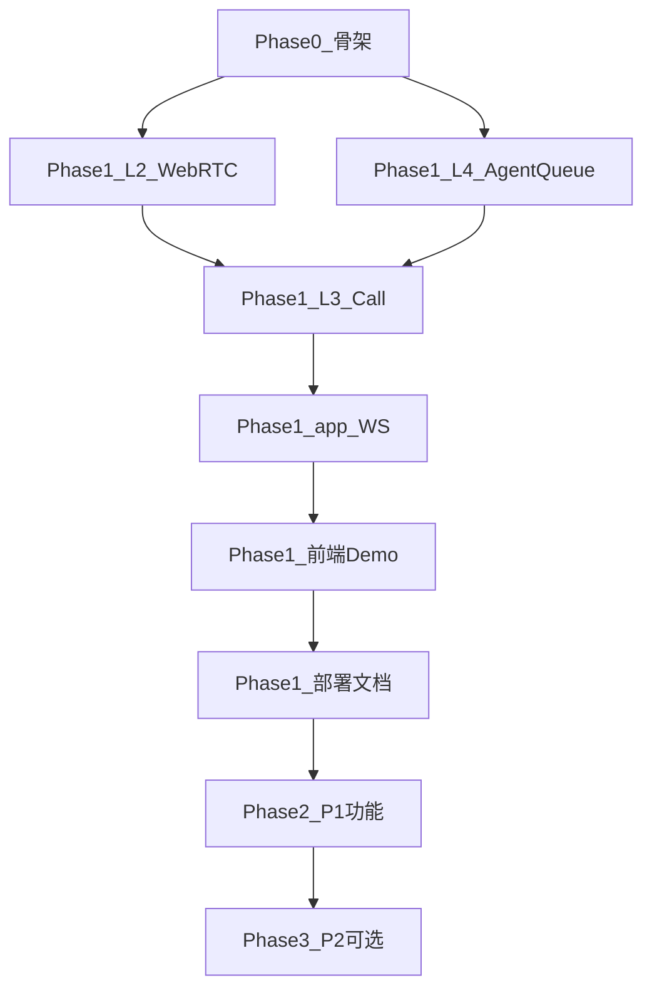

# Open VoIP 实施计划

> 版本：v0.3  
> 对齐：[architecture.md](./architecture.md) v0.4、[technical-design.md](./technical-design.md) v0.2、[requirements.md](./requirements.md) v0.3  
> 当前仓库状态：Phase 2/3 主路径已落地（Go 分层 + Lit 三端 + CI）。组合根为 `cmd/open-voip` + `internal/app/run.go`。

本文档将设计转化为 **分阶段、可验收、依赖清晰** 的研发排期。功能验收以 requirements 需求 ID 为准；实现边界以 technical-design 折中表为准。

---

## 1. 目标与原则

### 1.1 交付目标

| 阶段 | 名称 | 核心结果 | 对应 requirements |
|------|------|----------|-------------------|
| **Phase 0** | 工程骨架 | 可编译、可迁移、分层 CI 通过 | 分层 + NFR 基础 |
| **Phase 1** | MVP（P0） | 内网单机：语音/视频呼入、坐席振铃、CDR、Demo UI | §16.1 |
| **Phase 2** | 增强（P1） | IVR、录音、转接/外呼、报表、管理 API 完善 | §16.2 |
| **Phase 3** | 可选（P2） | PSTN、Webhook 高阶、质检、离线包等 | §16.3 |

### 1.2 实施原则

1. **自下而上组装**：`ports` → L2 最小可用 → L3 FSM → L4 业务 → `app` 适配 → 前端。
2. **组合根唯一**：仅 `cmd/open-voip`、`internal/app/run.go` 串联具体实现（见 [layering.md §4](./layering.md)）。
3. **每迭代可演示**：优先打通「访客入队 → 振铃 → 接听 → 双向媒体 → 挂断 → CDR」再扩展。
4. **验收绑 ID**：每个里程碑列出 requirements ID，便于测试用例与 PR 描述。
5. **中文注释**：与 architecture §5 同步落地，不事后补。

---

## 2. 总体依赖关系

**关键路径**：Phase 0 → L2 Room/Offer-Answer → L3 Call FSM + ACD 协作 → WS 事件 → 坐席/访客 UI → 端到端验收。

---

## 3. Phase 0：工程骨架（约 1～2 周）

### 3.1 工作包

| 序号 | 工作项 | 产出 | 负责人建议 |
|------|--------|------|------------|
| 0.1 | 初始化 `go.mod`（Go 1.27.1）、目录树 | 与 technical-design §2.9 一致 | 后端 |
| 0.2 | `internal/config`：加载 `config.yml`、`Validate()` | 对齐 `deploy/config.example.yml` | 后端 |
| 0.3 | `internal/store`：GORM + Postgres、`AutoMigrate` 基础表骨架 | users/agents/queues 空壳 model + comment tag | 后端 |
| 0.4 | `internal/ports/*`：接口与 DTO 占位（CallControl、Media、ACD、事件等） | 中文 doc comment 齐全 | 后端 |
| 0.5 | `internal/layers/{biz,control,media}` 空包 + 包注释 | depguard 可扫描 | 后端 |
| 0.6 | `internal/app/run.go` + `cmd/open-voip/main.go` | 启动读配置、连 DB、挂 chi、`GET /health` | 后端 |
| 0.7 | CI：golangci-lint + depguard（`app/.golangci.yml`）+ OpenAPI validate | PR 违反分层即失败 | 工程 |
| 0.8 | 前端三入口 Vite 脚手架（agent/guest/admin）+ `shared/*` 空模块 | `npm run build` 通过 | 前端 |
| 0.9 | 前端独立目录 `frontend/`，Nginx 托管；API 不服务静态页 | 与 §12 部署一致 | 工程 |

### 3.2 验收标准

- [ ] 在 `app/` 下 `open-voip -config deploy/config.example.yml` 启动，返回 `GET /health` 200。
- [ ] Postgres AutoMigrate 无错误；空库可重复启动。
- [ ] `go test ./...` 与 lint/arch 在 CI 绿。
- [ ] 各层 package **无** 跨层非法 import。

### 3.3 风险

- Go 1.27.1 工具链环境需团队统一；若暂不可用，在 `go.mod` 中明确 toolchain 并在 README 说明。

---

## 4. Phase 1：MVP / P0（约 6～10 周）

按 **迭代（Sprint）** 组织；每迭代 1～2 周，可根据人力并行 L2 与 L4 部分工作。

### 4.1 Sprint 1.1 — L4 认证与坐席基础

| 任务 | 说明 | 需求 ID |
|------|------|---------|
| 用户/坐席 CRUD（API + store） | admin 创建 agent、extension | AGENT-01, ADM-01 |
| JWT 登录/刷新/撤销 | argon2id、jti 黑名单表 | PLAT-02 |
| 签入/签出、状态 idle/busy/on_call/acw | **不** CreateRoom | AGENT-02, AGENT-03 |
| `AgentDirectoryPort`、`AgentEventPublisher` 桩 → 真实 WS | 状态变更推送 | EVT-02 |

**验收**：Postman/OpenAPI 登录；签入后 WS 收到 `agent.state_changed`；未登录 401。

### 4.2 Sprint 1.2 — L4 队列与 ACD

| 任务 | 说明 | 需求 ID |
|------|------|---------|
| 队列 CRUD、`video_enabled`、最大等待 | | QUEUE-01, QUEUE-04, ADM-01 |
| ACD：`longest_idle` 或 `round_robin` 二选一先实现 | `ACDDispatchPort` | QUEUE-02 |
| 视频队列过滤 `video_capable` | | AGENT-07, QUEUE-04 |
| Guest session（简化：Demo 直链选队列，token 可 Phase 2 完善） | | UI-C-01 部分 |

**验收**：多坐席 idle 时分配可预期；仅语音坐席不进视频队列。

### 4.3 Sprint 1.3 — L2 媒体最小闭环

| 任务 | 说明 | 需求 ID |
|------|------|---------|
| SFU：单 Room = call_id、双向 audio track | Opus | MEDIA-03, VIDEO-11 |
| MediaPort：`CreateRoom` / `CloseRoom` / JoinWebRTC / ICE trickle | HTTP 经 L3 facade | MEDIA-04, NFR-03 |
| ICE：内网 host 候选；STUN 可指向本机或省略 | | MEDIA-04 |
| 静音（track mute）基础 | | UI-A-04 部分 |

**验收**：两浏览器 **不经队列** 的 L3 测试 harness 或临时 API 可 1:1 语音互通。

### 4.4 Sprint 1.4 — L3 呼叫控制（语音呼入主路径）

| 任务 | 说明 | 需求 ID |
|------|------|---------|
| Call + CallLeg 持久化；FSM：created → queued → ringing → active → ended | | §6 CALL 主路径 |
| `CallControlPort.StartInbound` / `Answer` / `Hangup` | L4 Guest 调 Port | QUEUE-03 |
| 振铃时 `CallEventPublisher.call.ringing`；接听后 CreateRoom | | EVT-01, EVT-02 |
| `CDRRecorderPort`：接通/放弃/失败 + `session_type` | | CDR-01, CDR-02 |
| 防双振铃（agent 锁或乐观锁） | | technical-design §3.2 |

**验收**：访客入队 → 坐席振铃 → 接听 → 语音双向 → 挂断 → CDR 与 call_id 一致。

### 4.5 Sprint 1.5 — 视频 P0

| 任务 | 说明 | 需求 ID |
|------|------|---------|
| Room 增加 video track；VP8（+ H.264 可选） | | VIDEO-01, NFR-06 |
| 权限引导与降级文案（访客端） | | VIDEO-02, UI-C-04 |
| 通话中开关摄像头/麦克风（信令 + MediaPort mute） | | VIDEO-05 |
| 坐席设备枚举（浏览器 API） | | VIDEO-03 |

**验收**：视频队列 1:1 可听可见；关摄像头音频不断（mixed 会话）。

### 4.6 Sprint 1.6 — app 层与前端 Demo

| 任务 | 说明 | 需求 ID |
|------|------|---------|
| `app/http`：agent/guest/media 路由对齐 OpenAPI 子集 | | ADM-01 子集 |
| `app/ws`：鉴权、订阅、call/agent 事件 | | EVT-01 |
| 坐席 UI：登录、签入、来电、通话、挂断 | | UI-A-01～04 |
| 访客 UI：选语音/视频、等待、通话 | | UI-C-01～03 |
| HTTPS：文档 + 自签/企业 CA 步骤 | 二进制 TLS 或 nginx 示例 | PLAT-01, DEPLOY-02, DEPLOY-03 |

**验收**：内网 HTTPS 下麦克风/摄像头权限正常；坐席无需轮询即可响铃。

### 4.7 Sprint 1.7 — 部署、健康检查、容量 smoke

| 任务 | 说明 | 需求 ID |
|------|------|---------|
| systemd、`deploy/` 安装说明、数据目录持久化 | 本机二进制 + Nginx，无 Docker | DEPLOY-01～04, technical-design §12 |
| `GET /api/v1/status`：db_ok、active_calls、ws_connections | | PLAT-06, DEPLOY-08 |
| 并发 smoke：**≥10 路语音**（脚本或多 tab） | | NFR-04, §0.3 |

**Phase 1 里程碑验收（MVP 签字）**

- requirements §16.1 所列 P0 能力均可演示。
- 全链路 `call_id` = Room ID 可日志追踪。
- depguard 与中文注释规范在 PR 检查清单执行。

---

## 5. Phase 2：P1 增强（约 8～12 周）

可与 Phase 1 部分并行规划，但 **依赖 MVP 媒体与 FSM 稳定**。

### 5.1 建议迭代划分

| 迭代 | 主题 | 主要需求 ID | 层 |
|------|------|-------------|-----|
| 2.1 | IVR 配置发布 + L3 运行时 | IVR-01, IVR-02, ADM-02 | L4 publish + L3 runtime + L2 InjectAudio/DTMF |
| 2.2 | Hold/Mute/DTMF 完善 | MEDIA-05, MEDIA-06 | L2 + L3 |
| 2.3 | 录音策略与文件 | REC-01～04 | L2 写盘 + L4 元数据/RBAC |
| 2.4 | 视频：升/降级、屏幕共享、转接 | VIDEO-06～09, VIDEO-08 | L3 事件 + L2 renegotiation |
| 2.5 | 外呼/分机互拨、盲转 | CALL-01, CALL-02, MEDIA-09 | L3 + L4 directory |
| 2.6 | 报表与实时监控 | RPT-01～03, MON-01（status 折中） | L4 |
| 2.7 | RBAC 班长、审计、入会链接 | PLAT-03, PLAT-05, ADM-05 | L4 + app |
| 2.8 | 管理 Demo / CDR 导出 | UI-M-01, CDR-03, UI-A-05～08 | 前端 + L4 |
| 2.9 | TURN（coturn）与短期凭证 | MEDIA-04b, VIDEO-12 | L2 + deploy 文档 |
| 2.10 | 溢出、排队文案、示忙原因 | QUEUE-05, QUEUE-06, AGENT-04 | L4 + L3 |

### 5.2 Phase 2 出口标准

- requirements §16.2 核心 P1 可验收。
- 关键时序（呼入 IVR、升视频）与 [technical-design §13](./technical-design.md) 一致。
- 录音可按 call_id 检索；报表与 CDR 字段一致。

---

## 6. Phase 3：P2 / 可选（按需排期）

| 模块 | 需求 ID | 备注 |
|------|---------|------|
| SIP/PSTN 中继 | MEDIA-07, MEDIA-08 | 进程内 sipgo：Digest REGISTER、401/407、Record-Route、PCMU/PCMA 转码；未配置 trunk 不启动 |
| Webhook 订阅与重试 | EVT-04 | 同步重试 + 管理端 retry API |
| 质检标记 | QA-01 | qa_marks 表 |
| 高级 IVR / 工作时间 | IVR-03 | ConfigSnapshot |
| 三方、班长监听 | CALL-03, CALL-04 | supervisor leg |
| 优先级队列 | QUEUE-07 | |
| 录音自动清理 | REC-05 | purge API + 外部 cron |
| 离线安装说明 | DEPLOY-07 | 文档为主 |
| API 限流 | PLAT-07 | technical-design 当前不实现，若公网暴露再开 |

---

## 7. 团队分工与并行建议

| 角色 | Phase 1 重点 | 可并行 |
|------|--------------|--------|
| 后端 L2 | Pion SFU、MediaPort、录音管道（Phase 2） | Sprint 1.3 起 |
| 后端 L3 | FSM、signaling facade、与 ACD/CDR 协作 | 依赖 1.3 接口稳定 |
| 后端 L4 | Auth、队列、ACD、CDR | Sprint 1.1 起 |
| 后端 app | HTTP/WS、run 组合根 | Sprint 1.4 起集成 |
| 前端 | shared/webrtc.js、三端页面 | Sprint 1.3 后可对接 media API |
| 运维/文档 | TLS、systemd、防火墙、备份 | Sprint 1.6～1.7 |

**建议最小团队**：2 后端（L2+L3 一人、L4+app 一人）+ 1 前端；单人全栈则严格按 Sprint 顺序。

---

## 8. 测试与质量门禁

| 类型 | 内容 | 阶段 |
|------|------|------|
| 单元测试 | FSM 迁移、ACD 选人、IVR 节点 | 1.4 起 |
| 集成测试 | 本机 Postgres + CallControl 流程（`OPEN_VOIP_TEST_DSN`） | 1.4 起 |
| 媒体手工测试 | 内网两机 + 多 tab 并发 | 1.7 |
| 契约测试 | OpenAPI 与 handler 路径一致 | 持续 |
| 分层 CI | depguard | Phase 0 起 |
| 验收清单 | 按 requirements ID 勾选 | 每 Phase 末 |

---

## 9. 文档与代码同步

| 触发 | 动作 |
|------|------|
| 新增 REST | 更新 `docs/api/openapi.yaml` + errors.md |
| 新增 WS 事件 | 更新 `docs/events.md` |
| 配置项变更 | 更新 `deploy/config.example.yml` + technical-design §12 |
| Port 方法变更 | 更新 `internal/ports` + layering.md 表 |

---

## 10. 里程碑时间表（参考）

假设 **1 个小型团队（3～4 人）**，日历仅供参考：

| 里程碑 | 目标周次 | 标志 |
|--------|----------|------|
| M0 骨架就绪 | W2 | health + migrate + CI |
| M1 语音单通 | W5 | 无队列 harness 或简化 API |
| M2 呼入端到端 | W7 | 队列 + 振铃 + CDR |
| M3 MVP 发布 | W10 | P0 + Demo + 部署文档 |
| M4 P1 功能完整 | W22 | §16.2 主项 |
| M5 P2 按需 | W28+ | 商务驱动 |

---

## 11. 修订记录

| 版本 | 日期 | 说明 |
|------|------|------|
| v0.1 | 2026-09-18 | 初稿：Phase 0～3、Sprint 拆分、验收与分工 |
| v0.3 | 2026-09-18 | 状态改为 Phase 2/3 已落地；组合根 run.go；SIP 为自研信令 |
| v0.4 | 2026-09-19 | MEDIA-07 改为进程内 sipgo 直连中继（Digest REGISTER、ACL、PCMA） |
