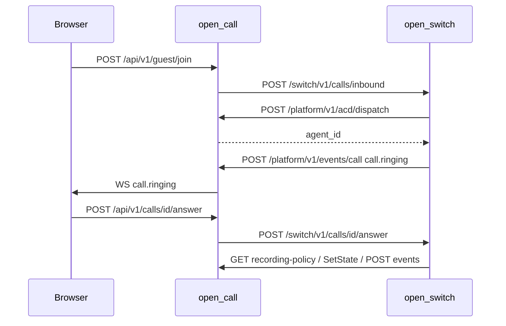

# open-switch 对接说明

> 版本：v1.1.0（2026-09-22，双服务边界修订）
> 推荐联调：open-switch v1 + open-call v1  

本文档是 **open-switch（软交换）** 与 **业务系统** 之间的唯一对接正文。open-call 为首个参考实现（含 BFF 与 Platform API）；其他 CRM、工单、呼叫中心可按同一 Switch 契约接入。

相关文档：[events.md](./events.md)（WS 信封）、[api/openapi.yaml](./api/openapi.yaml)（open-call 对浏览器 API）。

---

## 1. 文档目的与读者

| 角色 | 职责 |
|------|------|
| **open-switch** | WebRTC/SIP 媒体、单通 Call FSM、录音文件、对外 **Switch API** |
| **业务系统**（如 open-call） | 用户/RBAC、坐席/队列/ACD、CDR 与录音元数据、IVR 配置发布、对终端 **BFF**（可选） |

业务系统 **不得** import open-switch 代码；仅通过 HTTP 对接。

---

## 2. 版本与 Base URL

| API | 前缀 | 示例 Base |
|-----|------|-----------|
| Switch API | `/switch/v1` | `http://127.0.0.1:8082`（内网，不对公网） |
| Platform API | `/platform/v1` | `http://127.0.0.1:8080`（open-call 范例） |

- 主版本在 URL path 中；不兼容变更递增 `/switch/v2`。
- 废弃：旧版至少保留一个小版本周期，响应头可选 `Deprecation: true`。

---

## 3. 鉴权

### 3.1 业务系统 → open-switch（Switch API）

```
Authorization: Bearer <integration_secret>
X-Principal: <JSON>   # 可选，终端 JWT 解析后的主体，见下
```

`X-Principal` 示例（open-call BFF 验证坐席/访客令牌后重新生成，禁止浏览器透传）：

```json
{"user_id":"...","agent_id":"...","role":"agent","guest_id":"","guest_call_id":""}
```

Switch 用其做 `authorizeCall` 等价校验；无 `X-Principal` 时仅允许 integration 级调用（如内部入呼）。

### 3.2 open-switch → 业务系统（Platform API）

```
Authorization: Bearer <integration_secret>
```

两进程配置 **相同** `integration_secret`（各自 config 中 `integration.secret`）。

---

## 4. Switch API（业务系统 → open-switch）

除另有说明外，请求/响应为 `application/json`；错误体 `{ "error": "...", "message": "..." }`。

### 4.1 呼叫控制

| 方法 | 路径 | 说明 |
|------|------|------|
| POST | `/switch/v1/calls/inbound` | 创建呼入，body：`InboundRequest`（call_id, queue_id, caller, session_type, …） |
| GET | `/switch/v1/calls/{callId}` | 通话与 legs 视图 |
| POST | `/switch/v1/calls/{callId}/answer` | 坐席接听，需 Principal.agent_id |
| POST | `/switch/v1/calls/{callId}/decline` | 拒接 |
| POST | `/switch/v1/calls/{callId}/hangup` | 挂断，body 可选 `reason` |
| POST | `/switch/v1/calls/outbound` | 外呼 |
| POST | `/switch/v1/calls/{callId}/hold` | body `{ "on": true/false }` |
| POST | `/switch/v1/calls/{callId}/transfer` | `TransferRequest` |
| POST | `/switch/v1/calls/{callId}/transfer/complete` | 完成咨询转 |
| POST | `/switch/v1/calls/{callId}/video/request` | 升视频请求 |
| POST | `/switch/v1/calls/{callId}/video/respond` | body `{ "accept": true/false }` |
| POST | `/switch/v1/calls/{callId}/video/downgrade` | 降视频 |
| POST | `/switch/v1/calls/{callId}/screen-share` | body `{ "on", "leg_id" }` |
| POST | `/switch/v1/calls/{callId}/conference` | body `{ "agent_id" }` |
| POST | `/switch/v1/calls/{callId}/dtmf` | body `{ "leg_id", "digit" }` |
| POST | `/switch/v1/supervisor/calls/{callId}/listen` | 班长只听 |
| POST | `/switch/v1/supervisor/agents/{agentId}/force-check-out` | 强制释放 |

### 4.2 媒体信令（WebRTC）

| 方法 | 路径 | 说明 |
|------|------|------|
| POST | `/switch/v1/calls/{callId}/legs/{legId}/offer` | 返回服务端 SDP Offer |
| POST | `/switch/v1/calls/{callId}/legs/{legId}/answer` | 提交 Answer SDP |
| POST | `/switch/v1/calls/{callId}/legs/{legId}/ice` | Trickle ICE |
| POST | `/switch/v1/calls/{callId}/legs/{legId}/mute` | body `{ "audio", "video" }` |
| GET | `/switch/v1/calls/{callId}/turn-credentials` | TURN 短期凭证 |

### 4.3 健康

| 方法 | 路径 | 说明 |
|------|------|------|
| GET | `/health` | 返回 `OK` |

### 4.4 幂等与错误

- 入呼 `call_id` 由业务侧或 Switch 协商；同一 `call_id` 重复 inbound 应返回冲突或幂等成功（实现定义，需在联调中确认）。
- HTTP 状态码与现 monolith API 一致（401/403/404/409/422）。

---

## 5. Platform API（open-switch → 业务系统）

open-switch 在 FSM 运行期回调业务系统；**open-call** 在 `/platform/v1` 实现下列接口。其他系统 host 可不同，但需 **语义等价**。

| 方法 | 路径 | 说明 |
|------|------|------|
| POST | `/platform/v1/acd/dispatch` | body `DispatchRequest` → `{ "agent_id": "..." }`（可为空） |
| GET | `/platform/v1/agents/{agentId}` | 坐席目录条目 |
| GET | `/platform/v1/agents/by-extension/{extension}` | 按分机查询 |
| POST | `/platform/v1/agents/{agentId}/state` | body `{ "from_state", "to_state", "reason" }` 乐观锁 |
| GET | `/platform/v1/queues/{queueId}/snapshot` | 队列快照 |
| GET | `/platform/v1/ivr/flows/{flowId}/snapshot/latest` | 最新 IVR 发布快照 |
| GET | `/platform/v1/queues/{queueId}/business-hours` | 工作时间 |
| GET | `/platform/v1/queues/{queueId}/recording-policy` | 录音策略 |
| GET | `/platform/v1/dids/resolve?did=` | DID → queue_id |
| POST | `/platform/v1/cdr` | 写/更新 CDR |
| POST | `/platform/v1/recordings` | 录音元数据 |
| POST | `/platform/v1/events/call` | Switch 推送 `call.*` 事件（见 §6） |

---

## 6. 实时事件

### 6.1 Switch → 业务系统

Switch 在 FSM 迁移时 `POST /platform/v1/events/call`：

```json
{
  "type": "call.ringing",
  "call_id": "uuid",
  "agent_id": "optional",
  "payload": { }
}
```

字段与 [events.md](./events.md) 一致。业务系统收到后转发至自有 WS（open-call：`/api/v1/ws`）。

### 6.2 业务系统 → 终端

`agent.state_changed`、`queue.*` 由业务系统本地产生，**不经过** Switch。

---

## 7. open-call 对接范例

### 7.1 部署拓扑

| 进程 | 监听 | 数据库 |
|------|------|--------|
| open-call | `0.0.0.0:8080` | PostgreSQL `open_call` |
| open-switch | `127.0.0.1:8082` | PostgreSQL `open_switch` |

配置（节选）：

**open-call** `deploy/config.example.yml`：

```yaml
integration:
  secret: "change_me_integration"
  switch_base_url: "http://127.0.0.1:8082"
```

**open-switch** `deploy/config.example.yml`：

```yaml
integration:
  secret: "change_me_integration"
  platform_base_url: "http://127.0.0.1:8080"
```

### 7.2 BFF 代理表（浏览器 `/api/v1` → Switch）

open-call 对下列路径 **透明代理** 到 open-switch（path 替换 `/api/v1` → `/switch/v1`，并附加鉴权头）：

- `/api/v1/calls/**` → `/switch/v1/calls/**`
- 健康检查 `/health` 由 open-call 自身提供；Switch `/health` 仅内网探测

其余 `/api/v1/*`（auth、users、queues、guest、cdr、reports 等）由 open-call 本地处理。

### 7.3 典型时序（访客语音入队）



### 7.4 前端

- `VITE_API_BASE` 指向 open-call（如 `http://127.0.0.1:8080`）。
- WebRTC 媒体仍直连 Switch 侧 SFU（UDP）；信令 HTTP 经 BFF 代理。

---

## 8. 新业务系统接入清单

**必实现 Platform API（§5 全部）**

- [ ] ACD dispatch  
- [ ] Agent 查询与 SetState  
- [ ] Queue/IVR 快照、DID、录音策略、business-hours  
- [ ] CDR、录音元数据写入  
- [ ] 接收 `POST /platform/v1/events/call`  

**必调用 Switch API（§4）**

- [ ] 入呼/外呼/接听/挂断/信令（按业务场景）  

**联调**

- [ ] 配置相同 integration secret  
- [ ] Switch 能访问 Platform base URL  
- [ ] 业务系统能访问 Switch base URL（或仅 BFF 代理）  

**验收**

- [ ] 入队→振铃→接听→WebRTC→挂断→CDR 落在业务库  
- [ ] 停 Switch：业务管理 API 仍可用，通话不可用  
- [ ] 停业务系统：Switch 无法 ACD/写 CDR  

---

## 9. Changelog

| 日期 | 版本 | 说明 |
|------|------|------|
| 2026-09-21 | v1.0.0 | 初版：Switch/Platform 路径、open-call 范例、双库 |


## 2026-09-22 契约补充

部署与验收细则见 [双服务与 SIP 上线验收](sip-production-acceptance.md)。

| 方法 | 路径 | 语义 |
|---|---|---|
| GET | `/switch/v1/internal/calls` | 服务密钥鉴权，返回活跃 CallView 数组；报表/重连权威来源 |
| GET | `/switch/v1/internal/calls/{callId}` | 内部单通查询，不要求用户主体；禁止浏览器代理 |
| GET / DELETE | `/switch/v1/internal/recordings/{callId}/{recordingId}?ext=.wav` | 文件读取/删除；扩展名支持 wav/ogg/webm/mp4/ivf；视频 GET 可加 `format=webm|mp4` 临时转换，文件根目录限制 |
| GET | `/api/v1/agents/me/calls` | open-call 面向已登录坐席的过滤视图，返回 `{items: [...]}` |

`AgentInfo` 增加 `terminal_type`（webrtc/sip）、`sip_username`；设备密码只存在 open-switch 配置。`CallView` 增加 `created_at` 和 `caller`。全部 Port DTO 采用 snake_case JSON，升级时必须同时升级两端。

`POST /platform/v1/agents/{agentId}/state` 增加 `call_id`；通话产生的占用与释放应带 call_id，迟到释放对不同占用的坐席无影响。重复 ACD dispatch(call_id) 不重复占用坐席。签入仅允许绑定队列。

外呼返回时可能为 ringing；等 `call.answered` 或重新查询后建立浏览器媒体。SIP 坐席应在设备上接听/拨号，浏览器不代替 SIP 响应。`X-Principal` 的管理角色仅授权通话级管理，操作个人媒体腿仍检查所属坐席。

CDR、录音元数据、通话结束释放通过交换服务 outbox 顺序重试，业务服务端需按 ID 幂等。实时 WebSocket 和 Webhook 目前不保证持久投递；客户端重连后必须查询快照。服务端不能把业务服务失败解释为不存在分机，并自动拨向中继。
# 响应结构更新

CC 与 Switch 双向 HTTP 接口已统一采用 `code/message/data/request_id`。本文中的业务返回字段均位于 `data` 内，原无内容响应改为 HTTP 200 + `data:null`。文件流与 WebSocket 事件除外。详见 [统一响应契约](api/response-contract.md)。
