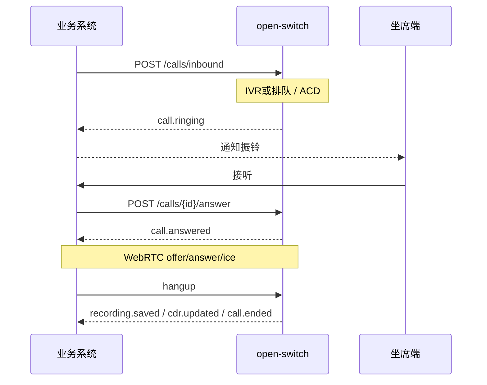
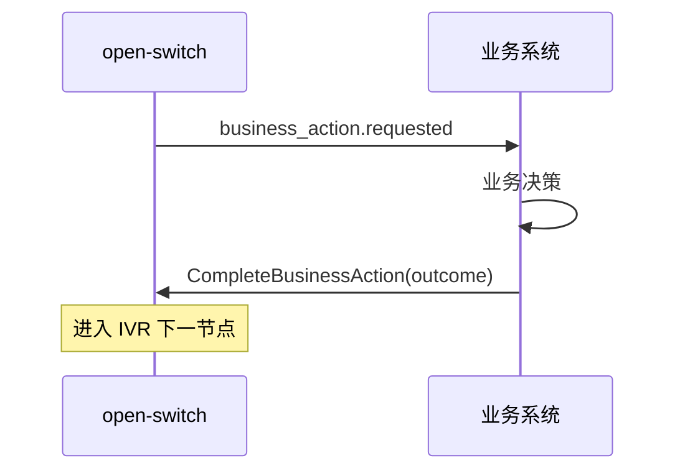

# open-switch 业务对接协议

面向**第三方业务系统**开发人员：说明如何与 softswitch（open-switch）对接。  
业务系统扮演呼叫中心业务面角色；Switch 负责媒体、呼叫状态机、ACD/IVR/录音。

基路径：`{switch_base_url}/switch/v1`  
字段与路径以当前实现为准；冲突时以 Switch 代码为准。

---

## 1. 交互模型

```
业务系统  ──HTTP──►  open-switch /switch/v1     （命令、配置、信令）
open-switch ──HTTP POST──► 业务系统 callback URL （事件推送）
```

| 方向 | 通道 | 说明 |
|------|------|------|
| 业务 → Switch | REST JSON | 无 `Authorization`；依赖私有网络隔离 |
| Switch → 业务 | `POST events_callback_url` | 无 `Authorization`；主路径为推送，`GET /events` 仅用于对账 |

Switch 侧须配置完整回调地址，例如：

```yaml
integration:
  events_callback_url: "http://biz.internal/integration/switch/events"
```

业务侧只需知道 Switch 根地址（如 `http://127.0.0.1:8082`）。

### 1.1 请求头

| Header | 说明 |
|--------|------|
| `Content-Type` | `application/json` |
| `Idempotency-Key` | 变更类命令幂等键（建议必带） |
| `X-Request-ID` / `X-Trace-ID` | 可选追踪 |

### 1.2 统一响应信封

```json
{
  "code": "OK",
  "message": "成功",
  "data": { },
  "request_id": "..."
}
```

成功时业务载荷在 `data`。失败时 `code` / `error` / `message` 描述原因；常见 HTTP：`400` 校验、`403` 无激活配置、`404` 不存在、`409` 版本/状态冲突。

---

## 2. 通话控制

变更类请求可带 body `expected_version`（与当前 `CallView.version` 不一致则 `409`），以及 Header `Idempotency-Key`。

### 2.1 通用类型

**`session_type`**：`audio` | `video` | `mixed`

**`hangup.reason`**：`normal`（默认）| `timeout` | `abandon` | `error` | `transfer`

**`leg.role`**：`customer` | `agent` | `ivr_bot` | `supervisor` | `pstn`

**Call FSM `state`**：`created` | `ivr` | `queued` | `ringing` | `active` | `held` | `transferring` | `ended`

#### `CallView`（多数接口的 `data`）

| 字段 | 类型 | 说明 |
|------|------|------|
| `id` | string | 通话 ID |
| `version` | int64 | 乐观锁版本 |
| `config_version` | int64? | 绑定的激活配置版本 |
| `state` | string | FSM 状态 |
| `direction` | string | inbound / outbound 等 |
| `session_type` | string | 媒介类型 |
| `queue_id` | string? | 当前队列 |
| `agent_id` | string? | 振铃或接听坐席 |
| `caller` / `callee` | string | 主被叫标识 |
| `held` | bool? | 是否保持 |
| `recording_notice` | string? | 录音告知文案 |
| `terminal_type` | string? | 终端类型 |
| `created_at` / `answered_at` / `ended_at` | time | 时间戳 |
| `legs` | `LegView[]` | 媒体腿 |

#### `LegView`

| 字段 | 类型 | 说明 |
|------|------|------|
| `id` | string | 腿 ID |
| `role` | string | 见 `leg.role` |
| `agent_id` | string? | 坐席腿时的坐席 ID |

### 2.2 创建与结束

| 方法 | 路径 | 请求体要点 | 响应 |
|------|------|------------|------|
| POST | `/calls/inbound` | `queue_id?`, `session_type?`, `priority?`, `caller?`, `skip_ivr?`, `call_id?`, `guest_session_id?` | `201` + `CallView` |
| POST | `/calls/outbound` | `agent_id`, `destination`, `trunk_id?` | `CallView` |
| POST | `/calls/{callId}/answer` | `agent_id`（须为当前 offered 坐席）, `expected_version?` | `CallView` |
| POST | `/calls/{callId}/decline` | `agent_id`, `expected_version?` | — |
| POST | `/calls/{callId}/hangup` | `reason?`, `expected_version?` | — |
| POST | `/calls/{callId}/hold` | `on` bool, `expected_version?` | — |

> inbound 的 `config_version` / `ivr_flow_id` 由 Switch（DID 等）注入，**不可**由客户端伪造。须先有激活配置，否则 `403`。

挂断顺序（Switch 侧）：释放坐席 → 停录音 → `cdr.updated` → `call.ended`。

### 2.3 转接 / 会议 / 主管

| 方法 | 路径 | Body |
|------|------|------|
| POST | `/calls/{callId}/transfer` | `mode`=`blind`\|`consult`；`target_agent_id` 与 `target_queue_id` 二选一；`expected_version?` |
| POST | `/calls/{callId}/transfer/complete` | 无（完成咨询转） |
| POST | `/calls/{callId}/conference` | `agent_id` |
| POST | `/supervisor/calls/{callId}/listen` | `agent_id` → `data.leg_id` |
| POST | `/supervisor/agents/{agentId}/force-check-out` | `policy` |

### 2.4 视频 / 屏幕共享 / DTMF

| 方法 | 路径 | Body |
|------|------|------|
| POST | `/calls/{callId}/video/request` | `from_leg_id` |
| POST | `/calls/{callId}/video/respond` | `accept` bool |
| POST | `/calls/{callId}/video/downgrade` | — |
| POST | `/calls/{callId}/screen-share` | `on`, `leg_id` |
| POST | `/calls/{callId}/dtmf` | `leg_id`, `digit` |

### 2.5 WebRTC 信令

| 方法 | 路径 | 请求 | 响应 `data` |
|------|------|------|-------------|
| POST | `/calls/{callId}/legs/{legId}/offer` | — | `{ sdp, type }` |
| POST | `/calls/{callId}/legs/{legId}/answer` | `sdp`, `type` | `{ ok }` |
| POST | `/calls/{callId}/legs/{legId}/ice` | `candidate`, `sdp_mid`, `sdp_mline_index?` | — |
| POST | `/calls/{callId}/legs/{legId}/mute` | `audio`, `video` | `{ ok }` |
| GET | `/calls/{callId}/turn-credentials?subject=` | — | TURN 凭证（含 `stun_urls`、`ur_ls`、`username`、`credential`、`ttl`） |

媒体权威在 Switch；业务系统只转发信令 API，不持有 RTP。

### 2.6 查询

| 方法 | 路径 | 说明 |
|------|------|------|
| GET | `/calls/{callId}` | 单通话 `CallView` |
| GET | `/calls?status=open` | 未结束通话；`data.items[]` |
| GET | `/internal/calls` / `/internal/calls/{callId}` | 运行时查询 |
| GET | `/events?after_id=&limit=` | 事件对账（主路径仍是 callback） |
| GET | `/commands/{commandId}` | 幂等命令状态 |
| GET | `/routing-sessions/{callId}` | 路由/IVR 会话快照 |
| GET | `/internal/recordings/{callId}/{recordingId}` | 下载录音文件 |

### 2.7 Direct / 桥接 / 腿（高级编排）

| 能力 | 方法 | 路径 | 主要字段 |
|------|------|------|----------|
| 空 Call | POST | `/calls` | `call_id`, `business_ref?`, `metadata?` |
| 直控创建 | POST | `/calls/direct` | `call_id`, `direction`, `caller`, `callee`, `session_type`, `initial_leg_role`, `agent_id?` |
| 加腿 | POST | `/calls/{id}/legs` | `role`, `agent_id?` |
| SIP 腿 | POST | `/calls/{id}/legs/sip` | `destination`, `trunk_id?` |
| 离腿 | DELETE | `/calls/{id}/legs/{legId}` | — |
| 建/换/拆桥 | POST/PUT/DELETE | `/calls/{id}/bridges...` | `leg_a`/`leg_b` 或 `leg_ids[]` |
| 腿保持/拒接 | POST | `.../legs/{legId}/hold\|reject` | `on` / `reason` |
| 放音 | POST/DELETE | `.../playbacks` | `asset_id` |
| 开/停录 | POST | `.../recording/start\|stop` 或 `.../recordings...` | — |

### 2.8 IVR 业务动作回填

```http
POST /switch/v1/calls/{callId}/business-actions/{actionId}/complete
```

| 字段 | 类型 | 说明 |
|------|------|------|
| `outcome` | string | 必须是流程声明的 `outcomes` 键之一 |

收到事件 `business_action.requested` 后须在 **deadline** 前调用本接口。相同 outcome 重放成功；不同 outcome → `409`；超时后 → `409`。

---

## 3. 配置与坐席运行态

**先激活配置，再产生呼叫。** 新激活仅影响新呼叫；在途通话绑定创建时的 `config_version`。

### 3.1 整包 Store + Activate

```http
POST /configuration/versions
POST /configuration/versions/{version}/activate
GET  /configuration/active
GET  /configuration/active/summary
```

（兼容别名 `/config-versions/...`）

`POST /configuration/versions` body：

| 字段 | 类型 | 说明 |
|------|------|------|
| `version` | int64? | 可选 |
| `queues` | QueueConfig[] | 队列 |
| `skills` | SkillConfig[] | 技能 |
| `agents` | AgentConfig[] | 坐席 |
| `dids` | DIDConfig[] | DID |
| `ivrs` | IVRConfig[] | 已发布 IVR |

响应 `ConfigVersion`：`version`, `status`, `checksum`, `created_at`, `activated_at?`。

适用：环境导入、整包备份恢复。日常单资源变更用 3.2。

### 3.2 资源级增量 API

每次写操作内部等价于「读当前激活包 → 改一处 → Store + Activate」。列表响应为 `{ "items": [...] }`（仍包在全局 `data` 内）；`DELETE` 多为 `204`。

#### 队列 `/queues`

| 方法 | 路径 | Body |
|------|------|------|
| GET | `/queues` | — |
| POST | `/queues` | `QueueConfig`（`id` 可空自动生成） |
| GET/PATCH/DELETE | `/queues/{queueId}/config` | PATCH 见合并语义 |
| PUT | `/queues/{queueId}/agents` | `{ agent_ids: string[] }` 整表替换 |
| PUT | `/queues/{queueId}/skills` | `{ skill_ids: string[] }` 整表替换 |

**QueueConfig 主要字段**

| 字段 | 说明 | 默认 |
|------|------|------|
| `id` / `name` | UUID / 名称（name 必填） | id 可生成 |
| `video_enabled` | 是否视频 | false |
| `max_wait_sec` | 最大等待秒 | 300 |
| `dispatch_strategy` | `longest_idle` \| `round_robin` | `longest_idle` |
| `recording_policy` | `off` \| `audio` \| `video_composite` | `off` |
| `overflow_action` | `hangup` \| `voicemail` \| `queue` | `hangup` |
| `overflow_queue_id` | 溢出目标队列（action=`queue` 时） | — |
| `ivr_flow_id` | 绑定已发布 IVR | — |
| `wait_prompt` / `announce_recording` / `priority_enabled` | 等候与录音告知、优先级 | — |
| `business_hours_json` / `after_hours_action` | 营业时间与非工作动作 | after=`hangup` |
| `force_hangup_on_checkout` / `listen_announce` | 签出强挂 / 监听告知 | false |
| `skill_ids` / `agent_ids` | 技能与坐席成员 | — |

PATCH 合并：字符串/数值非空才覆盖；`skill_ids`/`agent_ids` 非 null 才覆盖；若干 bool **始终覆盖**（漏传会变 `false`）。改成员更推荐 `PUT .../agents|skills`。

#### 技能 `/skills`

| 方法 | 路径 | Body |
|------|------|------|
| GET/POST | `/skills` | POST: `{ id?, name }`（名称大小写不敏感唯一） |
| PATCH/DELETE | `/skills/{skillId}` | PATCH: `{ name }` |

#### 坐席配置 `/agents`

| 方法 | 路径 | Body |
|------|------|------|
| GET | `/agents/config` | — |
| PUT | `/agents/{agentId}/config` | `AgentConfig` Upsert |
| DELETE | `/agents/{agentId}/config` | — |
| PUT | `/agents/{agentId}/skills` | `{ skill_ids }` |

**AgentConfig**：`id`, `user_ref`（必填）, `extension`（必填、唯一）, `display_name?`, `video_capable`, `terminal_type`=`webrtc`\|`sip`, `sip_username?`（sip 必填）, `enabled`, `skill_ids?`。

#### DID `/did-routes`

| 方法 | 路径 | 说明 |
|------|------|------|
| GET/POST | `/did-routes` | POST Upsert |
| PATCH/DELETE | `/did-routes/{didId}` | PATCH 仅非空字段覆盖 |

**DIDConfig**：`id`, `trunk_id`（空→`*`）, `did`, `target_type`=`queue`\|`ivr`\|`reject`, `target_id?`（reject 须空）。唯一键：`(trunk_id, did)`。

#### IVR 已发布 `/ivr/flows`

**草稿由业务系统自行管理**；Switch 只存已校验的有效 payload，供话务使用。

| 方法 | 路径 | Body |
|------|------|------|
| GET | `/ivr/flows` / `/ivr/flows/{flowId}` | — |
| POST/PUT | `/ivr/flows` / `/ivr/flows/{flowId}` | `id`/`flow_id?`, `payload_json` 或 `payload` |
| DELETE | `/ivr/flows/{flowId}` | 有 DID 引用则拒绝 |

响应 `IVRPublishedView`：`flow_id`, `version`, `payload_json`。每次 Upsert 对该 flow **version+1** 并激活新配置包。

### 3.3 坐席签入

| 方法 | 路径 | Body | 响应 |
|------|------|------|------|
| POST | `/agents/{agentId}/check-in` | `{ queue_ids: string[] }` | `AgentSession` |
| POST | `/agents/{agentId}/check-out` | — | — |
| PUT | `/agents/{agentId}/presence` | `{ state, reason? }` | `AgentSession` |
| GET | `/agents/{agentId}/session` | — | `AgentSession` |

**AgentSession**：`agent_id`, `state`（idle/busy/ringing/on_call/acw 等）, `busy_reason?`, `current_call_id?`, `queue_ids`。

---

## 4. 事件回调（Switch → 业务系统）

### 4.1 投递约定

| 项 | 约定 |
|----|------|
| 方法 | `POST` 到 Switch 配置的 `events_callback_url` |
| 鉴权 | 无 |
| 超时 | 约 10s |
| 重试 | 失败指数退避，最多约 12 次 |
| 成功 Ack | HTTP 2xx，且 body（或 `data` 内）`accepted=true`；`event_id` 为空或等于本次事件 `id` |

建议应答：

```json
{ "code": "OK", "data": { "accepted": true, "event_id": 123 } }
```

按全局事件 `id` 做幂等游标；重复投递应安全。

### 4.2 Event 顶层字段

| 字段 | 类型 | 说明 |
|------|------|------|
| `id` | int64 | **全局单调**事件 ID |
| `call_id` | string | 通话 ID（部分坐席事件可空） |
| `seq` | int64 | **单通话内**序号，从 1 递增 |
| `version` | int64 | 关联通话版本 |
| `command_id` | string? | 关联幂等命令 |
| `agent_id` | string | 目标坐席 |
| `target_only` | bool | `true` 时勿向访客广播 |
| `type` | string | 事件类型 |
| `payload` | object | 类型相关载荷 |
| `created_at` | time | UTC |

对账：`GET /switch/v1/events?after_id=&limit=` → `{ items: Event[] }`。

### 4.3 主要事件类型

#### 生命周期

| type | 典型 payload | 说明 |
|------|--------------|------|
| `call.created` | `direction` | 创建 |
| `call.state_changed` | `state`, `queue_id`, `version` | FSM |
| `leg.incoming` | `leg_id`, `role` | 客户腿 |
| `call.ringing` / `leg.ringing` | `queue_id`, `caller`, `agent_id`… | 振铃 |
| `call.answered` | `agent_id` | 接通 |
| `call.hold` / `call.unhold` | — | 保持 |
| `call.ended` | — | 结束 |
| `call.transferring` / `call.consulting` / `call.transferred` | — | 转接 |
| `call.voicemail` / `call.supervisor_listen` / `call.media_reconnect_required` / `call.device_failed` | — | 其它 |

#### 排队 / IVR

| type | 说明 |
|------|------|
| `routing.entered_ivr` | 进入 IVR |
| `ivr.prompt` | 提示 |
| `queue.entered` / `queue.position_changed` / `queue.overflowed` | 排队 |
| `acd.agent_reserved` | ACD 预留 |

#### 录音 / CDR（业务侧应落库投影）

| type | payload 要点 |
|------|----------------|
| `recording.notice` / `started` / `stopped` / `failed` | 录音过程 |
| `recording.saved` | `id`, `call_id`, `file_path`, `media_type`, `started_at`, `ended_at?`, `retain_until?`, `file_size` |
| `cdr.updated` | `call_id`, `direction`, `queue_id`, `agent_id`, `caller`, `callee`, `session_type`, `result`（answered/abandoned/failed）, `started_at`, `answered_at?`, `ended_at?`, `video_*`, `screen_share_count`… |

#### 业务动作（必须处理）

| type | payload |
|------|---------|
| `business_action.requested` | `call_id`, `action_id`, `node_id`, `action`, `deadline`, `outcomes`（键→下一节点） |
| `business_action.completed` / `expired` | `action_id`, `outcome?` |

对 `requested`：在 deadline 内 `POST .../business-actions/{actionId}/complete` 提交 `outcome`。决策应快于 Dispatcher 超时（约 10s）。

#### 坐席 / Direct / 命令

| type | 说明 |
|------|------|
| `agent.routing_state_changed` | 常带 `target_only=true` |
| `leg.*` / `bridge.*` | Direct 腿与桥接 |
| `command.accepted` / `succeeded` / `failed` | 幂等命令结果 |

---

## 5. 典型时序

### 5.1 Web 呼入（业务系统创建）


```mermaid
sequenceDiagram
  participant Biz as 业务系统
  participant SW as open-switch
  participant Agent as 坐席端

  Biz->>SW: POST /calls/inbound
  Note over SW: IVR或排队 / ACD
  SW-->>Biz: call.ringing
  Biz-->>Agent: 通知振铃
  Agent->>Biz: 接听
  Biz->>SW: POST /calls/{id}/answer
  SW-->>Biz: call.answered
  Note over Biz,SW: WebRTC offer/answer/ice
  Biz->>SW: hangup
  SW-->>Biz: recording.saved / cdr.updated / call.ended
```

### 5.2 SIP/DID 呼入

Switch 本地解析 DID 后建呼，**不经**业务系统的 inbound API；业务系统只收事件并驱动坐席侧信令/接听。

### 5.3 business_action


```mermaid
sequenceDiagram
  participant SW as open-switch
  participant Biz as 业务系统
  SW->>Biz: business_action.requested
  Biz->>Biz: 业务决策
  Biz->>SW: CompleteBusinessAction(outcome)
  Note over SW: 进入 IVR 下一节点
```

### 5.4 配置发布

日常：3.2 资源 API（队列/技能/DID/坐席绑定等）每次写即激活新版本；**Switch 为运行时配置真相源**。  
整包：`POST /configuration/versions` → `POST .../activate`（configio 导入/灾备用）。  
open-call 的 `oc_queues` / `oc_did_routes` 等为遗留镜像，访客签发与实时报表直接读 Switch，不再以本地表为准。

---

## 6. 一致性约束（必读）

1. **先激活配置，再呼叫**  
2. **事件全局 `id` 单调**；业务侧游标只前进，乱序晚到应幂等忽略  
3. Switch **先落库再推送**；Ack 失败会重试，业务侧须幂等  
4. 同 `call_id` 命令串行；配合 `expected_version` 与 `Idempotency-Key`  
5. 仅当前 offered 坐席可 Answer  
6. 录音通常在接通后开始；无队列通话默认不录音（`off`），须显式策略才录  
7. `business_action` 须在 deadline（及推送超时）内回填  
8. **单实例部署**：控制面 FSM / 媒体 / SIP registrar 不跨进程；勿多活共享库  
9. 呼入 `config_version` 由 Switch 从激活配置或 DID/队列注入，客户端不可伪造  

联调检查：

- [ ] Switch 已配可达的 `events_callback_url`  
- [ ] 已激活含队列/坐席/DID（如需）的配置  
- [ ] 坐席已 check-in 到目标队列  
- [ ] callback 返回 `accepted:true` 且 `event_id` 匹配  
