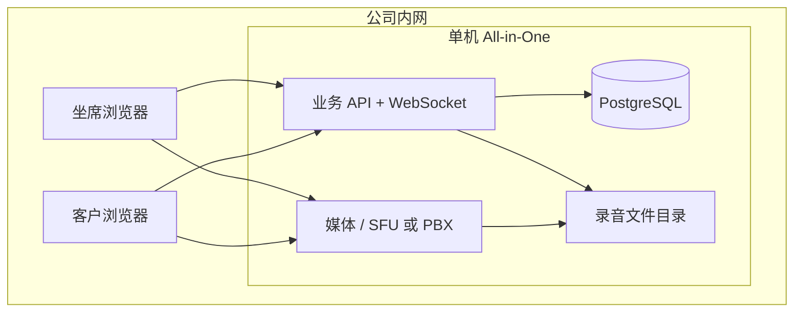

# Open VoIP 呼叫中心需求列表

> 2026-09-22 范围调整（用户确认）：open-call / open-switch 按业务边界拆分；SIP 中继/PBX/网关与 SIP 话机/软电话坐席均为交付目标，不再将 SIP 仅作为可选演示。单实例可同机或分机部署，仍不承诺集群高可用。以下 v0.3 为原始需求基线，冲突处以本条及 [上线验收矩阵](sip-production-acceptance.md) 为准。

新增验收：BOUNDARY-01 用户身份不能由客户端伪造；BOUNDARY-02 业务库与话务库独立；BOUNDARY-03 文件由交换服务管理；SIP-SEAT-01 独立凭证注册与坐席绑定；SIP-SEAT-02 队列派单到话机；SIP-SEAT-03 坐席设备发起分机/中继外呼；RECOVERY-01 回调重试与重启收尾。每项都必须记录测试环境和结果，不能以代码存在代表验收完成。

> 范围：后台服务端 + 简易客户端 Demo（语音坐席 + 视频坐席）  
> **部署场景：小型公司内网、单机部署（All-in-One）**  
> 版本：v0.3  
> 说明：需求 ID 便于排期与验收；优先级 P0=首期 MVP，P1=二期，P2=增强/可选。

---

## 0. 部署场景与规模假设

### 0.1 目标场景

| 项 | 假设 |
|----|------|
| 组织规模 | 小型公司，坐席约 **5～30 人**，管理员 1～2 人 |
| 网络 | **公司内网**（同一 LAN 或经内网 DNS 可达）；客户端通过内网 URL 访问 |
| 部署形态 | **单台服务器**（物理机或 VM）运行全部组件；不要求集群与高可用 |
| 客户来源 | 以内网访客页/内网链接为主；**不要求**首期对接公网 PSTN |
| 运维 | 单点维护、可接受计划内停机；备份与磁盘由管理员自行管理 |

### 0.2 单机拓扑（逻辑）

### 0.3 容量目标（单机验收参考）

| 指标 | 建议目标 | 说明 |
|------|----------|------|
| 同时在线坐席 | ≤ 30 | 超过需硬件升级或拆媒体节点（Out of Scope） |
| 并发语音通话 | **≥ 10 路**（P0 验收） | 典型小型队列足够 |
| 并发视频通话 | **≥ 5 路 720p**（P1 验收） | 受 CPU/带宽影响大，文档给出最低硬件建议 |
| 录音存储 | 本地磁盘 | 按保留策略估算容量（见 DEPLOY-05） |

### 0.4 对需求优先级的整体影响

- **弱化**：多租户、跨公网 TURN、K8s/多节点、PSTN、Webhook 高可用投递  
- **强化**：单机二进制安装、内网 HTTPS、配置导出备份、本机磁盘与日志  
- **TURN**：纯二层/同一网段可 **P1 可选**；存在 **跨 VLAN、对称 NAT、Wi‑Fi 访客网** 时升为 **P0**

---

## 1. 文档约定

| 字段 | 含义 |
|------|------|
| **ID** | 唯一编号，格式 `模块-序号` |
| **优先级** | P0 / P1 / P2 |
| **角色** | 系统、管理员、班长、坐席、客户、访客 |

---

## 2. 平台与基础能力

| ID | 需求描述 | 优先级 | 角色 | 验收要点 |
|----|----------|--------|------|----------|
| PLAT-01 | 内网 HTTPS：支持内网 DNS 主机名或 IP；文档含 **企业 CA / 自签证书** 导入浏览器步骤 | P0 | 系统 | 内网坐席机可稳定获取麦克风/摄像头权限 |
| PLAT-02 | 统一认证：坐席/管理员登录，签发可撤销的访问令牌（如 JWT） | P0 | 坐席、管理员 | 未登录不可调用业务 API |
| PLAT-03 | RBAC：至少区分管理员、班长、坐席；权限控制管理接口与敏感操作 | P1 | 管理员 | 坐席无法修改队列/IVR 全局配置 |
| PLAT-04 | 多租户隔离（SaaS） | — | — | **Out of Scope**（单机内网单组织） |
| PLAT-05 | 操作与访问审计日志（登录、配置变更、录音回放） | P1 | 系统 | 可按人、时间检索 |
| PLAT-06 | 健康检查与基础监控指标（服务存活、活跃通话数、WebSocket 连接数） | P1 | 系统 | 提供 `/health` 或等价探针 |
| PLAT-07 | API 限流与防暴力登录 | P2 | 系统 | 内网可信环境可放宽；公网暴露时必须启用 |

---

## 2.1 单机部署与运维

| ID | 需求描述 | 优先级 | 角色 | 验收要点 |
|----|----------|--------|------|----------|
| DEPLOY-01 | 提供 **单机安装**（本机 PostgreSQL + 二进制 + 前端静态站），组件默认本机互联 | P0 | 管理员 | 一台干净内网机器按文档可启动全栈 |
| DEPLOY-02 | 统一配置文件（或 `.env`）：监听地址、内网访问 URL、数据库路径、录音目录 | P0 | 管理员 | 改一处即可让坐席用 `https://cc.internal` 访问 |
| DEPLOY-03 | 默认绑定内网 IP/端口；文档说明防火墙仅需开放 **443（Web）+ 媒体 UDP 端口段** | P0 | 管理员 | 同网段坐席可注册/通话 |
| DEPLOY-04 | 数据持久化：PostgreSQL 数据目录与录音目录落本机磁盘；**升级二进制不丢数据** | P0 | 系统 | 重启/升级后 CDR 与录音仍在 |
| DEPLOY-05 | 安装文档含 **最低硬件建议**（CPU/内存/磁盘）及录音磁盘估算公式 | P1 | 管理员 | 小型公司可按文档采购/分配 VM |
| DEPLOY-06 | 配置与数据备份：支持导出用户/队列配置 + 说明如何备份 DB 与录音目录 | P1 | 管理员 | 可按文档完成冷备份恢复演练 |
| DEPLOY-07 | 可选 **离线安装** 说明（无法访问公网时拷贝二进制与前端 `dist`） | P2 | 管理员 | 文档路径清晰 |
| DEPLOY-08 | 单进程/单节点健康汇总（各子服务状态一页或一条 API） | P1 | 管理员 | 与 PLAT-06 一致，便于内网运维 |

---

## 3. 语音 VoIP 与媒体

| ID | 需求描述 | 优先级 | 角色 | 验收要点 |
|----|----------|--------|------|----------|
| MEDIA-01 | 坐席分机注册与鉴权（SIP 或 WebRTC 等价账号） | P0 | 坐席 | 签入后媒体层在线 |
| MEDIA-02 | 坐席间 / 测试分机语音互通（呼入、接听、挂断） | P0 | 坐席 | 双向可听清，CDR 有记录 |
| MEDIA-03 | 支持常用音频编解码（至少 Opus 或 G.711 之一） | P0 | 系统 | 协商成功无静音假通 |
| MEDIA-04 | ICE：内网直连为主；**STUN** 默认可用（可指向本机或省略） | P0 | 系统 | 同网段坐席互通无需公网 STUN |
| MEDIA-04b | **TURN**（本机 coturn 或与媒体同机）：跨 VLAN / 对称 NAT 时启用 | P1 | 系统 | 文档说明何时必须开 TURN；开启后跨网段可通话 |
| MEDIA-05 | 通话中静音、保持（Hold）、恢复 | P1 | 坐席 | 对端感知符合设计（保持音或静音） |
| MEDIA-06 | DTMF 发送（IVR 与拨号盘） | P1 | 坐席、客户 | IVR 按键可识别 |
| MEDIA-07 | 出局/PSTN 中继对接 | P2 | 系统 | **非内网典型需求**；有外线时再启用 |
| MEDIA-08 | 外显号码/DID 配置与路由 | P2 | 管理员 | 依赖 MEDIA-07 |
| MEDIA-09 | 内网 **分机互拨**（短号/分机号）满足日常外呼 Demo | P1 | 坐席 | CALL-01 可呼叫 `1xxx` 分机，无需 PSTN |

---

## 4. 呼叫中心 — 组织与坐席状态

| ID | 需求描述 | 优先级 | 角色 | 验收要点 |
|----|----------|--------|------|----------|
| AGENT-01 | 坐席账号 CRUD、重置凭证、关联技能组/队列 | P0 | 管理员 | 新坐席可签入指定队列 |
| AGENT-02 | 坐席签入/签出；签出后不再分配来电 | P0 | 坐席 | 状态与分配逻辑一致 |
| AGENT-03 | 坐席状态：空闲、示忙、通话中、事后处理（ACW） | P0 | 坐席 | 状态变更实时同步至服务端 |
| AGENT-04 | 示忙原因（小休、培训等）可选 | P1 | 坐席 | 报表可按原因统计 |
| AGENT-05 | 班长强制签出坐席 | P1 | 班长 | 被签出坐席通话按策略处理 |
| AGENT-06 | 技能组：坐席可多技能；路由按技能匹配 | P1 | 管理员 | 仅匹配技能坐席接起 |
| AGENT-07 | 视频技能标识：坐席是否具备视频服务能力 | P0 | 管理员 | 视频队列不分配给仅语音坐席 |

---

## 5. 呼叫中心 — 队列与路由

| ID | 需求描述 | 优先级 | 角色 | 验收要点 |
|----|----------|--------|------|----------|
| QUEUE-01 | 呼入队列配置：名称、最大等待时长、排队提示音/文案 | P0 | 管理员 | 超时按策略结束或溢出 |
| QUEUE-02 | 分配策略：至少支持一种（如最长空闲或轮询） | P0 | 系统 | 多坐席空闲时分配可预期 |
| QUEUE-03 | 客户呼入进入队列；坐席空闲时振铃并接起 | P0 | 客户、坐席 | 端到端呼入成功 |
| QUEUE-04 | 队列类型：语音队列 / 视频队列（或队列级 `video_enabled`） | P0 | 管理员 | 视频单不进入纯语音队列 |
| QUEUE-05 | 排队位置或预计等待（简易文案即可） | P1 | 客户 | 等待页展示状态 |
| QUEUE-06 | 溢出：超时转语音队列、留言或结束（可配置一种） | P1 | 管理员 | 触发条件生效 |
| QUEUE-07 | 优先级队列或 VIP 路由 | P2 | 管理员 | 高优先级先入队或先分配 |

---

## 6. 呼叫中心 — 通话控制与 IVR

| ID | 需求描述 | 优先级 | 角色 | 验收要点 |
|----|----------|--------|------|----------|
| CALL-01 | 坐席外呼：输入号码或分机发起呼叫 | P1 | 坐席 | 外呼 CDR 正确 |
| CALL-02 | 盲转、咨询转（至少盲转） | P1 | 坐席 | 通话转至目标坐席/队列 |
| CALL-03 | 三方通话或专家邀请（Web 场景） | P2 | 坐席 | 第三人加入同一会话 |
| CALL-04 | 班长监听（语音） | P2 | 班长 | 不影响客户感知或可配置提示 |
| IVR-01 | 简易 IVR：按键菜单（如 1 语音 / 2 视频） | P1 | 客户 | 分支进入对应队列 |
| IVR-02 | 播放预录语音或 TTS 提示 | P1 | 管理员 | 节点可配置提示内容 |
| IVR-03 | 工作时间：非工作时间播放提示并结束或留言 | P2 | 管理员 | 时间外不走坐席分配 |

---

## 7. 视频坐席

| ID | 需求描述 | 优先级 | 角色 | 验收要点 |
|----|----------|--------|------|----------|
| VIDEO-01 | 1:1 视频通话：音视频同步，挂断释放资源 | P0 | 坐席、客户 | 双方可见可听（允许仅音频入会） |
| VIDEO-02 | 客户入队前：浏览器权限引导页（摄像头/麦克风） | P0 | 客户 | 拒绝权限时有明确提示与降级路径 |
| VIDEO-03 | 坐席端设备选择：摄像头、麦克风、扬声器 | P0 | 坐席 | 切换设备后通话继续 |
| VIDEO-04 | 坐席本地预览（签入或振铃阶段） | P1 | 坐席 | 预览与正式发送一致 |
| VIDEO-05 | 通话中开关摄像头/麦克风 | P0 | 坐席、客户 | 状态同步，关摄像头不中断音频（若会话仍为 mixed） |
| VIDEO-06 | 语音通话中升级视频：一方请求，另一方同意/拒绝 | P1 | 坐席、客户 | 拒绝后保持语音；同意后出现视频轨 |
| VIDEO-07 | 降级为仅语音（关闭视频保留音频） | P1 | 坐席、客户 | 队列/报表记 session_type 变化 |
| VIDEO-08 | 屏幕共享（坐席为主，客户可选） | P1 | 坐席 | 共享期间布局以共享内容为主 |
| VIDEO-09 | 视频转接：目标坐席须具备视频能力且就绪 | P1 | 坐席 | 转接失败有明确原因 |
| VIDEO-10 | 带宽/终端粗检（可选）：弱网提示关闭视频 | P2 | 客户 | 提示后可选继续语音 |
| VIDEO-11 | 视频会话与房间 ID 绑定；与 CDR 同一 call_id 关联 | P0 | 系统 | 单通话全链路可追踪 |
| VIDEO-12 | TURN 凭证短期签发（启用 TURN 时；按房间或用户） | P1 | 系统 | 与 MEDIA-04b 一致；纯同网段未启 TURN 时可 N/A |

---

## 8. 录制、合规与质检

| ID | 需求描述 | 优先级 | 角色 | 验收要点 |
|----|----------|--------|------|----------|
| REC-01 | 语音通话录音（全程或按队列策略） | P1 | 系统 | 录音文件可凭 call_id 检索 |
| REC-02 | 视频通话录制（合流或主画面+音频） | P1 | 系统 | 回放音画同步可接受 |
| REC-03 | 录制前告知：语音/视频/屏幕共享适用提示文案 | P1 | 客户 | 配置可开关（合规按业务定） |
| REC-04 | 录音/录像访问 RBAC；下载审计 | P1 | 班长、管理员 | 坐席默认不可下他人录像 |
| REC-05 | 保留周期与自动清理策略 | P2 | 管理员 | 过期文件不可访问 |
| QA-01 | 质检：按通话回放并打时间戳标记 | P2 | 班长 | 标记持久化 |

---

## 9. 实时事件与 CDR

| ID | 需求描述 | 优先级 | 角色 | 验收要点 |
|----|----------|--------|------|----------|
| EVT-01 | WebSocket（或 SSE）推送：来电、振铃、接通、挂断、队列变更 | P0 | 坐席 | 坐席 UI 无需轮询即可响铃 |
| EVT-02 | 事件类型含：`call.ringing`、`call.answered`、`call.ended`、`agent.state_changed` | P0 | 系统 | 文档化 payload |
| EVT-03 | 视频相关事件：`video.requested`、`video.accepted`、`screen_share.started` 等 | P1 | 系统 | 与 session 状态一致 |
| CDR-01 | 生成 CDR：主被叫、起止时间、时长、队列、坐席、结果（接通/放弃/失败） | P0 | 系统 | 与真实通话一致 |
| CDR-02 | CDR 扩展：`session_type`（audio/video/mixed）、视频起止时间 | P0 | 系统 | 报表可区分媒介 |
| CDR-03 | CDR 导出 CSV（按时间范围） | P1 | 管理员 | 字段完整 |
| EVT-04 | Webhook 订阅关键事件（供 CRM 对接） | P2 | 系统 | 失败重试或死信可配置 |

---

## 10. 报表与监控

| ID | 需求描述 | 优先级 | 角色 | 验收要点 |
|----|----------|--------|------|----------|
| RPT-01 | 实时：在线坐席数、通话中数量、队列等待数 | P1 | 班长、管理员 | 延迟在秒级 |
| RPT-02 | 历史：接通率、平均等待、平均通话时长、放弃率 | P1 | 管理员 | 可按队列、日期筛选 |
| RPT-03 | 视频指标：视频接通率、语音升视频成功率、屏幕共享次数 | P1 | 管理员 | 与 CDR 字段一致 |
| RPT-04 | 坐席利用率、状态时长统计 | P2 | 管理员 | 与签入记录一致 |
| MON-01 | 单机资源视图：CPU/内存/磁盘占用、活跃会话数（进程或 API 暴露） | P1 | 管理员 | 内网运维可判断是否需要加硬盘/升配 |

---

## 11. 后台管理 API 与配置

| ID | 需求描述 | 优先级 | 角色 | 验收要点 |
|----|----------|--------|------|----------|
| ADM-01 | REST API：用户/坐席、队列、技能组 CRUD | P0 | 管理员 | OpenAPI 或等价文档 |
| ADM-02 | REST API：IVR 流程配置（简易树或 JSON 配置） | P1 | 管理员 | 发布后呼入生效 |
| ADM-03 | REST API：查询 CDR、录音元数据 | P1 | 管理员 | 分页与过滤 |
| ADM-04 | 配置变更版本或生效时间（避免半套配置） | P2 | 系统 | 呼入读取一致快照 |
| ADM-05 | 客户入会链接：内网 base URL + queue token；可配置 **有效时长** | P1 | 坐席、系统 | 链接形如 `https://cc.internal/guest?...`；过期不可用 |

---

## 12. 简易客户端 Demo — 坐席端

| ID | 需求描述 | 优先级 | 角色 | 验收要点 |
|----|----------|--------|------|----------|
| UI-A-01 | 登录页与 token 持久化（会话过期跳转登录） | P0 | 坐席 | 安全上下文下可用 |
| UI-A-02 | 签入：选择队列；展示当前状态与切换示闲/示忙 | P0 | 坐席 | 与 AGENT-* 一致 |
| UI-A-03 | 来电弹窗：主叫/队列名；接听、拒接 | P0 | 坐席 | 拒接后回到空闲/ACW |
| UI-A-04 | 通话中：时长、挂断、静音；视频单增加摄像头开关 | P0 | 坐席 | 与 MEDIA/VIDEO 一致 |
| UI-A-05 | 外呼拨号盘 | P1 | 坐席 | 可呼叫测试分机 |
| UI-A-06 | 屏幕共享按钮与状态提示 | P1 | 坐席 | 与 VIDEO-08 一致 |
| UI-A-07 | 简易通话小结（文本，提交后关联 call_id） | P1 | 坐席 | 后台可查询 |
| UI-A-08 | 语音升视频 / 降级的 UI 与对端确认 | P1 | 坐席 | 与 VIDEO-06/07 一致 |

---

## 13. 简易客户端 Demo — 客户/访客端

| ID | 需求描述 | 优先级 | 角色 | 验收要点 |
|----|----------|--------|------|----------|
| UI-C-01 | 通过链接或 Demo 入口选择「语音服务 / 视频服务」 | P0 | 客户 | 进入对应队列 |
| UI-C-02 | 等待页：排队状态文案 | P0 | 客户 | 接入坐席后自动进房 |
| UI-C-03 | 通话页：音频 UI；视频单显示远端与本地小窗 | P0 | 客户 | 挂断后释放设备 |
| UI-C-04 | 权限拒绝与重试引导 | P0 | 客户 | 可改选语音-only 路径（若配置） |
| UI-C-05 | 同意/拒绝坐席「开启视频」请求 | P1 | 客户 | 与 VIDEO-06 一致 |

---

## 14. 简易管理 Demo（可选界面）

| ID | 需求描述 | 优先级 | 角色 | 验收要点 |
|----|----------|--------|------|----------|
| UI-M-01 | 最小管理页或 Swagger：创建队列、绑定坐席 | P1 | 管理员 | 无需改库即可演示 |
| UI-M-02 | 实时队列监控大屏（简版数字卡片） | P2 | 班长 | 与 RPT-01 一致 |

---

## 15. 非功能需求

| ID | 需求描述 | 优先级 | 说明 |
|----|----------|--------|------|
| NFR-01 | 语音端到端延迟：内网典型 **< 150ms**（同交换机更佳） | P0 | 单机内网为主场景 |
| NFR-02 | 带宽：内网千兆交换机下 720p 单路约 1～2 Mbps；文档给出 **5 路视频 + 10 路语音** 估算 | P1 | 写入 DEPLOY-05 |
| NFR-03 | 媒体与信令传输加密（TLS、SRTP/DTLS） | P0 | 默认开启；自签证书需文档说明信任链 |
| NFR-04 | 单机并发：**≥ 10 路语音**（P0）、**≥ 5 路 720p 视频**（P1） | P0/P1 | 见 §0.3；超出为硬件升级非集群 |
| NFR-05 | 关键服务可配置日志级别；通话异常可关联 trace/call_id | P1 | 排障 |
| NFR-06 | 浏览器兼容：Chrome/Edge 最新版；Safari 视频需验证 H.264 | P1 | 兼容性列表 |
| NFR-07 | 隐私：屏幕共享与录制需产品层策略说明 | P1 | 对接 REC-03 |

---

## 16. 分期交付建议

### 16.1 一期 MVP（P0 全集）

- **DEPLOY-01～04**：单机二进制安装、内网 HTTPS、数据持久化  
- 认证、坐席签入与状态、内网语音互通（ICE 直连）  
- 语音/视频队列、基础分配、WebSocket 来电  
- 1:1 视频、设备与权限引导、房间与 CDR 关联  
- 坐席端 + 客户 Demo（内网 URL）  
- CDR 基础字段与 `session_type`

### 16.2 二期（P1）

- IVR、录音/录像、屏幕共享、升/降级视频  
- 转接、外呼、报表与实时监控、通话小结  
- 管理配置 API 完善、入会链接  

### 16.3 三期（P2）

- PSTN、Webhook、质检、高级 IVR、班长强插、离线安装包等  

---

## 17. Out of Scope（当前版本明确不做）

- **多节点集群、K8s、异地双活、负载均衡多机**  
- **多租户 SaaS**（PLAT-04）  
- 预测式/预览式外呼 campaign 完整平台  
- 原生 iOS/Android 坐席 App（Demo 以 Web 为主）  
- AI 实时质检、虚拟背景、证件 OCR  
- 完整 CRM/工单系统（仅预留 Webhook/弹屏字段）  
- 依赖公网云的必选组件（首期必须可 **完全内网闭环** 运行）  

---

## 18. 修订记录

| 版本 | 日期 | 说明 |
|------|------|------|
| v0.1 | 2026-09-18 | 初稿：语音呼叫中心 + 视频坐席 + Demo |
| v0.3 | 2026-09-18 | 唯一数据引擎为 PostgreSQL；去掉 SQLite 拓扑 |
| v0.4 | 2026-09-24 | 明确 open-call/open-switch 边界；补充会话撤销、一次性访客令牌、Webhook 死信、配置预检恢复、结构化 ACW、质检评分及运维探针的生产要求 |

### 18.1 生产控制面补充验收

- 禁用账号、修改角色、重置或修改密码后，已有 REST、刷新令牌和 WebSocket 权限必须立即失效；管理员可撤销用户全部会话，用户可查看并撤销单个会话。
- 生产访客必须使用服务端签发的一次性短期令牌，队列优先级由受信任签发方决定；公开队列直连只允许显式演示模式。
- Webhook 事件必须先写 PostgreSQL，再由多实例安全的 worker 投递；任务具备稳定事件 ID、租约、退避、死信、查询及人工重放。
- 配置导入必须支持版本校验、引用预检、`dry_run` 和事务执行，并返回逐类恢复统计。配置包不替代数据库灾备。
- CDR 支持坐席、队列、方向、结果和时间过滤，大批量导出采用流式响应；录音列表不得返回服务器文件路径，过期文件删除失败必须重试。
- 通话小结支持处置码、标签和 ACW 完成；质检标记必须关联存在的话单与录音，校验时间范围，并支持评分、修改和删除。
- `/health/live` 用于存活，`/health/ready` 检查 PostgreSQL 与 open-switch；详细 `/api/v1/status` 仅管理员和主管可访问。
