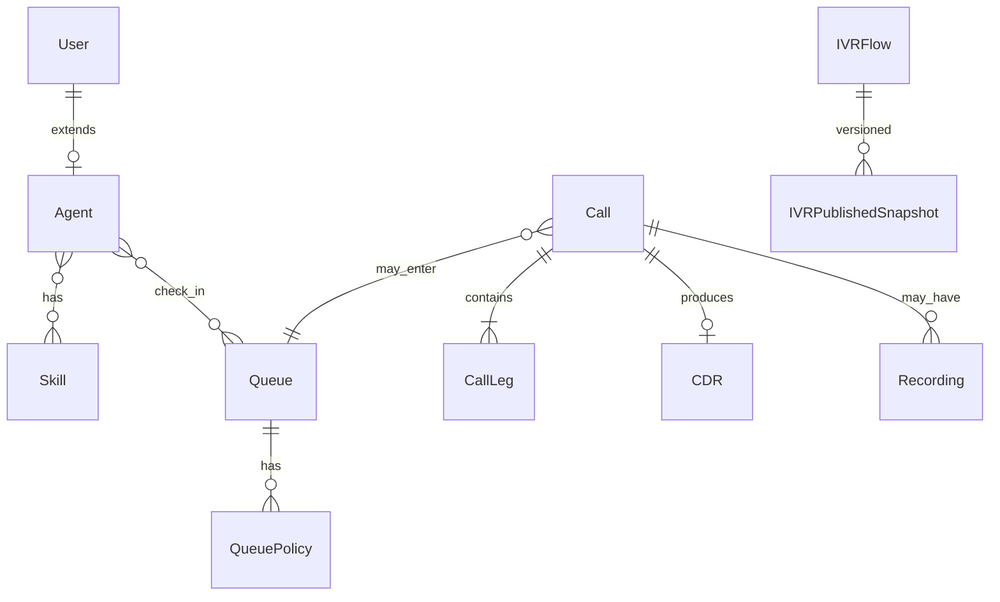
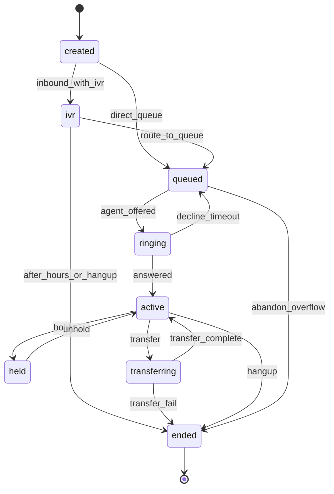
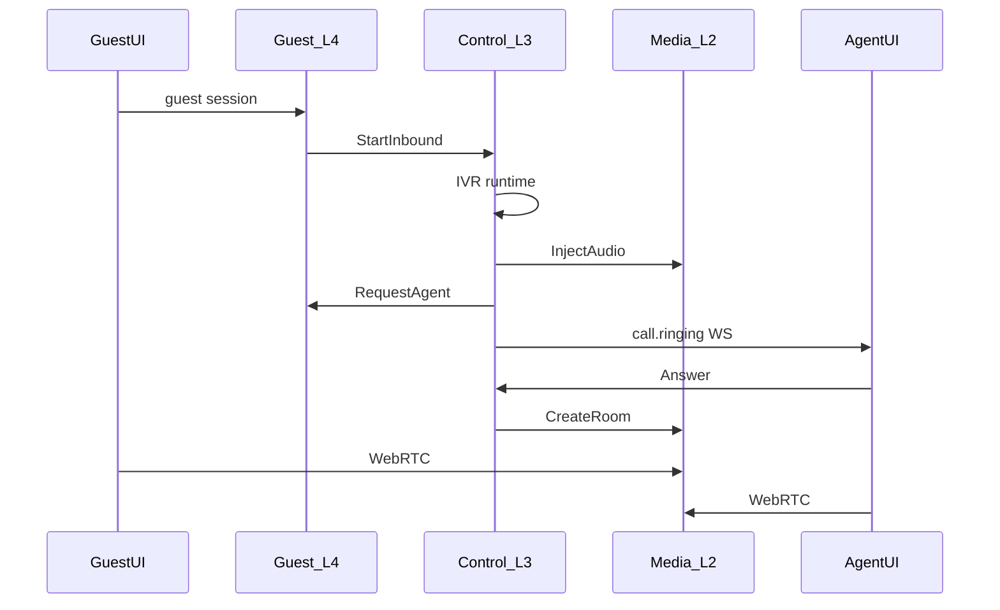
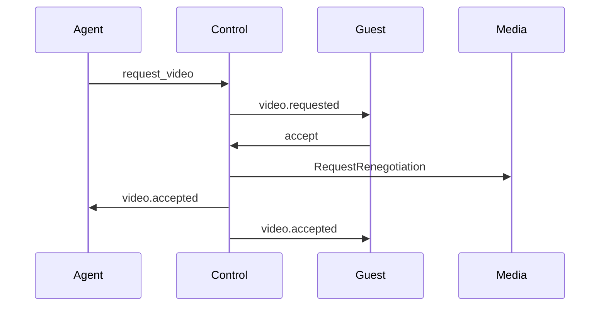

# Open VoIP 技术设计

> 2026-09-22：当前交付为 open-call + open-switch 双服务，SIP 中继和 SIP 坐席均在目标范围。新增边界与实际验收状态见 [双服务与 SIP 上线验收](sip-production-acceptance.md)。历史阶段完成度不能作为生产认证。

> 版本：v0.3  
> 对齐：[requirements.md](./requirements.md) v0.3、[architecture.md](./architecture.md) v0.4  
> 场景：内网单机；双进程 `open-call` + `open-switch` + PostgreSQL + 可选前置 TLS 反代

本文档描述 **实现级** 设计：技术选型、领域模型、Port、数据、部署与需求映射。四级分层以 [architecture.md §2](./architecture.md) 为准，本文不重复大段分层正文。

---

## 1. 引言

### 1.1 目标读者

- **开发**：按 Port 与目录边界实现 Go / Lit 前端  
- **评审**：对照分层禁止项与需求矩阵  
- **运维**：二进制部署、`config.yml`、PostgreSQL 与备份  
- **第三方客户端**：REST 以 [docs/api/README.md](./api/README.md) 与 [openapi.yaml](./api/openapi.yaml) 为准；实时事件见 [events.md](./events.md)

### 1.2 文档地图

| 文档 | 内容 |
|------|------|
| [requirements.md](./requirements.md) | 功能验收 ID |
| [architecture.md](./architecture.md) | 四级分层、Port 概要、中文注释规范 |
| [layering.md](./layering.md) | depguard、组合根规则 |
| [events.md](./events.md) | WebSocket / Webhook 载荷 |
| [docs/api/](./api/) | 独立 REST 对接文档 |

### 1.3 全局约束

- 全链路主键 **`call_id`**（UUID）；媒体 **Room ID = call_id**（VIDEO-11）  
- open-switch 承载 L2/L3，open-call 承载 L4；各自具有 `internal/app` 适配层，跨进程仅通过 HTTP Port
- Out of Scope 见 requirements §17  

---

## 2. 技术选型

实现权威清单在本章；architecture 仅保留摘要并链接至此。

### 2.1 语言与运行时

| 领域 | 选定 | 理由 |
|------|------|------|
| 服务端 | **Go 1.27.1**（`go.mod` 中 `go 1.27.1` 与 `toolchain go1.27.1`） | 统一工具链 |
| Go 语法 | **禁止已废弃 API/写法** | CI：`go vet ./...`；`staticcheck`；Code Review 对照附录 A 禁用清单 |
| 前端 | **原生 JavaScript（ES modules）+ Lit 3** | 轻量 Web Demo |
| 前端构建 | **Vite 5**（不强制 TypeScript） | 产出 `open-call-web/dist/`，由 Nginx 托管 |

### 2.2 服务端框架与基础设施

| 领域 | 选定 | 理由 |
|------|------|------|
| HTTP | **chi/v5** | 中间件链；handler 与 OpenAPI 对齐 |
| WebSocket | **coder/websocket** | WSS（EVT-*） |
| 配置 | **单一 YAML**（`config.yml`），**禁止环境变量覆盖** | 仅启动参数 `-config /path/to/config.yml` |
| 配置解析 | **gopkg.in/yaml.v3** + `Validate()` | 无隐式 env |
| 日志 | **log/slog** | NFR-05；结构化字段含 `call_id` |
| 指标 / 限流 / 定时任务 | **不引入** | 见 §2.10 |
| 组合 | **无 DI 框架**；各服务的 `cmd/open-call/main.go` / `cmd/open-switch/main.go` + `internal/app/run.go` 手写 `new` | 见 §2.11 |
| 数据库 | **PostgreSQL 16+** | 唯一支持引擎 |
| ORM / 迁移 | **GORM v2** + 启动 **embed SQL**（`internal/store/migrate/sql`） | 表结构以 SQL 为源；model 仅 ORM |
| 校验 | **go-playground/validator** | Admin DTO |
| JWT | **golang-jwt/jwt/v5** + `jwt_revocations` 表 | PLAT-02 |
| 密码 | **argon2id** | 凭证存储 |

### 2.3 媒体、信令与电信

| 领域 | 选定 |
|------|------|
| WebRTC | **pion/webrtc/v4** |
| SFU | 自研轻量转发（Pion PeerConnection + track 选择性转发） |
| TURN | 可选同机 **coturn** 二进制；YAML 可关闭 |
| 音频 | Opus 优先，G.711（SIP 互通） |
| 视频 | VP8 默认，H.264 可选（Safari） |
| 录音 | 语音写 **Ogg/Opus**；视频另写 **IVF/VP8**。若本机有 **ffmpeg**，停止录制时封装为 WebM（非实时混流） |
| IVR 放音 | **PCM WAV** 注入（8/16 kHz）；无文件时播短提示音。TTS 不内置 |
| SIP/PSTN | 进程内 **sipgo** UA（RFC 3261 UA 子集）：Digest REGISTER（Request-URI 无 userinfo）、对话 ID=Call-ID+tags、SDP answer 单 PT（RFC 3264）、3xx 跟随、480、405+Allow、RFC 3262 PRACK、RFC 4028 session timer、RFC 3325 PAI 仅中继。PCMU/PCMA RTP 与坐席 WebRTC PCMU 桥接。未配置 trunk 不启动 |

### 2.4 数据与缓存

- 录音与 IVR 资产：**本地目录**（YAML 配置路径）  
- **无 Redis**；WS 连接映射为进程内 map + DB 会话字段  

### 2.5 部署与交付

| 领域 | 选定 |
|------|------|
| 交付 | **两个二进制**：`open-call`（业务 API + WS + BFF），`open-switch`（呼叫控制 + SIP/WebRTC + 录制） |
| 静态前端 | Vite 构建 → 独立静态站（Nginx） |
| TLS | 二进制直连 TLS（YAML 证书）或前置 **nginx**（文档示例） |
| 容器 | **不交付** Docker / Compose / 镜像 |
| API 契约 | [docs/api/openapi.yaml](./api/openapi.yaml) 手写维护 |

### 2.6 前端（Lit）

- 组件：**Lit 3**；路由：`history.pushState` 或 `@lit-labs/router`  
- REST：`fetch` + `open-call-web/shared/api.js`
- 实时：`open-call-web/shared/ws.js`
- WebRTC：`open-call-web/shared/webrtc.js`

### 2.7 工程与质量

- 分层：**depguard**（[layering.md](./layering.md)）  
- Lint：**golangci-lint** + depguard；`revive exported` **不默认启用**（architecture §5.3）  
- CI：lint + arch + OpenAPI validate  

### 2.8 明确不引入

Prometheus、限流库、cron/scheduler、wire/fx/dig、SQLite、sqlc/goose、Redis、Kafka、K8s、Docker / Compose / 容器镜像。

### 2.9 仓库结构

```
open-voip/
  docs/                    # 需求、架构、api/（OpenAPI），无业务代码
  app/                     # Go 服务端
    cmd/open-call/ 或 cmd/open-switch/
    internal/
      ports/
      layers/biz/          # L4
      layers/control/      # L3
      layers/media/        # L2
      app/                 # http, ws, run（组合根）
      store/
      config/
    deploy/
  open-call-web/           # Lit 三端，独立构建
    agent/ guest/ admin/
    shared/
  app/.golangci.yml
```

### 2.10 需求折中（相对 requirements 原文）

| ID | 实现方式 |
|----|----------|
| PLAT-06 | `GET /health` + `GET /api/v1/status`（`db_ok`, `active_calls`, `ws_connections`, 进程内存, `recordings_dir_bytes`） |
| PLAT-07 | 当前版本**不实现**限流 |
| MON-01 | 不采集主机 CPU%；status 暴露进程内存与录音目录占用 |
| DEPLOY-01 | PostgreSQL + 二进制 + 可选 nginx（见 §12） |
| REC-02 | 可回放 Ogg（音频）/ IVF（视频轨）；可选 ffmpeg 封装 WebM，非实时合流 |
| REC-05 | `POST /api/v1/admin/recordings/purge-expired`（人工或外部 cron 调用） |
| EVT-04 重试 | 同步重试 N 次 + DB 状态；`POST .../webhooks/deliveries/{id}/retry` |
| MEDIA-07 | sipgo UA：RFC 3261/3262/3264/3325/4028 子集、Digest REGISTER、ACL、PCMU/PCMA、PAI 仅中继；未配 trunk 不启动 |
| ADM-04 | IVR 使用发布快照；队列/技能/工作时间为实时读库（单机可接受） |
| IVR-02 TTS | 不内置 TTS，节点配置 WAV 文件或使用提示音 |

### 2.11 组合根（启动顺序）

```
读 config.yml → 校验
→ gorm.Open(Postgres) → migrate.Migrate()（embed SQL）
→ NewMediaService → 实现 MediaPort
→ NewControlService(ports..., mediaPort)
→ NewBizServices(db, ports...)
→ NewHTTPRouter / NewWSHub
→ Listen (TLS/HTTP) + UDP 媒体端口
```

**唯一**可 import 各层 concrete 的包：各服务 `cmd/open-call` / `cmd/open-switch`、`internal/app`（`run.go` 组合根）。

---

## 3. 核心领域模型

### 3.1 实体关系



| 实体 | 说明 |
|------|------|
| User | 角色 admin / supervisor / agent |
| Agent | extension、`video_capable`、技能 |
| AgentSession | 签入队列、WS 关联、state、busy_reason |
| Queue | `video_enabled`、max_wait、overflow、recording_policy |
| Call | direction、session_type、FSM state、parent_call_id（咨询转） |
| CallLeg | customer / agent / ivr_bot / supervisor / pstn |
| GuestSession | queue_token、expires_at |
| IVRPublishedSnapshot | 单调 version；呼入只读最新 published |

### 3.2 Call 状态机



- 单坐席：最多一个 offered + 一个 active（咨询转可配置例外）  
- Offer 带 `offer_expires_at`；防双振铃：行锁或 agent 乐观锁  
- AGENT-05：`force_hangup` | `wait_until_idle`（队列级默认）

### 3.3 Agent 状态机

`offline` → 签入 → `idle` ⇄ `busy(reason)` → `ringing` → `on_call` → `acw` → `idle` → 签出 → `offline`。写入 `agent_state_log`（RPT-04）。

### 3.4 Session 类型与视频

- 初始：队列 `video_enabled` + 访客选择  
- VIDEO-06：`video.requested` → accept/decline → MediaPort `RequestRenegotiation`  
- VIDEO-07：移除 video track，更新 CDR `session_type`  
- VIDEO-08：独立 screen track；事件 `screen_share.*`  

---

## 4. 层间 Port 与 DTO

详表见 [layering.md §2](./layering.md)。摘要如下。

### 4.1 CallControlPort（L3 实现，L4 / app 调用）

| 方法 | 说明 |
|------|------|
| `StartInbound(ctx, InboundRequest) (callID, error)` | 访客/呼入创建 Call |
| `Answer(ctx, callID, agentID) error` | 坐席接听 |
| `Hangup(ctx, callID, reason) error` | 挂断 |
| `Transfer(ctx, callID, TransferRequest) error` | 盲转/咨询转 |
| `Outbound(ctx, OutboundRequest) (callID, error)` | 外呼/分机 |
| `StartIVR(ctx, callID, snapshotID) error` | 绑定 IVR 运行时 |

L4 **不得**持有 MediaPort。

### 4.2 MediaPort（L2 实现，**仅 L3** 调用）

```go
type MediaPort interface {
    CreateRoom(ctx context.Context, callID string, opts RoomOptions) error
    CloseRoom(ctx context.Context, callID string) error
    JoinWebRTC(ctx context.Context, callID, legID string, role LegRole) (LocalOffer, error)
    AcceptAnswer(ctx context.Context, callID, legID string, answer SDP) error
    TrickleICE(ctx context.Context, callID, legID string, cand ICECandidateInit) error
    IssueTURNCredentials(ctx context.Context, subject string, ttl time.Duration) (TURNConfig, error)
    SetTrackMuted(ctx context.Context, callID, legID string, audio, video bool) error
    SetHold(ctx context.Context, callID, legID string, on bool) error
    RequestRenegotiation(ctx context.Context, callID, legID string, addVideo bool) error
    InjectAudio(ctx context.Context, callID, botLegID string, source AudioSource) error
    SubscribeDTMF(ctx context.Context, callID, legID string, handler DTMFHandler) error
    StartRecording(ctx context.Context, callID string, policy RecordingPolicy) (recordingID string, error)
    StopRecording(ctx context.Context, recordingID string) error
    OriginateSIP(ctx context.Context, callID, legID, dial, trunkID string) error
    BridgeLegs(ctx context.Context, callID, legA, legB string) error
}
```

`app/http/media` 仅调用 L3 **signaling facade**，不持有 MediaPort。

### 4.3 其他 Port

| Port | 调用方 | 实现方 | 职责 |
|------|--------|--------|------|
| ACDDispatchPort | L3 | L4 acd | `RequestAgent` → agent_id |
| ConfigSnapshotPort | L3 | L4 | 已发布 queue/ivr/工作时间 |
| AgentDirectoryPort | L3 | L4 | extension → agent |
| RecordingPolicyPort | L3 | L4 | 队列录音策略 |
| CDRRecorderPort | L3 | L4 | FSM 迁移写 CDR |
| CallEventPublisher | L3 | app/ws | call.* / video.* |
| AgentEventPublisher | L4 | app/ws | agent.* |

---

## 5. 业务子系统（L4）

### 5.1 ACD 与队列

- 策略：`longest_idle` | `round_robin`；技能超集匹配；视频队列过滤 `video_capable`  
- QUEUE-05：周期推送 `queue.position`  
- QUEUE-06/07：overflow、priority（guest token / IVR）  

### 5.2 IVR

- 配置节点：`play`, `menu`, `route_queue`, `time_check`, `hangup`  
- 发布：draft → validate → publish → `ivr_published_snapshots`  
- 运行时（L3）：InjectAudio、SubscribeDTMF  

### 5.3 CDR、报表、Webhook

- CDR 字段见 §8；导出 CSV  
- 报表：实时内存计数 + SQL 历史聚合  
- Webhook：同步投递 + DB；失败可管理员重试（§2.10）  

### 5.4 录制与质检

- 策略：off / audio / video_composite；Answer 后 L3 调 `StartRecording`  
- REC-05：purge API；QA：`qa_marks`  

---

## 6. 呼叫控制（L3）

| 能力 | 设计要点 |
|------|----------|
| 外呼/分机 | direction=internal/outbound；PSTN 走 sip leg |
| 盲转 | 目标振铃；原 agent 退出 room |
| 咨询转 | hold + consult leg |
| 三方 | 第三 WebRTC leg，同 Room |
| 班长监听 | supervisor leg recvonly |
| 视频转接 | 目标须 video_capable + idle |

媒体信令 HTTP：`/api/v1/calls/{id}/legs/{legId}/offer|answer|ice`（见 OpenAPI）。

---

## 7. 媒体子系统（L2）

- SFU：选择性转发，非默认 MCU  
- Hold：停止转发 + MOH inject  
- TURN：YAML 开启时 HMAC 短期凭证  
- SIP：sipgo 中继（Digest REGISTER、IP ACL、DID 路由、出局 CLI）；未启用则不监听  

---

## 8. 数据持久化

### 8.1 逻辑表（GORM model）

| 表 | 读写层 | 用途 |
|----|--------|------|
| users, agents, agent_skills, skills | L4 | 组织与技能 |
| agent_sessions, agent_state_log | L4 | 签入与状态 |
| queues, queue_agents | L4 | 队列配置 |
| calls, call_legs | L3 写经 service；L4 只读报表 | 通话 |
| cdr | L4 经 CDRRecorderPort | 话单 |
| guest_sessions | L4 | 访客 token |
| ivr_flows, ivr_published_snapshots | L4 | IVR |
| recordings, qa_marks, call_wrap_ups | L4 | 录音质检小结 |
| webhook_subscriptions, webhook_deliveries | L4 | Webhook |
| audit_logs, jwt_revocations | L4 | 审计与撤销 |

### 8.2 SQL 迁移（embed）

- **open-call**：[`open-call/internal/store/migrate/sql/`](../open-call/internal/store/migrate/sql/)，业务表前缀 **`oc_`**。
- **open-switch**：[`open-switch/internal/store/migrate/sql/`](../open-switch/internal/store/migrate/sql/)，运行时表前缀 **`os_`**。
- 进程启动时执行未应用版本，open-call 记录在 **`oc_schema_migrations`**，open-switch 记录在 **`os_schema_migrations`**（`version` / `name` / `applied_at`）。版本号在两个服务内独立递增；本机共库联调不会互相跳过迁移。
- 变更 schema：**新增** `NNNNNN_description.sql`，勿再依赖 GORM `AutoMigrate`。
- 中文 COMMENT：每个 migration 须对**每张表、每个字段**执行 `COMMENT ON`（与 model 语义一致，见 architecture §5.2）。
- **已有旧库**（无前缀表或 AutoMigrate 时代）：需人工 `RENAME`/导数据后对齐 `oc_`/`os_`，或空库重建。

### 8.3 索引要点

- `cdr(started_at, queue_id)`  
- `ivr_published_snapshots(flow_id, version DESC)`  
- `agent_sessions(agent_id)` unique 签入  

---

## 9. 接入适配（internal/app）

| 包 | 职责 |
|----|------|
| app/http/admin | REST CRUD |
| app/http/agent | 签入、状态 |
| app/http/guest | token 入会 → L4 → CallControlPort |
| app/http/media | SDP/ICE → L3 signaling |
| app/ws | 连接、推送、上行命令 |

---

## 10. 前端架构

- 三入口 Vite：`open-call-web/agent`, `guest`, `admin`
- `shared/api.js`, `ws.js`, `webrtc.js`  
- 第三方对接不依赖 Demo 代码，以 docs/api 为准  

---

## 11. 安全与平台

- JWT access + refresh；jti 黑名单  
- RBAC：admin / supervisor / agent（路由矩阵见 OpenAPI `x-roles`）  
- 录音下载额外 scope + 审计  
- **无限流**（PLAT-07 折中）  

---

## 12. 部署与运维（二进制）

### 12.1 目录布局

```
/opt/open-call/          # 业务控制面，不存储媒体文件
  open-call
  config.yml
/opt/open-switch/        # SIP、RTP、WebRTC 与录音文件
  open-switch
  config.yml
  data/recordings/
```

### 12.2 config.yml 块

open-call：`server`、`database`、`recordings`（仅策略）、`jwt`、`integration`、`webhook`、`public`、`security`、`bootstrap`、`tls`、`log`。

open-switch：`server`、`database`、`recordings`（文件目录）、`integration`、`ice`、`turn`、`sip`、`sip_trunks`、`tls`、`log`。SIP 设备密码、Contact、RTP 端口与会议混音配置不得出现在 open-call。

### 12.3 systemd

分别使用 `open-call/deploy/open-call.service` 与 `open-switch/deploy/open-switch.service`；运行目录为 `/opt/open-call` 和 `/opt/open-switch`，不可复用原单体的 ExecStart。

### 12.4 前置条件

- PostgreSQL 已建库；防火墙：open-call HTTPS、open-switch 内网 API、SIP 与 UDP 媒体端口段
- 备份：`pg_dump` + 录音目录 rsync  

open-call 可运行多个实例；登录会话、访客令牌、Webhook 投递租约和配置均由 PostgreSQL 协调。Webhook worker 先持久化任务，再通过 `SKIP LOCKED` 领取并指数退避，超过上限进入死信。配置 JSON 用于同版本业务配置迁移，完整灾备仍使用 PostgreSQL 备份。

### 12.5 容量（DEPLOY-05）

录音 GB/天 ≈ 路数 × 码率 × 86400；5×720p + 10 路语音带宽见 requirements NFR-02。

---

## 13. 关键场景时序

### 13.1 呼入（IVR → 队列 → 接听）



### 13.2 语音升视频



---

## 14. 需求覆盖矩阵

| 模块 | IDs | 文档 |
|------|-----|------|
| 平台 | PLAT-01～03,05～06 | §2、§11、§12；PLAT-07 折中 §2.10 |
| 部署 | DEPLOY-02～08 | §12；DEPLOY-01 折中 §2.10 |
| 媒体 | MEDIA-01～09 | §7、[openapi](./api/openapi.yaml) Media |
| 坐席/队列 | AGENT-*、QUEUE-* | §5、[openapi](./api/openapi.yaml) |
| 通话/IVR | CALL-*、IVR-* | §6、[events](./events.md) |
| 视频 | VIDEO-* | §3.4、§7、[events](./events.md) |
| 录制/CDR | REC-*、CDR-*、QA-01 | §5、§8、[openapi](./api/openapi.yaml) |
| 事件 | EVT-* | [events.md](./events.md)；Webhook 折中 §2.10 |
| 报表 | RPT-*、MON-01 | §5、[openapi](./api/openapi.yaml) Reports |
| 管理/API | ADM-* | [docs/api/](./api/) |
| 前端 | UI-* | §10 |
| NFR | NFR-* | §2、§7、§12 |
| 中文注释 | — | [architecture §5](./architecture.md) |

---

## 15. 风险与对策

| 风险 | 对策 |
|------|------|
| 单机视频 CPU | SFU 不混流；录制写 Ogg/IVF，可选 ffmpeg 封装；弱网降 480p 提示 |
| SQL 迁移生产变更 | 新增版本化 `.sql`；大变更走维护窗口；关键索引人工复核 |
| 无后台任务 | REC/Webhook 依赖 API + 外部 cron |
| Webhook 拖垮请求 | 同步重试上限 + 异步 goroutine 仅单次投递链 |

---

## 附录 A：Go 1.27 禁用/弃用写法（维护清单）

- 禁止 `io/ioutil` 包（使用 `io` / `os` 替代）  
- 禁止忽略 `staticcheck` 报告的 `Deprecated` 符号  
- 新增 Go 版本发布时，在本附录追加官方 deprecate 项  

## 附录 B：建议 go.mod 直接依赖（摘要）

`chi/v5`, `coder/websocket`, `gorm.io/gorm`, `gorm.io/driver/postgres`, `gopkg.in/yaml.v3`, `github.com/golang-jwt/jwt/v5`, `github.com/go-playground/validator/v10`, `pion/webrtc/v4`, `github.com/emiago/sipgo`, `github.com/icholy/digest`, `github.com/google/uuid`, `golang.org/x/crypto`

---

## 修订记录

| 版本 | 日期 | 说明 |
|------|------|------|
| v0.3 | 2026-09-19 | MEDIA-07：sipgo 直连运营商中继（Digest REGISTER、ACL、PCMA 转码、外显 CLI） |
