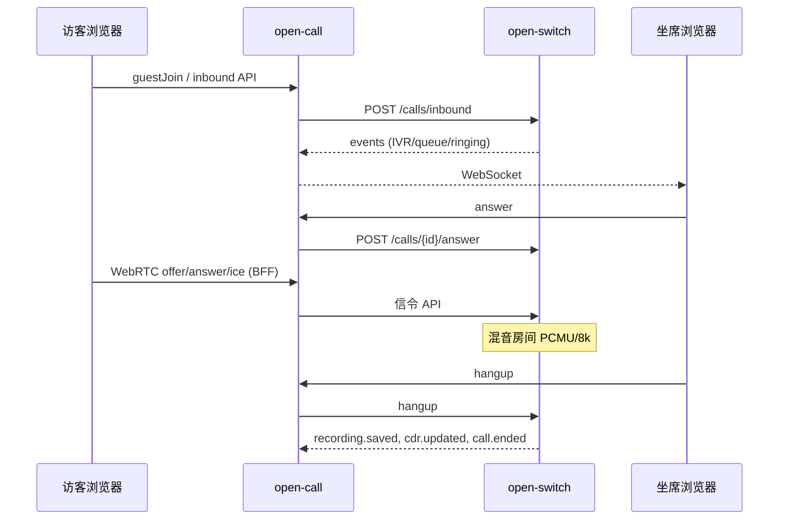

# open-voip VoIP 流程与技术方案总览

本文梳理当前仓库内**已落地**的 VoIP 相关端到端流程，以及各环节采用的技术方案与职责边界。细节契约以代码与专题文档为准；接口字段见 [open-switch 对接说明](./open-switch对接说明.md)，媒体与录音见 [媒体契约](./audio-quality.md)。

---

## 1. 系统分层

```
┌─────────────────────────────────────────────────────────────────┐
│  open-call-web（Lit + Vite）                                     │
│  坐席 / 访客 / 管理端 · 浏览器 WebRTC · REST + WebSocket         │
└────────────────────────────┬────────────────────────────────────┘
                             │ HTTPS  /api/v1
┌────────────────────────────▼────────────────────────────────────┐
│  open-call（呼叫中心 BFF + 业务）                                 │
│  鉴权、配置草稿、CDR/录音投影、通知/机器人任务、WS 广播              │
└──────────── REST switchapi ────────┬────────────────────────────┘
                                     │ 内网 HTTP（无鉴权）
┌────────────────────────────────────▼────────────────────────────┐
│  open-switch（软交换，单实例）                                    │
│  Call FSM · DID/队列/ACD/IVR · SIP/WebRTC 媒体 · Switch API      │
└────────────────────────────┬────────────────────────────────────┘
                             │
              SIP/RTP · WebRTC · PSTN 中继/网关模组
```

| 组件 | 职责 | 不做什么 |
|------|------|----------|
| **open-switch** | 通话状态机、媒体房间、SIP 注册/出局、WebRTC 信令端、IVR 引擎、ACD、录音写盘、配置运行时真相源 | 用户登录、满意度业务语义、模型对话、通知任务持久化 |
| **open-call** | 用户/权限、BFF、Switch 事件投影（CDR、录音元数据、CSAT）、访客令牌、语音通知与 AI 机器人编排 | 持有 RTP、不替代 Switch 做媒体混音 |
| **open-call-web** | UI、本地 `RTCPeerConnection`、通过 BFF 转发 Offer/Answer/ICE | 不直连 Switch（生产路径经 open-call） |

控制面与媒体面均在 **open-switch 单进程**内完成；多实例共享同一库会导致 FSM/房间分裂，见 [open-switch README](../open-switch/README.md)。

---

## 2. 核心技术选型（按能力）

| 能力 | 方案 | 主要位置 / 依赖 |
|------|------|-----------------|
| HTTP API | Go `net/http`，Switch 基路径 `/switch/v1` | `open-switch/internal/app/http`，`open-call/internal/app/http` |
| 持久化 | PostgreSQL + GORM，版本化配置与事件表 | 两侧 `internal/store` |
| Switch ↔ CC 集成 | CC 调 Switch REST；Switch `POST events_callback_url` 推送事件，CC 落库后 WS 广播 | `open-call/internal/integration/switchapi`，`switch_events.go` |
| SIP 信令 | sipgo | `open-switch/internal/layers/media/sip*.go` |
| WebRTC | Pion WebRTC v4（服务端 PeerConnection） | `open-switch/internal/layers/media` |
| 浏览器 WebRTC | 标准 `RTCPeerConnection`，信令经 BFF 代理 Switch | `open-call-web/shared/webrtc.js` |
| ICE/TURN | Switch 配置 ICE/TURN，`GET .../turn-credentials` | Switch 配置 + BFF 代理 |
| 音频编解码（电话域） | G.711 PCMU/PCMA @ 8 kHz（窄带） | 协商与 payload 处理见 [媒体契约](./audio-quality.md) |
| 抖动缓冲 / 混音 | vendored **media-sdk**（LiveKit jitter + mixer） | `open-switch/third_party/media-sdk` |
| G.711 编解码 | media-sdk / zaf g711 | 同上 |
| PLC（丢包 concealment） | SpanDSP（CGO） | Linux 构建依赖 |
| 重采样 | libsoxr（CGO） | Linux 构建依赖 |
| 20 ms 媒体时钟与路由 | `mix_scheduler`、房间级混音、按腿排除自听 | `mix_scheduler.go` 等 |
| 应用/机器人音频 | PCM WebSocket（duplex/sendonly/recvonly） | `application.go`，[应用音频边界](./应用音频与业务边界.md) |
| 业务侧固定放音 | `POST .../playbacks` + WAV 素材 | Switch 解码/重采样后进混音 |
| 会话录音 | `conversation_mono_v1`：8 kHz PCM16 单声道 WAV + 对齐分轨 | `conversation_recording.go`，事件 `recording.*` |
| 视频录像 | FFmpeg 合成（WebM/MP4），与窄带音频策略独立 | `recording_video.go` |
| IVR | Switch 内状态机：`play`、`collect_input`、`route_queue`、`business_action` 等 | `open-switch/internal/layers/control` |
| 前端 | Lit 3 + Vite | `open-call-web` |
| 认证 | JWT 会话 + 可选 OIDC；访客一次性令牌 | `open-call` |

未来可通过 `MediaBackend` 对接 FreeSWITCH 等外部媒体（PoC 说明见 [external-backend-fs.md](./external-backend-fs.md)）；**当前生产仍为进程内 Pion + sipgo**。

---

## 3. 通话状态机（Switch 权威）

`CallView.state`：`created` → `ivr` / `queued` → `ringing` → `active`（可 `held`、`transferring`）→ `ended`。

- 乐观锁：`expected_version` + `Idempotency-Key` 防并发命令冲突。
- 坐席振铃/通话/保持中再次外呼 → `409 AGENT_BUSY`（须先显式挂断）。
- 挂断顺序（Switch）：释放坐席 → 停录音 → `cdr.updated` → `call.ended`。

 leg 角色：`customer` | `agent` | `ivr_bot` | `supervisor` | `pstn` 等，见对接说明。

---

## 4. 端到端流程

### 4.1 Web 访客呼入（H5 /guest）

| 步骤 | 技术 |
|------|------|
| 选队列或访客邀请链接 | open-call `guestJoin` / `guestJoinToken` |
| 创建入站通话 | BFF → Switch `POST /calls/inbound`（`queue_id`、`session_type` 等） |
| IVR / 排队 / ACD | Switch 控制面按队列快照 `config_version` 执行 |
| 振铃与接听 | 事件 `call.ringing` → 坐席 UI；`POST /calls/{id}/answer` |
| 媒体 | 访客与坐席各自 `media.start`：BFF 代理 `offer` → 浏览器 `answer` → `ice`；Switch 侧 Pion 与房间混音 |
| 结束与话单 | Switch 事件 → open-call 投影 → WS `call.ended`（以 `result` / `message` 为准） |



### 4.2 SIP / DID 呼入

| 步骤 | 技术 |
|------|------|
| 入局 INVITE | sipgo 解析，按 `(trunk_id, did)` 查激活配置 |
| 建呼 | **不经过** open-call 的 inbound API；`startInbound` 注入 `queue_id` 或 `ivr_flow_id` |
| 业务感知 | Switch 事件回调 → open-call → 坐席 WS |
| 客户媒体 | RTP G.711 ↔ 混音房间；与 WebRTC 坐席同房间时钟 |

SIP 设备按 DID 入局与「设备用户呼 DID」分支见 `open-switch/internal/app/run.go` 中 `SetInboundHandler` / `SetDeviceHandler`。

### 4.3 坐席外呼（WebRTC 坐席 → 内线/访客）

| 步骤 | 技术 |
|------|------|
| 发起 | `POST /api/v1/calls/outbound` → Switch `POST /calls/outbound` |
| 振铃阶段媒体 | 外呼 `ringing` 时前端即 `media.start`（PSTN 场景见下） |
| 终端 | `terminal_type=webrtc`：浏览器 WebRTC；`sip`：Switch SIP 注册腿 + RTP |

### 4.4 坐席外呼 PSTN

| 步骤 | 技术 |
|------|------|
| 路由 | Switch `OriginateSIP`：运营商 **中继 REGISTER**（路线 A）或 **网关模组 Contact**（路线 B） |
| 进度 | `call.outbound_progress`（`dialing` / `connected` / `failed`） |
| 媒体 | PSTN 腿 `pstn` 与客户/坐席同桥；窄带 G.711 |

运维与 ECS 验收：[outbound-pstn-ecs.md](./outbound-pstn-ecs.md)。

### 4.5 语音通知（单向业务）

| 步骤 | 技术 |
|------|------|
| 提交任务 | `POST /api/v1/calls/voice-notifications` → HTTP **202**，表 `oc_voice_notifications` |
| 不占坐席 | 通用 `POST /calls` + `POST .../legs/sip` + `playbacks` |
| 执行 | open-call 后台租约推进；Switch 播 WAV，`leg.playback_*` 事件 |
| 完成语义 | `completion_scope=server_output`（服务器输出结束，非「客户已听懂」） |

见 [应用音频与业务边界](./应用音频与业务边界.md)、[ivr-ai-voice.md](./ivr-ai-voice.md)。

### 4.6 AI 机器人坐席

| 步骤 | 技术 |
|------|------|
| 配置 | open-call `aibot`：虚拟 `agent_id`、队列提示词、模型网关 |
| 排队与振铃 | Switch ACD 与普通坐席相同 |
| 接听后媒体 | open-call Worker：`switchapi` PCM WebSocket（generation 打断、背压） |
| 混音出站 | Switch 重采样至 8 kHz 电话域，进统一混音与录音 |

### 4.7 IVR、排队、ACD

| 环节 | 技术 |
|------|------|
| 流程定义 | 管理端草稿在 open-call；发布为 Switch `/ivr/flows` 的 `payload_json` |
| 运行时 | Switch IVR 引擎；`play` 结束回调推进节点（非循环放音） |
| 按键 | 通用 `collect_input` → `ivr.input_collected`；CSAT 由 open-call 编译并解释 |
| 营业时间 | 队列 `business_hours_json` + `after_hours_action` |
| 溢出 | `overflow_action`：挂断 / 留言 / 转队列 |
| 派工 | `dispatch_strategy`：`longest_idle` / `round_robin` |

### 4.8 转接、保持、会议、监听

经 Switch API：`/transfer`、`/hold`、`/conference`、`/supervisor/.../listen` 等；媒体仍为房间路由变更，不迁移到 open-call。

### 4.9 事后 IVR / 满意度

浏览器 `POST /api/v1/calls/{id}/survey` → open-call 鉴权 → Switch `POST /calls/{id}/ivr`（`flow_id` 或快照 `post_call_ivr_flow_id`）。评分落库在 open-call，Switch 只采集 DTMF。

### 4.10 录音与 CDR

| 项目 | 方案 |
|------|------|
| 策略 | 队列 `recording_policy`：`off` / `audio` / `video_composite` |
| 新主录 | `conversation_mono_v1`，8 kHz 单声道；FIFO 写盘，失败 `recording.failed` 且通话继续 |
| 元数据 | 事件 `recording.saved` → open-call `recmeta` 投影 → 管理端录音列表 |
| CDR | `cdr.updated` / `call.ended` 的 `result`：`answered` / `abandoned` / `failed` |

事件语义：[call-events.md](./call-events.md)。

### 4.11 配置发布

| 场景 | 方案 |
|------|------|
| 运行时真相源 | Switch 激活配置包（队列、坐席、DID、IVR） |
| 日常变更 | Switch 资源级 API 或 open-call 管理端合并后推送 |
| 整包导入 | `POST /configuration/versions` + activate |
| 音频能力 | 本期队列仅 **`narrowband`**（8 kHz）；宽带配置升级时迁移为窄带新版本 |

### 4.12 认证与实时通知

| 路径 | 方案 |
|------|------|
| 员工 | open-call JWT / OIDC；权限驱动 open-call-web 菜单与操作 |
| 访客 | 短期 guest token / 邀请链接 |
| 坐席实时 | open-call WebSocket 订阅投影后的事件（非直连 Switch） |
| Switch 事件可靠 | 先落库再推送；CC callback 返回 `accepted:true`；可 `GET /events` 对账 |

---

## 5. 媒体路径对照（四条验收路径）

| 路径 | 终端 | 信令/承载 | 音频处理 |
|------|------|-----------|----------|
| 人工 WebRTC | 浏览器 | BFF → Switch WebRTC API | PCMU/8k ↔ 房间混音 |
| 人工 SIP | 话机/模组 | Switch SIP 注册 + RTP | G.711 ↔ 房间混音 |
| 机器人 | open-call Worker | PCM WebSocket | 多采样率 PCM ↔ soxr → 8k 混音 |
| 语音通知 | PSTN 单腿 | SIP 出局 + playbacks | WAV → 混音 → 仅下行 |

IVR 等候音、队列提示音由 Switch IVR/队列引擎播放，**不能**被业务 `playbacks` 的 DELETE 误停；业务播放按 `call_id + leg_id + playback_id` 精确定位。

统一管线（抖动、PLC、混音、发送队列、质量日志）见 [audio-quality.md](./audio-quality.md)。

---

## 6. Direct / 高级编排（可选）

Switch 提供空 Call、加腿、SIP 腿、桥接、腿级 hold/reject、录播控制等（`/calls/direct`、`/bridges`、`/legs/sip`）。open-call 管理 runtime 与集成测试使用；典型呼叫中心路径以 FSM + inbound/outbound 为主。

---

## 7. 部署与运行约束（摘要）

| 项 | 要求 |
|----|------|
| open-switch 构建/运行 | Linux/WSL，Go 1.27+，**CGO**，libsoxr + SpanDSP |
| 单实例 | 控制面、媒体、SIP registrar、事件投递同进程 |
| 网络安全 | CC↔Switch 内网、无 HTTP 鉴权，依赖网络隔离 |
| 视频录像 | 需 FFmpeg 与 `recordings.video` 配置 |
| 前端生产 | HTTPS（麦克风权限）、`VITE_API_BASE` 指向 open-call |

快速部署：[server-deploy-quickstart.md](./server-deploy-quickstart.md)。

---

## 8. 相关文档索引

| 文档 | 内容 |
|------|------|
| [open-switch对接说明.md](./open-switch对接说明.md) | Switch API、事件、配置字段 |
| [应用音频与业务边界.md](./应用音频与业务边界.md) | PCM、playbacks、通知任务 |
| [audio-quality.md](./audio-quality.md) | 媒体管线与录音契约 |
| [call-events.md](./call-events.md) | WS 事件与 UI 责任 |
| [ivr-ai-voice.md](./ivr-ai-voice.md) | 机器人与通知联调 |
| [outbound-pstn-ecs.md](./outbound-pstn-ecs.md) | PSTN 出局配置 |
| [docs/api/openapi.yaml](./api/openapi.yaml) | open-call 浏览器 API |

---

*文档版本与仓库 main 同步；若与代码冲突，以 Switch / open-call 实现为准。*
