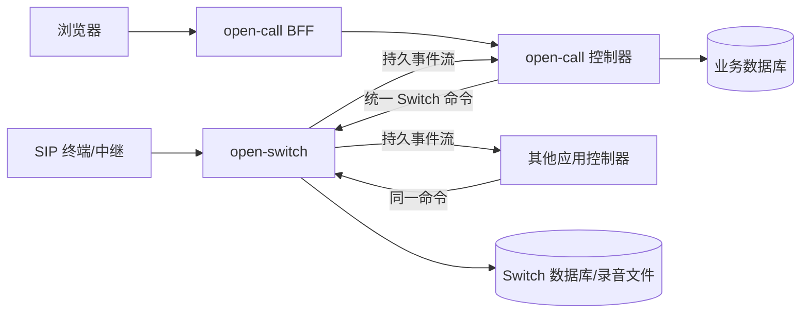

# 统一软交换架构实施方案

> 状态：待实施的目标设计，依据 2026-09-26 仓库代码编写。本文描述下一次破坏性重构；[现行对接说明](./open-switch对接说明.md)描述当前已实现的 `call_center` / `external` 双模式。完成本文的切换验收后，应更新现行说明、OpenAPI 和架构文档，再将本文标记为已实施。

## 1. 决策与范围

**唯一目标：open-switch 是内网软交换；open-call 和第三方应用均是使用同一控制协议的上层控制器。** 删除 `integration.mode`，不保留 `call_center`、`external` 双路由及旧 `/platform/v1` 回调链。此次不要求旧 Switch API、旧配置或运行中的媒体会话兼容。迁移前必须备份数据并结束通话。

本期交付包括 SIP 入呼与出呼、WebRTC 双腿、桥接、保持、转接、三方会议、只听媒体腿、放音与 DTMF、录制、事件重放，以及 open-call 现有呼叫中心业务的迁移。初始部署保持**单个活跃 Switch 进程**和独立 PostgreSQL 数据库；多活媒体节点、跨控制器移交通话和跨节点会话迁移不在本期范围。

Switch 对持有服务凭据的控制器完全信任：它校验服务凭据和命令格式、资源状态，不校验终端用户、坐席、队列、号码的业务权限。每个控制器负责自己的用户认证、租户边界、号码策略和操作审计。控制器标识用于入呼分派、事件订阅与追踪，不构成 Switch 内的用户 RBAC。

### 1.1 边界

| 能力 | open-switch | open-call 或其他控制器 |
| --- | --- | --- |
| SIP、RTP、WebRTC、ICE/TURN | 建立连接，协商和转发媒体 | 选择接入设备、号码与中继，驱动信令 |
| 通话、媒体腿、桥接、会议、录制 | 保存实际状态并执行命令 | 编排时机，决定参与者与策略 |
| DID | 将入呼送到配置绑定的控制器 | 将 DID 映射到队列、流程或业务对象 |
| 坐席、队列、ACD、工作时间、IVR 流程 | 不存储或计算 | 全部拥有和执行 |
| 录音文件与原始媒体统计 | 生成文件和技术元数据 | 告知、授权、保存期限、业务录音元数据 |
| 事件 | 按通话持久化实际状态变化 | 持久消费，更新业务状态、CDR、WS/Webhook |
| 前端鉴权 | 不处理 | BFF 验证用户后调用 Switch |

Switch 数据库只保留通话、媒体腿、媒体拓扑、录制、命令和事件等运行事实。业务 `queue_id`、`agent_id`、排队优先级和 IVR 节点保存在控制器数据库；Switch 可保存不参与逻辑判断的 `client_ref` 与有限的 `metadata` 供对账。

## 2. 当前代码差距

| 现状 | 目标处理 | 主要位置 |
| --- | --- | --- |
| `call_center` 时 Switch 从 Platform API 取得 ACD、队列、坐席、IVR、录制策略并回写 CDR | 删除这些依赖，把编排放进 open-call | `open-switch/internal/app/run.go`、`integration/platform/`、`layers/control/service.go`、`ivr.go`、`features.go` |
| `external` 通过 Null 业务端口运行，限制为两腿 | 改为唯一通用控制服务，支持可变媒体拓扑 | `integration/external/`、`layers/control/direct.go`、`layers/media/service.go` |
| 双模式注册不同 HTTP 路由 | 只暴露一个 `/switch/v2` 契约 | `open-switch/internal/app/http/switch_router.go` |
| `call.created` 等事件可能在状态落库后单独写入，部分错误被忽略 | 状态与事件同一事务；异步媒体操作有持久命令记录 | `open-switch/internal/store/call_events.go`、`layers/control/` |
| SIP 入呼由 Switch 当场查询业务 DID/队列，或直接创建 direct 呼叫并自动 SIP 应答 | Switch 建立待决入呼腿并发事件，由控制器决定接听、拒绝与后续流程 | `open-switch/internal/app/run.go`、`layers/media/sip.go` |
| open-call 仍暴露 `/platform/v1`，内部客户端调用业务专用 Switch 命令 | 删除回调入口，建立统一控制器和业务事件投影 | `open-call/internal/app/platform/`、`app/run.go`、`integration/switchapi/` |
| open-call 的 BFF 主要按旧路径反向代理 | 保留终端鉴权；将终端动作转为控制器业务命令，再由统一 Switch 客户端执行 | `open-call/internal/app/http/bff.go`、`bff_trusted.go` |

现有 `direct` API、媒体实现和事件游标可作为改造起点，不将它们的双腿限制或当前事件可靠性视为目标行为。

## 3. 目标架构与数据流



所有呼叫共享一个 `call_id`，每条 SIP 或 WebRTC 连接有独立 `leg_id`。Switch 维护媒体拓扑；控制器保存本地 `business_call_id ↔ call_id`、业务参与者与队列。WebSocket 和 Webhook 是控制器对终端及外部业务的输出，不是 Switch 向控制器交付事件的唯一通道。

### 3.1 多控制器的入呼归属

- 为每个可信控制器配置 `controller_id` 与独立服务凭据；凭据只识别服务，不携带终端用户身份。
- Switch 使用**静态入口绑定**把 SIP trunk、DID 或设备接入点映射到 `controller_id`。这只决定通知谁，不决定队列、坐席或营业时间。相同优先级的绑定不能重叠；启动时校验。未匹配的入呼拒绝并记录原因。
- 控制器创建的呼叫由服务身份记录 `controller_id`。事件按该字段过滤；全局事件 ID 可以有正常间隙。控制器之间不移交通话；需要跨应用协作时由上层系统协调。
- 所有服务凭据仍被 Switch 信任为控制命令来源；Switch 不从 `agent_id`、`user_id` 等字段推导权限。

## 4. 通用领域模型

### 4.1 状态

| 对象 | 状态与规则 |
| --- | --- |
| Call | `created → open → closing → ended`。只表示 Switch 会话生命周期；没有 `queued`、`ivr`、`acw` 等业务状态。结束原因和时间不可再改。 |
| Leg | `new → dialing/ringing → connected → ending → ended`，失败时可进入 `failed`。`held`、`muted` 是连接上的独立属性。SIP 应答与 WebRTC ICE/DTLS 连通需分别明确。 |
| Bridge | `pending → active → ended`。显式关联两个或多个媒体腿；创建前不转发彼此媒体。三方会议是多参与者 Bridge，监听腿的发送方向设为 `recv_only`。 |
| Recording | `starting → recording → stopping → stopped/failed`，包括文件 ID、路径、类型、字节数和时间。 |
| Command | `accepted → running → succeeded/failed/unknown`；异步 SIP/媒体效果以命令结果事件结束。 |

每个状态变更都有单通通话递增的 `version`，每个事件有通话内 `seq` 与全局递增 `event_id`。控制器传 `expected_version` 时，版本冲突返回 `409` 并附最新视图；相同 `Idempotency-Key` 与相同请求体返回原命令结果，不重复拨号或录制。

Leg 的 `type` 仅为 `sip|webrtc|playback`；`participant_ref`、`client_ref`、`metadata` 是控制器的不透明关联信息。`customer/agent/supervisor` 不作为 Switch 的行为分支。Switch 可限制字段长度、媒体腿数量和资源配额，防止错误命令耗尽本机资源。

### 4.2 SIP 入呼应答

收到 INVITE 后，Switch 创建 Call 和 SIP Leg，保存 `leg.incoming` 事件，并发送协议允许的临时响应。**不得在控制器决定前自动发送 200 OK。**控制器可调用 `answer`、`reject`，或先配置早期媒体；超时按入口绑定的 `decision_timeout_sec` 结束，缺省 30 秒。控制器断线或事件消费滞后时，Switch 仍按同一超时处理，不无限占用 SIP 会话。SIP ACK、BYE、CANCEL、失败码转换成 Leg 事件与最终状态。

## 5. 统一服务契约 `/switch/v2`

这是目标契约，切换时移除 `/switch/v1`，不提供双协议兼容期。响应延续现有 `{code,message,data,request_id}` 信封；错误明确区分 `invalid_request`、`not_found`、`conflict`、`dependency_unavailable` 和异步命令失败。所有时间使用带时区的 RFC 3339；ID 为 UUID。

### 5.1 命令与查询

| 方法 | 路径 | 语义 |
| --- | --- | --- |
| `POST` | `/calls` | 控制器创建空 Call；可传 `call_id`、`client_ref`、`metadata` |
| `GET` | `/calls/{callId}` | Call、Leg、Bridge、Recording、版本及最后事件 ID |
| `GET` | `/calls?status=open&cursor=...` | 对账用分页快照，包含控制器标识 |
| `POST` | `/calls/{callId}/legs/webrtc` | 建立 WebRTC Leg，返回 `leg_id` |
| `POST` | `/calls/{callId}/legs/sip` | 指定 destination、trunk，接受异步拨号命令 |
| `POST` | `/calls/{callId}/legs/{legId}/answer` | 应答待决 SIP 入呼 |
| `POST` | `/calls/{callId}/legs/{legId}/reject` | 拒绝待决 SIP 入呼，传可映射的原因 |
| `DELETE` | `/calls/{callId}/legs/{legId}` | 挂断单腿，幂等 |
| `POST` | `/calls/{callId}/bridges` | 指定 `leg_ids`、`mode: pair|conference` 和各腿发送方向 |
| `PUT` / `DELETE` | `/calls/{callId}/bridges/{bridgeId}` | 原子替换参与腿或拆桥；保留 Call |
| `POST` | `/calls/{callId}/legs/{legId}/hold` | 该腿保持/恢复；body `on` |
| `POST` | `/calls/{callId}/legs/{legId}/playbacks` | 播放已上传资源，返回 `playback_id` |
| `DELETE` | `/calls/{callId}/legs/{legId}/playbacks/{playbackId}` | 停止放音 |
| `POST` | `/calls/{callId}/legs/{legId}/dtmf` | 向指定腿发送 DTMF；收到的 DTMF 走事件 |
| `POST` | `/calls/{callId}/recordings` | 开始录制，指定音频或视频组合方式 |
| `POST` | `/calls/{callId}/recordings/{recordingId}/stop` | 停止并持久化文件元数据 |
| `POST` | `/calls/{callId}/hangup` | 结束所有腿、桥、放音和录制；幂等 |
| `POST` | `/calls/{callId}/legs/{legId}/webrtc/offer` | 获取本地 Offer |
| `POST` | `/calls/{callId}/legs/{legId}/webrtc/answer` | 提交远端 Answer |
| `POST` | `/calls/{callId}/legs/{legId}/webrtc/ice` | 提交 ICE candidate |
| `GET` | `/calls/{callId}/turn-credentials?subject=...` | 获取短期 TURN 凭据 |
| `GET` | `/events?after_id=N&limit=100&wait_sec=20` | 按游标读取或短时等待事件 |
| `GET` | `/commands/{commandId}` | 查询异步命令状态与最终结果 |

不再有 `/calls/inbound`、`/calls/outbound`、`/answer(agent_id)`、`/conference(agent_id)`、`/supervisor/...`、`/ivr/flows` 等业务专用 Switch 路径。盲转由控制器建立目标腿并替换 Bridge；咨询转先建立咨询 Bridge，再原子替换；班长监听通过 `recv_only` 腿加入 Bridge。视频请求/同意是控制器业务信令，Switch 只执行重新协商和媒体拓扑变化。

### 5.2 请求示例

```http
POST /switch/v2/calls/6f180aad-9fe2-4d91-b927-8d1141666268/legs/sip
Authorization: Bearer <controller_service_secret>
Idempotency-Key: outbound-6f180aad-9fe2-4d91-b927-8d1141666268-v1
Content-Type: application/json

{"destination":"13800000000","trunk_id":"trunk-1","client_ref":"customer-471"}
```

成功接受异步操作返回 `202`、`command_id`、`leg_id` 与当前版本。`202` 不表示对端已接听；以 `leg.connected` / `leg.failed` 或命令查询判定结果。所有创建、拨号、桥接、录制和挂断命令要求稳定的 `Idempotency-Key`。Offer/Answer/ICE 可使用独立协商序号并保证重复提交不产生第二个 PeerConnection。

## 6. 事件、可靠性和故障恢复

事件格式：

```json
{"event_id":1042,"controller_id":"open-call","call_id":"6f180aad-9fe2-4d91-b927-8d1141666268","seq":8,"version":5,"type":"leg.connected","occurred_at":"2026-09-26T09:00:00Z","command_id":"...","payload":{"leg_id":"...","type":"sip"}}
```

稳定事件至少包括 `call.created`、`call.ended`、`leg.incoming`、`leg.ringing`、`leg.connected`、`leg.failed`、`leg.ended`、`bridge.active`、`bridge.ended`、`dtmf.received`、`playback.finished`、`recording.started`、`recording.stopped`、`recording.failed`、`command.failed`。事件不包含业务 `queue_id`、`agent_id`、`call.queued` 或 `agent.state_changed`；这些由 open-call 自己发布。

1. **同事务提交**：对 Call/Leg/Bridge/Recording 的数据库状态修改和相应事件插入同一 PostgreSQL 事务。SIP/WebRTC 回调也走此入口。不得忽略事件存储错误；未成功提交时不得向 HTTP 返回命令成功。
2. **媒体副作用采用可恢复命令**：先提交 `command.accepted` 和待执行状态，再执行拨号或媒体操作，最后提交成功/失败及事件。重启时扫描未完成命令；对可能已发出 SIP INVITE 的 `unknown` 命令查询可观察会话并对账，不能盲目再次拨号。外部 SIP 网络无法由数据库事务保证“恰好一次”。
3. **事件顺序**：同通话命令串行；事件行按数据库提交顺序分配全局 `event_id`，避免消费者越过较小但尚未提交的 ID。`seq` 在同通话内连续。跨通话不承诺业务顺序。
4. **消费语义**：至少一次。open-call 以 `(controller_id,event_id)` 写 Inbox，业务投影、游标和待发送的业务命令 Outbox 在同一事务提交。网络命令由 Outbox Worker 在事务外发送。WS/Webhook 从业务 Outbox 发布；前端可按事件 ID 去重。
5. **对账**：启动先记录游标 `C0`，分页读取未结束 Call 并和本地投影比对，再消费 `event_id > C0`；断线恢复同理。事件保留期目标默认 14 天且可配置；请求游标早于保留起点返回 `410 cursor_expired` 与最早可用 ID，控制器执行完整对账后重置游标。监控消费延迟并在保留期前告警。
6. **数据库故障**：不接受新呼叫或新命令并返回 `503`。已有媒体会话在可配置的短暂宽限期内继续，超过宽限期有序结束；恢复后按数据库记录、SIP 对话和文件清单对账，标记 `internal_failure`。不能声称数据库故障期间有无损事件交付。

## 7. open-call 迁移后的业务流程

### 7.1 SIP 入呼

1. Switch 根据静态入口绑定创建待决 SIP Leg，事务提交 `leg.incoming`，向 `open-call` 事件流交付。
2. open-call 记录 Inbox，按 DID 查队列、营业时间、访客规则与 IVR 版本，建立或更新业务 Call。队列等待、溢出和 ACD 超时均由 open-call 持久计时任务驱动。
3. open-call 决定接听或拒绝。需要 IVR 时先应答，通过 Switch playback 命令放音，从 `dtmf.received` 事件驱动 IVR 节点；需要排队时播放等待音。IVR 发布快照锁定在业务 Call 上，Switch 不解析流程 JSON。
4. ACD 在 open-call 事务内预留坐席，发送 `leg/webrtc` 或 SIP 坐席拨号命令；坐席接听并媒体连通后建立 Bridge。失败、拒接与超时由业务任务释放预留并选择下一坐席。
5. 按录制策略和告知结果发 `recordings` 命令。`call.ended` 与录制事件投影为 CDR 和录制业务元数据，再通知浏览器及 Webhook。

### 7.2 外呼与业务控制

- open-call 在 BFF 验证坐席权限、号码规则与中继使用权，创建业务 Call 和 Switch Call，建立坐席腿与 SIP 目的腿，等待 `leg.connected` 后桥接；拒接、忙线、失败映射为业务 CDR 结果。
- 保持：open-call 决定 MOH/提示策略，Switch 执行 Leg hold 和 playback。坐席状态与 ACW 只在 open-call 改变。
- 盲转、咨询转、会议：open-call 管理目标坐席预留、邀请与超时；Switch 提供添加腿、Bridge 替换和会议拓扑。任何阶段失败，控制器撤销新腿并保留或恢复旧 Bridge。
- 班长监听、强制下线：open-call 校验权限并选择 `recv_only` 媒体腿或挂断命令；Switch 不认识“班长”或“下线”。
- 浏览器始终只访问 open-call。BFF 不裸代理任意 `/switch/v2` 路径；它将允许的前端动作交给 open-call 业务服务，业务服务调用统一 Switch 客户端。第三方应用按同一命令与事件契约实现自己的控制器。

## 8. 数据、配置与代码改造

### 8.1 数据

| 服务 | 保留或新增 | 移除的语义 |
| --- | --- | --- |
| Switch | `calls`、`legs`、`bridges`、`recordings`、`commands`、`events`；索引包含 `(call_id,seq)`、`event_id`、`(controller_id,event_id)`、幂等键唯一约束 | `queue_id`、`agent_id`、业务优先级、IVR 节点、业务话单和坐席状态 |
| open-call | 现有队列、坐席、IVR、CDR；新增业务 Call 运行状态、Switch ID 映射、Inbox、命令 Outbox、超时任务和消费游标 | 把 Switch 媒体状态当作本地业务状态直接修改的写法 |

两个数据库不做跨库事务。通过 Inbox/Outbox 和幂等命令达成最终一致。现有历史 CDR 与录音元数据留在 open-call；切换前备份数据库和录音文件。由于不兼容旧运行状态，部署窗口需先让活跃呼叫归零；不得直接删除历史业务表。

### 8.2 配置

Switch 删除 `integration.mode`、`integration.platform_base_url` 与 Platform 回调重试配置。新增 `controllers[]`（ID、服务凭据、事件保留/配额）和 `ingress_bindings[]`（trunk/DID/设备接入点、controller ID、决策超时）；保留 SIP 中继、ICE/TURN、录音目录及数据库配置。服务凭据只放在服务端配置或密钥管理中。open-call 保留 `switch_base_url` 与自己的服务凭据，去掉对 Platform 回调入口的配置。

### 8.3 代码工作包与依赖顺序

| 阶段 | open-switch | open-call | 完成门槛 |
| --- | --- | --- | --- |
| A. 契约与模型 | 落地 `/switch/v2` OpenAPI、状态迁移表、事件 schema、统一错误码 | 实现同一契约的客户端类型与业务 Call 映射 | 示例请求、状态转换和错误均可用契约测试验证 |
| B. 持久命令/事件 | 建立 Call/Leg/Bridge/Command/Event 仓储，事务写入与恢复扫描 | 建立 Inbox、Outbox、游标和幂等事件投影 | PostgreSQL 集成测试覆盖并发顺序、重试、崩溃恢复 |
| C. 媒体原语 | 完成延迟 SIP 应答、拨号、双腿和会议拓扑、只听方向、播放、录制及重启清理 | Switch 客户端支持全部通用命令 | SIP↔SIP、SIP↔WebRTC、WebRTC↔WebRTC 实际媒体测试通过 |
| D. 业务迁移 | 不再调用 Platform API；事件只描述交换事实 | 迁移入呼路由、ACD、IVR、外呼、转接、会议、监听、录制、CDR；BFF 改为业务命令入口 | 现有业务验收用例通过，所有业务决策发生在 open-call |
| E. 清理与交付 | 删除 `integration/platform/`、Null 模式、旧控制方法与 `/switch/v1` 业务路由 | 删除 `/platform/v1`、旧 switchapi 方法和双模式依赖；更新前端适配 | 全仓搜索无旧回调链，文档和配置示例均描述单一方案 |

阶段 A、B 是后续媒体及业务迁移的前置条件。每阶段允许在开发分支使用临时适配器，但交付版本不得留有双模式开关或生产旧路径。相关设计文档 `architecture.md`、`technical-design.md`、`events.md`、`docs/api/` 与部署示例需在阶段 E 同步更新。

## 9. 验证与验收

### 9.1 必须覆盖的自动化检查

- 契约测试：同一 Switch 测试套件分别由 open-call 客户端和一个最小第三方控制器客户端运行；请求、响应、错误与事件 schema 一致。
- 状态与并发：相同幂等键只产生一次拨号；不同请求体复用键返回冲突；同通话并发桥接/挂断受版本控制；并发多通话事件游标不跳过未提交事件。
- PostgreSQL 集成测试：状态与事件事务回滚、Inbox/Outbox 原子提交、迁移、游标过期与重建、进程异常退出后的命令恢复。使用独立测试 DSN，不修改用户业务库。
- 媒体集成测试：三种双腿组合、三方会议、只听方向、拆桥前后无串音、保持、DTMF、录音停止及文件可读；覆盖 WebRTC ICE 未连通时禁止激活 Bridge。
- SIP 故障测试：入呼决策超时、CANCEL、BYE、中继拒绝与超时、重复 INVITE、重启时未知拨号结果；验证不自动二次外呼。
- open-call 业务测试：入呼到队列/IVR/坐席、溢出、拒接重选、外呼、盲转/咨询转、会议、监听、强制下线、录制告知、CDR；验证 BFF 拒绝伪造用户或越权媒体腿。

### 9.2 上线验收判定

1. Switch 在无 open-call、无 Platform API 地址时，可由第三方测试控制器完成入呼、外呼、媒体桥接和录制。
2. open-call 仅使用相同 `/switch/v2` 命令与事件流完成全部既有呼叫中心流程；Switch 代码和数据库不查询队列、坐席、ACD、IVR 流程或业务话单。
3. 断开控制器后事件可重放；重复事件不重复改变 CDR 或重复拨号；控制器恢复后通过对账收敛到 Switch 实际状态。
4. 模拟 Switch 重启、数据库短暂故障、SIP 超时和浏览器断线，不出现跨通话媒体转发、无界等待或静默丢失已提交状态事件。
5. 两个控制器使用同一协议接入，入呼只分派到静态绑定的控制器；各自事件流和业务数据库不依赖另一方在线。
6. `go test ./...`、必要的 PostgreSQL 集成测试、前端测试、媒体/SIP 端到端测试、OpenAPI 校验与部署冒烟测试全部通过。

## 10. 切换、回退与文档收口

1. 在预生产环境按 A→E 完成验收，记录数据库迁移脚本、配置转换样例、录音备份位置和健康探针结果。
2. 生产维护窗口停止新呼叫，等待当前 Call/Leg 全部结束；备份两端数据库、配置与录音文件。记录旧事件游标和未完成命令清单。无需把旧媒体会话迁移到新进程。
3. 停止旧 open-call 与 Switch，迁移数据库，部署新二进制与单一配置；先启动 Switch，再启动 open-call，并检查第三方控制器事件订阅。
4. 用独立测试 DID 和外呼号码做入呼、外呼、WebRTC、桥接、录音、事件对账冒烟测试，再恢复生产入口。
5. 若冒烟失败，关闭生产入口，停止新版本，恢复**成套**的旧二进制、旧配置和数据库备份；不可让新旧协议或数据库结构交叉运行。记录窗口内新呼叫及文件，人工核对后再决定重试切换。
6. 验收后将[现行对接说明](./open-switch对接说明.md)、架构/技术设计、OpenAPI、部署手册改成单模式正式契约，删除所有将 `call_center` / `external` 描述为现行目标的文字。

**完成定义**：代码只有一个控制路径；open-call 与第三方应用使用同一 Switch 协议；业务策略只在控制器中；媒体事实只在 Switch 中；事件、命令、对账及故障恢复满足第 9 节验收；文档和配置与实际代码一致。
