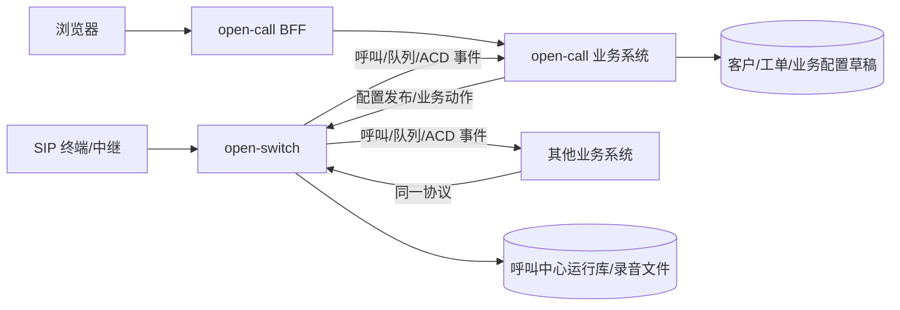

# 统一软交换架构实施方案

> **状态：架构已切换（2026-09），§9 全量验收未闭环。** 运行时以 [open-switch 对接说明](./open-switch对接说明.md)、[switch-standalone-runbook.md](./switch-standalone-runbook.md) 与 `switch_router.go` 为准；integrator 登记与事件 **callback** 已替代 YAML `applications[]` 与 open-call 轮询 `/events`。§5 路径以 `/switch/v2` 为主并注册别名；§6 含 `os_commands` 幂等、`os_bridges`/`os_ivr_sessions`、事件 `acd.*`/`bridge.ended` 等；Switch 重启可恢复 **IVR/排队/振铃**（已接通媒体仍须客户端重建）。open-call BFF 对白名单动作用 `switchapi`；仍保留 `answer/decline` 与 legacy 录制路径。Switch 主要写操作已支持 `expected_version`；核心写命令已支持 `Idempotency-Key`；`active` 重启恢复与 leg/bridge/playback API 已落地。§9 媒体/SIP 全量 E2E 见 [section9-acceptance-checklist.md](./section9-acceptance-checklist.md)。

## 1. 决策与范围

**唯一目标：open-switch 是内网呼叫控制与呼叫中心核心；open-call 和第三方应用是使用统一协议的上层业务系统。** Switch 统一承载 SIP/WebRTC 呼叫、DID 运行路由、队列、ACD、坐席话务状态和 IVR 媒体引擎；业务系统承载用户权限、客户、工单、表单及需要访问业务数据的判断逻辑。删除 `integration.mode`，不保留 `call_center`、`external` 双路由及旧 `/platform/v1` 同步查询链。此次不要求旧 Switch API、旧配置或运行中的媒体会话兼容。迁移前必须备份数据并结束通话。

本期交付包括 SIP 入呼与出呼、WebRTC 双腿、DID 路由、队列与 ACD、桥接、保持、转接、三方会议、只听媒体腿、IVR 媒体引擎、录制、事件重放，以及 open-call 现有呼叫中心运行能力的迁移。初始部署保持**单个活跃 Switch 进程**和独立 PostgreSQL 数据库；多活媒体节点、跨业务系统移交通话和跨节点会话迁移不在本期范围。

Switch 校验服务凭据、应用/租户作用域、命令格式和资源状态，但不承担终端用户登录与页面 RBAC。业务系统必须先完成用户认证、业务授权和操作审计，再以服务身份调用 Switch。Switch 中的坐席、队列和 DID 都归属于明确的 `application_id`/租户作用域，不能因持有任意服务凭据而跨域控制；服务身份和终端用户身份不得混用。

### 1.1 边界

| 能力 | open-switch（呼叫控制/呼叫中心核心） | open-call 或其他业务系统 |
| --- | --- | --- |
| SIP、RTP、WebRTC、ICE/TURN | 建立连接，维护注册/对话，协商和转发媒体 | 提交合法的呼叫意图，不直接持有 SIP 会话 |
| 技术路由 | 维护中继、注册 Contact、路由组健康与故障切换；选择实际中继 | 选择逻辑号码、路由组或业务目的，执行号码权限校验 |
| DID | 保存并执行已发布的 `trunk + DID → IVR/队列/业务入口` 路由 | 提供配置后台、维护草稿并发布；不处理 SIP INVITE |
| 队列 | 保存运行配置和实时队列；执行入队、等待、位置、超时、溢出及等待媒体 | 配置队列并读取事件/统计，不在业务进程内维持实时等待队列 |
| 坐席与 ACD | 保存路由所需的坐席话务投影、签入/签出、空闲/忙/离线、技能和队列成员关系；执行预留、选人、振铃与拒接重选 | 保存用户、组织、权限等业务资料；经鉴权发起签入、示忙等动作 |
| 工作时间 | 执行已发布的呼叫中心日历、节假日和非工作时间路由 | 管理日历草稿；复杂的客户/订单可服务性判断仍由业务逻辑完成 |
| IVR 引擎 | 执行放音、收 DTMF、录音、TTS/ASR、超时重试及媒体会话 | 定义业务流程与分支；查询客户、订单、余额并返回下一步动作 |
| 通话、媒体腿、桥接、会议、录制 | 保存实际状态并执行命令 | 发起经授权的业务操作，关联客户、工单和服务记录 |
| 录音文件与原始媒体统计 | 生成文件和技术元数据 | 告知策略、访问授权、保存期限和业务录音元数据 |
| 事件与话单 | 持久化呼叫、队列、ACD、坐席话务和媒体事实，生成技术 CDR | 持久消费，形成带客户/工单维度的业务 CDR、报表、WS/Webhook |
| 前端鉴权 | 不处理终端登录 | BFF 验证用户后调用 Switch |

边界的判定原则是：**Switch 管“呼叫本身及实时话务决策”，业务系统管“呼叫背后的业务数据与业务判断”。** `queue_id`、路由用 `agent_ref`、技能、排队优先级、ACD 预留和 IVR 媒体会话属于 Switch 的运行数据；客户身份、工单、表单、订单、余额和业务审批仍只保存在业务系统。Switch 可保存不透明的 `business_ref` 与有限 `metadata` 供关联，但不得据此自行解释业务含义。

在代码内部仍要保持三个逻辑模块：`call-core` 负责 SIP/媒体和通话状态，`cc-core` 负责 DID/队列/ACD/坐席话务，`ivr-engine` 负责媒体动作和交互会话。三者可以同进程部署，但不得把客户、工单或订单查询写进这些模块。TTS/ASR 的适配归属 IVR 引擎；若本期不交付具体供应商能力，只保留接口和明确的 `unsupported` 结果，不把它隐含为已实现范围。

### 1.2 配置面与运行面

DID、队列、坐席绑定、技能、工作时间、IVR 发布快照等**呼叫配置以 Switch 为 SoT**（`os_*` 激活版本与资源表）。open-call 保留用户/角色/权限、审计、CDR 与录音业务投影等 `oc_*` 主数据；管理页通过 BFF 调用 Switch 资源 API，保存即同步并自动激活，无需单独「发布并激活」步骤。`config/import` 灾备路径在恢复业务账号后调用 `StoreConfig` + `Activate` 写入 Switch。

1. 管理写操作：open-call 校验权限与业务规则后调用 Switch；Switch 在单次突变链内校验引用并递增激活版本。
2. 每通呼叫锁定所使用的配置版本；新版本只影响后续呼叫。IVR 草稿与发布版本存放在 Switch（`os_ivr_flows` + 按版本快照）。
3. Switch 是运行态权威：实时排队、坐席占用、ACD 预留和 IVR 媒体会话不得由 `oc_queues` 等业务表双写（相关表已退役写入）。
4. open-call `/health/ready` 可探测 `GET /configuration/active/summary`；`/api/v1/status` 可展示激活版本元数据。
5. open-call 从事件流构建只读投影和报表；投影延迟不得反向覆盖 Switch 运行态。

## 2. 当前代码差距

| 现状 | 目标处理 | 主要位置 |
| --- | --- | --- |
| `call_center` 时 Switch 从 Platform API 同步取得 ACD、队列、坐席、IVR 和录制策略 | 删除呼叫路径上的同步依赖；将 DID、队列、ACD、坐席话务状态、工作时间和 IVR 引擎收口到 Switch，以版本化快照接收业务配置 | `open-switch/internal/app/run.go`、`integration/platform/`、`layers/control/service.go`、`ivr.go`、`features.go` |
| `external` 通过 Null 业务端口运行，限制为两腿 | 改为唯一呼叫控制与呼叫中心服务；通用媒体原语和 CC 能力使用同一鉴权、命令及事件机制 | `integration/external/`、`layers/control/direct.go`、`layers/media/service.go` |
| 双模式注册不同 HTTP 路由 | 只暴露一个 `/switch/v2` 契约 | `open-switch/internal/app/http/switch_router.go` |
| `call.created` 等事件可能在状态落库后单独写入，部分错误被忽略 | 状态与事件同一事务；异步媒体操作有持久命令记录 | `open-switch/internal/store/call_events.go`、`layers/control/` |
| SIP 入呼由 Switch 当场同步查询业务 DID/队列，或在 external 模式直接创建呼叫 | Switch 使用本地已发布快照解析 DID、工作时间、IVR/队列入口并执行；只有显式业务判断节点才异步请求业务系统 | `open-switch/internal/app/run.go`、`layers/media/sip.go` |
| open-call 仍暴露 `/platform/v1` 供 Switch 在呼叫路径查询 | 删除通用同步查询入口；改为配置发布 API、业务动作回调和可靠事件消费 | `open-call/internal/app/platform/`、`app/run.go`、`integration/switchapi/` |
| open-call 的 BFF 主要按旧路径反向代理 | 保留终端鉴权；将终端动作转为经授权的业务动作，再由统一 Switch 客户端执行 | `open-call/internal/app/http/bff.go`、`bff_trusted.go` |

现有 `direct` API、呼叫中心代码、媒体实现和事件游标可作为改造起点，不将双模式、同步 Platform 查询、双腿限制或当前事件可靠性视为目标行为。

## 3. 目标架构与数据流


```mermaid
flowchart LR
  SIP[SIP 终端/中继] --> SW[open-switch]
  WEB[浏览器] --> BFF[open-call BFF]
  BFF --> APP[open-call 业务系统]
  APP -->|配置发布/业务动作| SW
  EXT[其他业务系统] -->|同一协议| SW
  SW -->|呼叫/队列/ACD 事件| APP
  SW -->|呼叫/队列/ACD 事件| EXT
  APP --> CDB[(客户/工单/业务配置草稿)]
  SW --> SDB[(呼叫中心运行库/录音文件)]
```

所有呼叫共享一个 `call_id`，每条 SIP 或 WebRTC 连接有独立 `leg_id`。Switch 维护媒体拓扑、`routing_session`、队列项、ACD 预留和路由用坐席状态；业务系统保存本地 `business_call_id ↔ call_id` 及客户、工单、表单等关联。WebSocket 和 Webhook 是业务系统对终端及外部业务的输出，不是 Switch 交付可靠事件的唯一通道。

### 3.1 多业务系统的入呼归属

- 为每个可信业务系统配置 `application_id`、租户作用域与独立服务凭据；凭据只识别服务，不携带终端用户身份。
- Switch 使用 `trunk_id + normalized_did` 等唯一入口键匹配已发布 DID 路由，直接得到归属应用以及 IVR、队列或业务入口。相同优先级的绑定不能重叠；发布时校验。未匹配的入呼按显式默认路由处理，否则拒绝并记录原因。
- 业务系统创建的呼叫由服务身份记录 `application_id`。事件按该字段过滤；全局事件 ID 可以有正常间隙。跨应用转接必须使用显式授权的逻辑目的，不能通过伪造 `agent_ref` 越权。
- Switch 校验资源均属于调用者作用域；用户能否配置 DID、强制签出坐席或查看录音，仍由业务系统在发出服务命令前校验。

## 4. 通用领域模型

### 4.1 状态

| 对象 | 状态与规则 |
| --- | --- |
| Call | `created → open → closing → ended`，表示 Switch 会话生命周期。呼叫当前处于 IVR、排队或派席由 `RoutingSession` 表示，不把 `acw` 等业务处理状态混入 Call。结束原因和时间不可再改。 |
| Leg | `new → dialing/ringing → connected → ending → ended`，失败时可进入 `failed`。`held`、`muted` 是连接上的独立属性。SIP 应答与 WebRTC ICE/DTLS 连通需分别明确。 |
| Bridge | `pending → active → ended`。显式关联两个或多个媒体腿；创建前不转发彼此媒体。三方会议是多参与者 Bridge，监听腿的发送方向设为 `recv_only`。 |
| RoutingSession | `incoming → ivr/queued → offering → connected → ended`。锁定 DID、路由和队列配置版本，保存队列项、优先级、溢出、ACD 尝试与超时。 |
| AgentRoutingState | `offline → available/reserved → ringing/busy → acw/available`，由签入动作和呼叫事实驱动；每个状态变更带版本，ACD 预留必须原子化。 |
| IVRSession | 保存媒体引擎当前动作、输入、超时和业务关联；只解释通用动作，不在 Switch 中查询客户、订单或余额。 |
| Recording | `starting → recording → stopping → stopped/failed`，包括文件 ID、路径、类型、字节数和时间。 |
| Command | `accepted → running → succeeded/failed/unknown`；异步 SIP/媒体效果以命令结果事件结束。 |

每个状态变更都有单通通话递增的 `version`，每个事件有通话内 `seq` 与全局递增 `event_id`。业务系统传 `expected_version` 时，版本冲突返回 `409` 并附最新视图；相同 `Idempotency-Key` 与相同请求体返回原命令结果，不重复拨号或录制。

Leg 的 `type` 仅为 `sip|webrtc|playback`；`participant_ref`、`business_ref`、`metadata` 是业务系统的不透明关联信息。`customer/supervisor` 不作为媒体层行为分支；ACD 只使用显式发布的 `agent_ref`、技能和实时话务状态。Switch 可限制字段长度、队列深度、媒体腿数量和资源配额，防止错误配置或命令耗尽本机资源。

### 4.2 SIP 入呼应答

收到 INVITE 后，Switch 创建 Call、SIP Leg 和 RoutingSession，保存 `leg.incoming` 事件，并发送协议允许的临时响应。Switch 使用本地激活的 DID/工作时间快照决定拒绝、进入 IVR、进入队列或触发业务判断，**不得为了查询普通 DID、队列或 ACD 而同步调用业务系统**。需要客户资格、订单状态等业务判断时，进入有截止时间的 `business_action` 节点；业务系统超时后执行快照中配置的兜底路由，不能无限占用 SIP 会话。SIP ACK、BYE、CANCEL、失败码转换成 Leg 事件与最终状态。

## 5. 统一服务契约 `/switch/v2`

这是目标契约，切换时移除 `/switch/v1`，不提供双协议兼容期。`/switch/v2` 同时提供通用呼叫原语和呼叫中心运行接口，但不提供客户、工单等业务 API。响应延续现有 `{code,message,data,request_id}` 信封；错误明确区分 `invalid_request`、`not_found`、`conflict`、`dependency_unavailable` 和异步命令失败。所有时间使用带时区的 RFC 3339；ID 为 UUID。

### 5.1 命令与查询

| 方法 | 路径 | 语义 |
| --- | --- | --- |
| `POST` | `/config-versions` | 上传完整 DID、队列、坐席路由资料、工作时间与 IVR 技术动作快照；只校验，不立即生效 |
| `POST` | `/config-versions/{version}/activate` | 原子激活已验证版本；已有 RoutingSession 继续使用锁定版本 |
| `GET` | `/config-versions/{version}` | 查询校验结果、引用错误和激活状态 |
| `POST` | `/calls` | 业务系统创建空 Call；可传 `call_id`、`business_ref`、`metadata` |
| `GET` | `/calls/{callId}` | Call、Leg、Bridge、Recording、版本及最后事件 ID |
| `GET` | `/calls?status=open&cursor=...` | 对账用分页快照，包含应用/租户标识 |
| `GET` | `/routing-sessions/{callId}` | 查询 DID、IVR、队列项、ACD 尝试、锁定配置版本与当前路由状态 |
| `POST` | `/routing-sessions/{callId}/business-actions/{actionId}/complete` | 返回业务判断结果及允许的下一逻辑动作；需幂等键和截止时间校验 |
| `POST` | `/agents/{agentRef}/check-in` | 将坐席签入指定队列/技能投影；Switch 校验激活配置并更新路由状态 |
| `POST` | `/agents/{agentRef}/check-out` | 签出；有活动呼叫或预留时按发布策略拒绝或延后 |
| `POST` | `/agents/{agentRef}/presence` | 设置可分配/示忙及原因；不能直接伪造 `busy`、`ringing` 等呼叫派生状态 |
| `GET` | `/queues/{queueId}/status` | 返回实时等待数、坐席数和服务状态；用于监控而非业务侧调度 |
| `POST` | `/calls/{callId}/legs/webrtc` | 建立 WebRTC Leg，返回 `leg_id` |
| `POST` | `/calls/{callId}/legs/sip` | 指定 destination 和逻辑 `route_group_id`，由 Switch 选择健康物理中继并接受异步拨号命令 |
| `POST` | `/calls/{callId}/legs/{legId}/answer` | 应答显式等待业务动作的 SIP 入呼；普通 DID/IVR/队列流程由 Switch 自动驱动 |
| `POST` | `/calls/{callId}/legs/{legId}/reject` | 拒绝显式等待业务动作的 SIP 入呼，传可映射原因；普通路由不能借此绕过已发布策略 |
| `DELETE` | `/calls/{callId}/legs/{legId}` | 挂断单腿，幂等 |
| `POST` | `/calls/{callId}/bridges` | 指定 `leg_ids`、`mode`（`pair` 或 `conference`）和各腿发送方向 |
| `PUT` / `DELETE` | `/calls/{callId}/bridges/{bridgeId}` | 原子替换参与腿或拆桥；保留 Call |
| `POST` | `/calls/{callId}/legs/{legId}/hold` | 该腿保持/恢复；body `on` |
| `POST` | `/calls/{callId}/legs/{legId}/playbacks` | 播放已上传资源，返回 `playback_id` |
| `DELETE` | `/calls/{callId}/legs/{legId}/playbacks/{playbackId}` | 停止放音 |
| `POST` | `/calls/{callId}/legs/{legId}/dtmf` | 向指定腿发送 DTMF；收到的 DTMF 走事件 |
| `POST` | `/calls/{callId}/recordings` | 开始录制，指定音频或视频组合方式 |
| `POST` | `/calls/{callId}/recordings/{recordingId}/stop` | 停止并持久化文件元数据 |
| `POST` | `/calls/{callId}/hangup` | 结束所有腿、桥、放音和录制；幂等 |
| `POST` | `/calls/{callId}/legs/{legId}/webrtc/offer` | 获取本地 Offer |
| `POST` | `/calls/{callId}/legs/{legId}/webrtc/answer` | 提交远端 Answer |
| `POST` | `/calls/{callId}/legs/{legId}/webrtc/ice` | 提交 ICE candidate |
| `GET` | `/calls/{callId}/turn-credentials?subject=...` | 获取短期 TURN 凭据 |
| `GET` | `/events?after_id=N&limit=100&wait_sec=20` | 按应用作用域和游标读取呼叫、队列、ACD、坐席话务及媒体事件 |
| `GET` | `/commands/{commandId}` | 查询异步命令状态与最终结果 |

不再让业务系统通过 `/answer(agent_id)` 等接口绕过 ACD 直接篡改队列和坐席运行态。正常入呼由 DID 路由、IVR、队列和 ACD 自动驱动；授权的人工外呼、转接、会议和监听仍组合通用 Call/Leg/Bridge 原语。盲转到队列或坐席时，Switch 创建新的路由尝试并原子替换 Bridge；咨询转先建立咨询 Bridge，再提交替换。视频请求/同意仍属于业务交互，Switch 只执行重新协商和媒体拓扑变化。

### 5.2 请求示例

```http
POST /switch/v2/calls/6f180aad-9fe2-4d91-b927-8d1141666268/legs/sip
Authorization: Bearer <application_service_secret>
Idempotency-Key: outbound-6f180aad-9fe2-4d91-b927-8d1141666268-v1
Content-Type: application/json

{"destination":"13800000000","route_group_id":"pstn-default","business_ref":"customer-471"}
```

成功接受异步操作返回 `202`、`command_id`、`leg_id` 与当前版本。`202` 不表示对端已接听；以 `leg.connected` / `leg.failed` 或命令查询判定结果。所有创建、拨号、桥接、录制和挂断命令要求稳定的 `Idempotency-Key`。Offer/Answer/ICE 可使用独立协商序号并保证重复提交不产生第二个 PeerConnection。

## 6. 事件、可靠性和故障恢复

事件格式：

```json
{"event_id":1042,"application_id":"open-call","call_id":"6f180aad-9fe2-4d91-b927-8d1141666268","seq":8,"version":5,"type":"leg.connected","occurred_at":"2026-09-26T09:00:00Z","command_id":"...","payload":{"leg_id":"...","type":"sip"}}
```

稳定事件至少包括 `call.created`、`call.ended`、`leg.incoming`、`leg.ringing`、`leg.connected`、`leg.failed`、`leg.ended`、`routing.entered_ivr`、`queue.entered`、`queue.position_changed`、`queue.overflowed`、`acd.agent_reserved`、`acd.offer_failed`、`agent.routing_state_changed`、`bridge.active`、`bridge.ended`、`dtmf.received`、`playback.finished`、`recording.started`、`recording.stopped`、`recording.failed`、`business_action.requested` 和 `command.failed`。队列、ACD 和坐席话务事件属于 Switch 事实；客户、工单、表单、订单和业务审批结果不得混入通用事件 schema，只使用不透明 `business_ref` 关联。

1. **同事务提交**：对 Call/Leg/Bridge/RoutingSession/QueueEntry/ACDAttempt/AgentRoutingState/IVRSession/Recording 的数据库状态修改和相应事件插入同一 PostgreSQL 事务。SIP/WebRTC 回调也走此入口。不得忽略事件存储错误；未成功提交时不得向 HTTP 返回命令成功。
2. **媒体副作用采用可恢复命令**：先提交 `command.accepted` 和待执行状态，再执行拨号或媒体操作，最后提交成功/失败及事件。重启时扫描未完成命令；对可能已发出 SIP INVITE 的 `unknown` 命令查询可观察会话并对账，不能盲目再次拨号。外部 SIP 网络无法由数据库事务保证“恰好一次”。
3. **事件顺序**：同通话命令串行；事件行按数据库提交顺序分配全局 `event_id`，避免消费者越过较小但尚未提交的 ID。`seq` 在同通话内连续。跨通话不承诺业务顺序。
4. **消费语义**：至少一次。open-call 以 `(application_id,event_id)` 写 Inbox，业务投影、游标和待发送的业务命令 Outbox 在同一事务提交。网络命令由 Outbox Worker 在事务外发送。WS/Webhook 从业务 Outbox 发布；前端可按事件 ID 去重。
5. **对账**：启动先记录游标 `C0`，分页读取未结束 Call、RoutingSession 和坐席话务状态并和本地投影比对，再消费 `event_id > C0`；断线恢复同理。事件保留期目标默认 14 天且可配置；请求游标早于保留起点返回 `410 cursor_expired` 与最早可用 ID，业务系统执行完整对账后重置游标。监控消费延迟并在保留期前告警。
6. **数据库故障**：不接受新呼叫或新命令并返回 `503`。已有媒体会话在可配置的短暂宽限期内继续，超过宽限期有序结束；恢复后按数据库记录、SIP 对话和文件清单对账，标记 `internal_failure`。不能声称数据库故障期间有无损事件交付。

## 7. 边界调整后的业务流程

### 7.1 SIP 入呼

1. Switch 收到 SIP INVITE 后创建 Call、SIP Leg 和 RoutingSession，按 `trunk_id + normalized_did` 命中本地激活的 DID 路由，并锁定配置版本；事务提交 `leg.incoming` 与路由事件。
2. Switch 执行工作时间和入口规则。普通非工作时间、固定 IVR、直接队列和默认拒绝都在本地完成，不同步查询 open-call。需要客户等级、订单状态或身份核验时，IVR 引擎发出带截止时间的 `business_action.requested`；open-call 查询业务数据并返回下一逻辑动作，超时则走已发布兜底分支。
3. IVR 引擎负责应答/早期媒体、放音、收 DTMF、录音、TTS/ASR 和输入超时；open-call 只决定“输入代表什么、下一步做什么”。任何业务返回都只能选择快照允许的逻辑目的，不能提交任意 SIP 地址。
4. 进入队列后，Switch 保存队列项并执行优先级、位置、等待媒体、最大等待、溢出和放弃处理。ACD 根据本地坐席话务状态、技能和策略原子预留坐席，发起振铃；失败、拒接和超时由 Switch 释放预留并重选。
5. 坐席接听且媒体连通后，Switch 建立 Bridge，并由呼叫事实驱动坐席进入 `busy`；结束后按策略进入 `acw` 或 `available`。open-call 不直接改写这些派生状态。
6. Switch 根据已发布的技术录制策略和业务告知结果执行录制，生成技术 CDR、录制和队列/ACD 事件。open-call 持久消费事件，关联客户和工单，形成业务 CDR、报表、浏览器消息及 Webhook。

### 7.2 外呼与业务控制

- open-call 在 BFF 验证坐席用户权限、号码规则与路由组使用权，再请求 Switch 外呼。Switch 解析坐席注册终端、选择路由组内健康中继、建立双方媒体腿并桥接；拒接、忙线和失败形成技术结果，open-call 再映射成业务结果。
- 保持：open-call 发起经授权的保持动作，Switch 执行 Leg hold 和已发布的 MOH/提示策略；`busy` 等话务状态由 Switch 根据真实呼叫状态维护。
- 盲转、咨询转、会议：open-call 校验发起人的业务权限并提交逻辑目标；Switch 负责目标坐席/队列的预留、振铃、超时、媒体腿和 Bridge 原子替换。任何阶段失败，Switch 保留或恢复旧 Bridge，并发布确定的失败事件。
- 班长监听、强制签出：open-call 校验班长权限；Switch 执行 `recv_only` 媒体腿、挂断或延迟签出，并维护坐席实时状态。Switch 只识别授权动作与路由资源，不保存班长的人事资料。
- 浏览器始终只访问 open-call。BFF 不裸代理任意 `/switch/v2` 路径；它将允许的前端动作交给业务服务，再以受限服务身份调用 Switch。第三方业务系统使用相同配置发布、呼叫命令与事件契约。

## 8. 数据、配置与代码改造

### 8.1 数据

| 服务 | 保留或新增 | 移除的语义 |
| --- | --- | --- |
| Switch | `calls`、`legs`、`bridges`、`routing_sessions`、`queue_entries`、`acd_attempts`、`agent_routing_states`、`ivr_sessions`、`recordings`、`commands`、`events`；保存激活配置版本及 DID/队列/技能/工作时间路由快照；索引包含 `(call_id,seq)`、`event_id`、`(application_id,event_id)`、队列顺序、坐席预留和幂等键唯一约束 | 客户、工单、表单、订单、余额、组织人事资料、终端用户 RBAC 和业务审批 |
| open-call | 用户/组织/权限、客户与工单；DID/队列/坐席绑定/工作时间/IVR 业务流程草稿和发布审计；业务 Call 映射、Inbox、命令 Outbox、消费游标、业务 CDR 与报表投影 | 实时等待队列、ACD 预留、坐席忙闲权威状态、SIP 对话和媒体状态的直接写入 |

两个数据库不做跨库事务。配置通过版本发布保证 Switch 获得自洽快照，运行事件通过 Inbox/Outbox 和幂等命令实现最终一致。现有历史 CDR 与录音业务元数据留在 open-call；切换前备份数据库和录音文件。由于不兼容旧运行状态，部署窗口需先让活跃呼叫归零；不得直接删除历史业务表。

### 8.2 配置

Switch 删除 `integration.mode`、`platform_base_url` 与呼叫路径 Platform 同步查询。**不再**在 Switch YAML 配置 `applications[]`：业务方 `POST /integrations/register` 登记 `application_id`、callback URL 与配额，Switch **签发** integrator secret；事件经 **HTTP callback** 推送（`GET /events` 仅对账）。DID/队列/IVR 等由激活快照提供；SIP/ICE/TURN/录音目录仍在 Switch YAML。open-call 配置 `switch_base_url`、`application_id`、`secret`、`events_callback_url`。

### 8.3 代码工作包与依赖顺序

| 阶段 | open-switch | open-call | 完成门槛 |
| --- | --- | --- | --- |
| A. 契约与模型 | 落地 `/switch/v2` OpenAPI、配置版本、Call/路由/队列/ACD/坐席状态迁移表、事件 schema 和统一错误码 | 实现配置发布、业务动作和事件客户端类型 | 示例请求、状态转换、作用域和错误均可用契约测试验证 |
| B. 持久运行态/事件 | 建立 Call/Leg/Bridge/RoutingSession/QueueEntry/ACDAttempt/AgentRoutingState/Command/Event 仓储，事务写入与恢复扫描 | 建立 Inbox、Outbox、游标和幂等业务投影 | PostgreSQL 集成测试覆盖排队与预留并发、事件顺序、重试和崩溃恢复 |
| C. 呼叫与 IVR 引擎 | 完成 SIP/WebRTC、DID 路由、工作时间、播放/收码、可选 TTS/ASR 适配接口、双腿和会议拓扑、录制及重启清理 | 完成 IVR 业务节点处理和超时兜底配置 | DID→IVR/队列及 SIP↔SIP、SIP↔WebRTC、WebRTC↔WebRTC 媒体测试通过；未配置 TTS/ASR 时明确返回不支持 |
| D. 队列与 ACD 迁移 | 本地执行队列、优先级、溢出、坐席话务状态、技能匹配、原子预留、拒接重选和 ACW；不在呼叫路径查询 Platform | 管理配置草稿并发布；消费运行事件形成业务 CDR、报表和前端消息 | 业务系统停机/变慢时，已发布的普通 DID→IVR→队列→坐席流程仍可运行 |
| E. 清理与交付 | 删除 `integration/platform/` 同步查询、Null 模式、旧控制方法与 `/switch/v1` 路由 | 删除 `/platform/v1` 通用查询、业务侧实时 ACD/队列计时器和双模式依赖；更新前端适配 | 全仓搜索无运行态双写和旧回调链，文档与配置示例均描述单一方案 |

阶段 A、B 是后续媒体及业务迁移的前置条件。每阶段允许在开发分支使用临时适配器，但交付版本不得留有双模式开关、业务侧实时 ACD 或生产旧路径。相关设计文档 `architecture.md`、`technical-design.md`、`events.md`、`docs/api/` 与部署示例需在阶段 E 同步更新。

## 9. 验证与验收

### 9.1 必须覆盖的自动化检查

- 契约测试：同一 Switch 测试套件分别由 open-call 客户端和一个最小第三方业务客户端运行；请求、响应、错误与事件 schema 一致。
- 配置发布：DID 冲突、失效队列/技能/IVR 引用不能激活；激活和回滚原子化；进行中的呼叫始终使用锁定版本。
- 状态与并发：相同幂等键只产生一次拨号；不同请求体复用键返回冲突；同通话并发桥接/挂断受版本控制；一个坐席不能被两个 ACD 事务同时预留；并发多通话事件游标不跳过未提交事件。
- PostgreSQL 集成测试：呼叫/队列/ACD 状态与事件事务回滚、Inbox/Outbox 原子提交、迁移、游标过期与重建、进程异常退出后的命令和预留恢复。使用独立测试 DSN，不修改用户业务库。
- 媒体集成测试：三种双腿组合、三方会议、只听方向、拆桥前后无串音、保持、DTMF、录音停止及文件可读；覆盖 WebRTC ICE 未连通时禁止激活 Bridge。
- SIP 故障测试：入呼决策超时、CANCEL、BYE、中继拒绝与超时、重复 INVITE、重启时未知拨号结果；验证不自动二次外呼。
- 呼叫中心核心测试：DID→工作时间→IVR→队列→ACD→坐席、优先级、溢出、拒接重选、签入/示忙/ACW，以及业务动作超时兜底；断开 open-call 时已发布的非业务查询流程仍继续运行。
- open-call 业务测试：配置草稿与发布、客户/工单 IVR 判断、外呼、盲转/咨询转、会议、监听、强制签出、录制告知、业务 CDR；验证 BFF 拒绝伪造用户、跨租户资源或越权媒体腿。

### 9.2 上线验收判定

1. Switch 在无 open-call、无 Platform API 地址时，使用已激活配置可独立完成 DID 入呼、工作时间、固定 IVR、队列、ACD、坐席振铃、桥接和录制；需要客户/订单查询的节点按配置走超时兜底。
2. open-call 仅通过统一 `/switch/v2` 发布配置、提交授权动作、处理显式业务判断并消费事件；Switch 不同步查询客户、工单、表单、订单或业务权限，open-call 不维持实时队列或执行 ACD 选人。
3. 断开业务系统后事件可重放，Switch 中排队和已建立的通话不丢失；重复事件不重复改变业务 CDR，重复命令不重复拨号；业务系统恢复后通过对账收敛到 Switch 实际状态。
4. 模拟 Switch 重启、数据库短暂故障、SIP 超时和浏览器断线，不出现跨通话媒体转发、无界等待或静默丢失已提交状态事件。
5. 两个业务系统使用同一协议和隔离的应用/租户作用域接入；各自 DID、队列、坐席、配置版本和事件流不可相互读取或控制，也不依赖另一方在线。
6. `go test ./...`、必要的 PostgreSQL 集成测试、前端测试、媒体/SIP 端到端测试、OpenAPI 校验与部署冒烟测试全部通过。

## 10. 切换、回退与文档收口

1. 在预生产环境按 A→E 完成验收，记录数据库迁移脚本、配置转换样例、录音备份位置和健康探针结果。
2. 生产维护窗口停止新呼叫，等待当前 Call/Leg 全部结束；备份两端数据库、配置与录音文件。记录旧事件游标和未完成命令清单。无需把旧媒体会话迁移到新进程。
3. 停止旧 open-call 与 Switch，迁移数据库，部署新二进制与单一配置；先启动 Switch，再启动 open-call，并检查第三方业务系统事件订阅。
4. 用独立测试 DID 和外呼号码做入呼、外呼、WebRTC、桥接、录音、事件对账冒烟测试，再恢复生产入口。
5. 若冒烟失败，关闭生产入口，停止新版本，恢复**成套**的旧二进制、旧配置和数据库备份；不可让新旧协议或数据库结构交叉运行。记录窗口内新呼叫及文件，人工核对后再决定重试切换。
6. 验收后将[现行对接说明](./open-switch对接说明.md)、架构/技术设计、OpenAPI、部署手册改成单模式正式契约，删除所有将 `call_center` / `external` 描述为现行目标的文字。

**完成定义**：代码只有一个控制路径；open-call 与第三方业务系统使用同一 Switch 协议；DID 运行路由、队列、ACD、坐席话务状态和 IVR 媒体引擎只在 Switch 中执行；客户/工单等业务数据和业务判断只在业务系统中执行；配置发布、事件、命令、对账及故障恢复满足第 9 节验收；文档和配置与实际代码一致。
